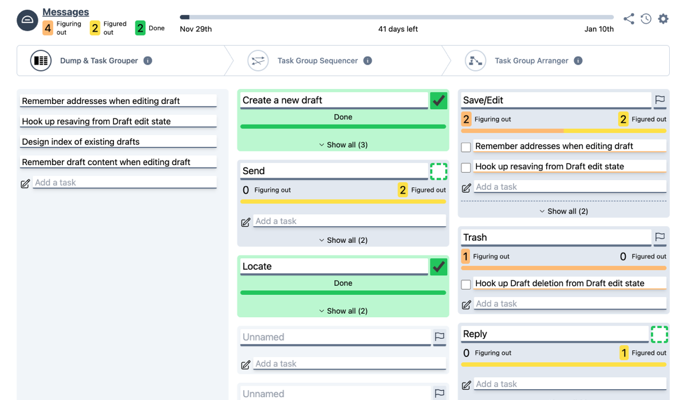

News! We decided to open source [dumplink](https://github.com/klausbreyer/dump.link), the tool for Shape Up Teams. This means it is free for the whole Shape Up community to use, and we also invite everybody with ideas to collaborate with us. The GitHub repository also contains all our ideas and concepts in the pipeline.

## 2023 - Introducing dumplink: A New Era in Project Management

Imagine a scenario where a product and tech team, enthusiastic about the Shape Up methodology, find themselves grappling with the challenge of translating high-level projects into actionable tasks. This is a familiar scene in many tech teams, where the conceptual leap from the big picture to the granular details often becomes a stumbling block.

[dumplink](https://github.com/klausbreyer/dump.link) is more than just a project management tool; it's a strategic ally for teams embracing Shape Up. Its functionalities resonate deeply with the principles of Shape Up, enhancing the workflow from unstructured ideas to a well-organized project plan.

### Key Features of dumplink

1. **Dump**: Break down a project into an unstructured list of tasks. This phase allows for a free-flowing collection of all tasks, mirroring the brainstorming stage of a project.

2. **Cluster**: Organize this list into task groups. By clustering tasks, teams can see natural groupings and dependencies, aiding in more strategic planning.

3. **Sequence**: Arrange the task groups in a logical sequence. This helps in identifying the order in which tasks should be tackled, aligning with the project's overall timeline.

4. **Arrange**: Get a structured data visualization of the task groups as an unfolded network. This visual representation provides a clear overview of the project's structure, making it easier to manage and navigate.

5. **Set Appetites and See Risk Ratios**: Quickly assess progress risk, from unsolved to solved phases. This feature allows teams to align their efforts with the project's 'appetite' or time budget, making strategic decisions about scope and priorities.

## A Tool Shaped by Shape Up

[dumplink](https://github.com/klausbreyer/dump.link) is not just another project management tool; it's a manifestation of the Shape Up methodology's core principles. It encourages teams to think in terms of big-picture goals and then methodically break them down into actionable steps. This approach not only aligns with Shape Up’s emphasis on flexible scopes and fixed timeframes but also enhances the overall efficiency and effectiveness of the process.

### Discover dumplink

I invite you to explore [dumplink](https://github.com/klausbreyer/dump.link) and witness its capabilities firsthand. To help you get started, watch our [introductory video](https://youtu.be/CSEhIJ7safA) that explains the software and delves into some of the underlying concepts of Shape Up.

A more in-depth look is provided by our podcast appearance [in the Shapers & Builders Podcast](https://shapersbuilders.transistor.fm/episodes/building-tools-for-shape-up-klaus-breyer-matt-lane-co-founders-of-dumplink).
