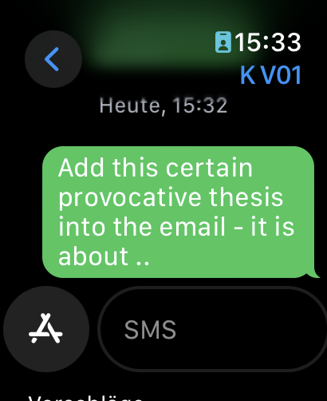

I often find myself out and about with just my Apple Watch (either because I’m running or playing with the kids in the garden) when that one important work thought hits me. Unfortunately (or fortunately!), the Apple Watch doesn’t have a notes app or a mail client.

So, I’ve gotten into the habit of sending myself SMS messages to my business number. When I’m back at the office and check my business phone the next day, I can take care of it immediately. And the best part is that it’s off my mind for the time being.

