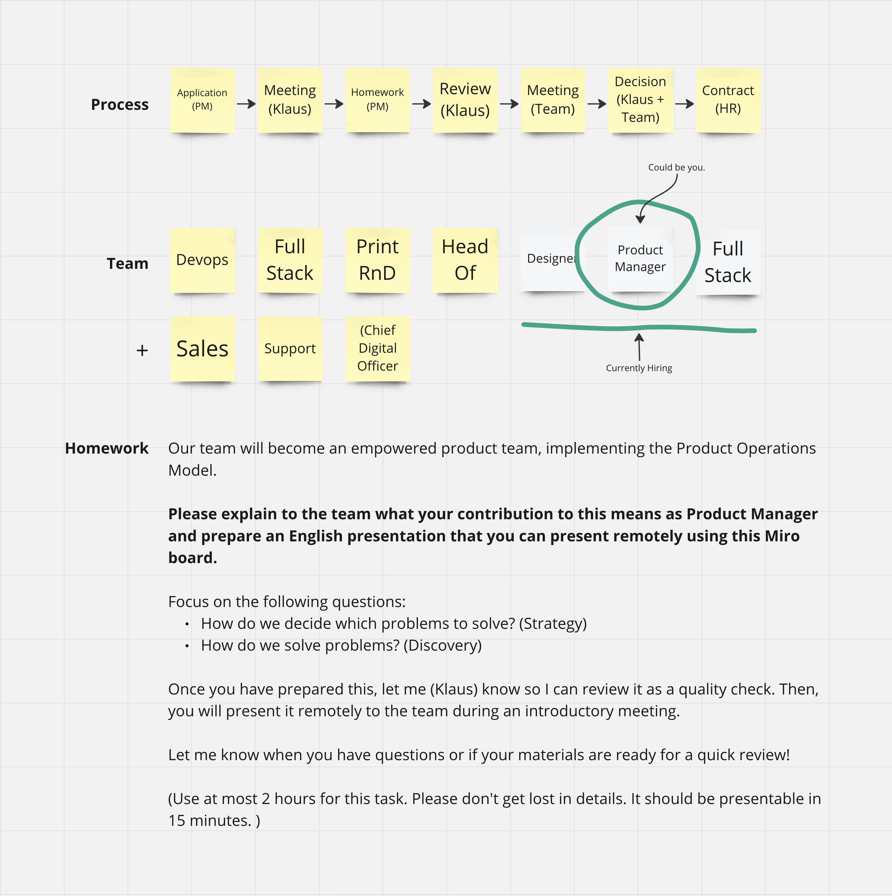

I am currently transforming a team within Eedding into an empowered product team.
To do this, I am looking for an excellent product manager who thrives in a remote team. Today, I am sharing how I approach this.

## The Job Posting

You can see the full job posting [here](pm.pdf). The job posting is in German for a role in the German market (but ChatGPT can assist English native speakers here).
I did not use a generic job posting but described how I expect a product manager to work in an empowered product team.
I want to draw special attention to the last paragraph:

> Show your talent for precise wording in your cover letter - a core competency in our remote team. Describe your motivation, a defining career event highlighting your discovery strengths, and an example of how you managed remote challenges as a Product Manager and contributed to team dynamics.

Initially, I wanted to test whether the applicants read to the end. It wasn't. No one provided this information right from the start.

## Filtering

The recruitment team again requested this information from the candidates who sounded interested based on their CVs. This simple query eliminated many candidates who needed to be more serious about the position.

## Getting to Know Each Other

I had a personal one-hour conversation with the candidates, who took it seriously and were able to answer these questions.

## Homework Assignment

For programmers, doing a homework assignment - a coding test- is common. What could a coding test for product managers be? I wanted a manageable amount of effort for myself, but I also wanted it to be manageable for the product managers.

In our context, the team has never worked with an empowered product manager before.
I wanted the product manager to explain to the team what it means to work with them in the future.

- This way, I can determine if they understand their craft and role.
- The team knows what to expect from the person.
- We know they can work well remotely - in a realistic scenario.

The homework assignment may not be applied 1:1 to every other case, but the principles remain.
