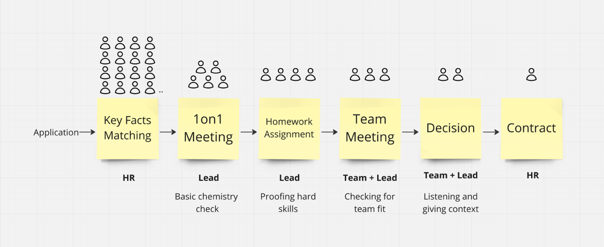

Regularly, I encounter team members who are surprised that they got to meet the candidates before I made the decision. They weren't used to this from their past experiences.

But let me provide some context: I am currently the Head of Product and Technology for [edding AG](https://www.edding.com/), transforming a team around the [easycheck](https://easycheck-by-edding.com/) product into an empowered product team. So, we're not the typical tech company, and it is not a large team, either.

Back to the topic: For me, the team must have a significant say in hiring and choosing their future colleague. In the end, it is about them—it is about their future coworker. They have to be with that person for most of their waking life.

To be frank, it's not just a second opinion for me. Yes, it relieves some pressure because I'm not making the decision alone, and I can also learn some new things about my current team.

But most importantly, it makes the future job for the applicant more concrete because they have met their future colleagues and had the chance to ask them all kinds of questions. Re-assuring them that this is a worthwhile position makes them less likely to sign somewhere else.

Of course, I don't only bring in some candidates. But I wanted to use this opportunity to sketch out this team's hiring process (the numbers are approximations).

## Key Facts Matching

HR ensures that the essential information is available: salary expectations and notice periods, or if there are any specific constraints for a position.

## 1-on-1 Meeting

I meet all the candidates who look matching on paper in a 1-on-1 setting.

I mainly want to get them talking. My go-to opening question is: What's your nerd/background story? How did you become a programmer, designer, etc.?

Along the way, I poke at some industry news (like [React compiler](https://react.dev/learn/react-compiler), etc.) to see if they are current and have a stance. But also to learn something by myself. ;)

Of course, it's interesting to see what questions they brought with them and if they were prepared. This is when I delve more into our setup: the product, who's already on the team, etc.

The main question I ask myself afterward is: Do they have roughly the right skills, and can this person harmonize with the remote team on an interpersonal level?

## Homework Assignment

If so, I will give them a homework assignment (or coding test).

For senior positions, I aim for it to take between 4 and 6 hours and tell them to stay within this. I'm more interested in how they would proceed when short on time.

The assignment itself varies.

- [For product managers, it's a theoretical task.](https://www.v01.io/posts/2024-hiring-remote-product-manager/)
- For developers, it's code.
- For designers, it's both theory and practice.

It's always contextualized to a real problem we're currently facing, so the time spent is always well-spent.

## Team Meeting

Now, to the core of what triggered this blog post: the Team Meeting.

The homework assignment is already structured so that candidates must present something in a remote setting.

I need to see how they handle remote work: Can they express themselves using the tools we will use later?

Sometimes, there is an additional step where, after the team, key stakeholders are also met. For example, in the case of a product manager, I also involve the Chief Digital Officer (in this case) since there will be a regular collaboration between them at a working level, together with me. I see this as a second team meeting.

## Decision

Afterwards, there's a decision meeting.

At the decision meeting, I first listen to all the team members to ensure I don't bias them with my strong opinion. Then, I go through my points, pros, and cons.

This collaborative approach teaches the team how I approach things (to nurture future leaders), and I also try to frame the current candidate in certain aspects to the other applicants.

I then write to the candidate personally. I tell them how well they did on their homework assignment and how well they fit into the team. I use this as a chance to pitch the benefits again:

- Fully remote
- Truly Empowered Product Team
- Space to Co-Create
- Cool Brand

## Contract

If the candidate confirms my email, it goes to HR next.

The actual contract work is handed over to HR. They are the experts in this. I brief HR with a salary range we consider appropriate, and that fits into the overall salary structure.

(When I write to candidates, I always offer them the chance to contact me personally if they feel something needs to be clarified with HR. So far, I have had a good experience. However, as a last resort, I want to avoid losing a promising candidate because of some silly misunderstanding.)
