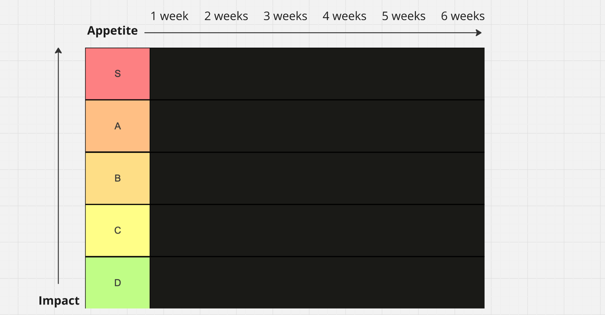
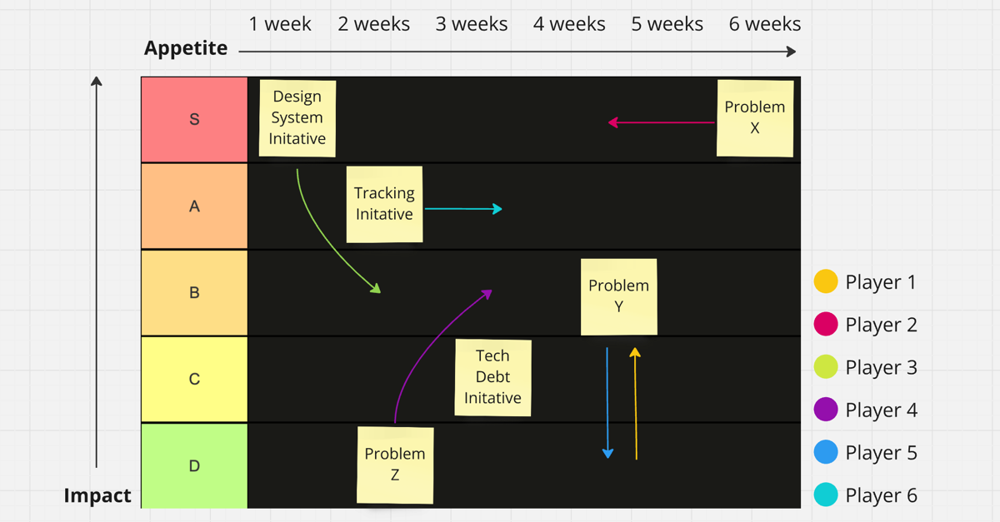
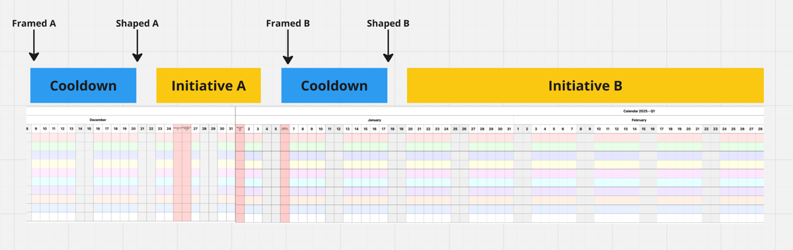

It was just the usual mess: The product team had merged a couple of months before, inheriting a codebase from an agency working on a shoestring budget. Technical debt loomed, basic foundations were missing, and product management had many interesting problems.

However, the good side in this case is that it is an empowered product team that includes insourced engineering, design, and product management—all the responsibility, resources, and freedom.

So, the challenge is doable for the team.

## But the team needs focus - and not just prioritized work.

By definition, focus is singular, and priorities are plural. So, priorities don't help much. One of the most important things for leaders is clarifying what they are **not** supposed to work on! (This is what Steve Jobs meant when he said [focusing is about saying no](https://www.youtube.com/watch?v=JbEjAFrvJv0). And saying **no to everything else** is the hard part.. )

## Shape Up is the methodology for focusing on one thing at a time.

[It is all about strategic resource allocation for fixed timeboxes instead of managing a backlog of tickets]().

But classic Shape Up is very top-down. And it makes sense: It comes from [37signals](https://37signals.com/), a company whose owners are also the chief designer and chief technician. They say what needs to be done and how. They have no stakeholders (and they are proud of it, rightly so).

As an empowered product team, we needed a format to involve everyone in focused discussions. But how do we identify "the thing"? And for how long should the focus last?

We developed the impact-appetite tier list to address this challenge. It is a customized planning approach that evolved from the popular [impact-effort matrix](https://gamestorming.com/impact-effort-matrix-2/). It incorporated the visual elements and concrete scale of various YouTube channels' well-known [tier list templates](https://www.youtube.com/watch?v=riQ8r8en0Rc).

Here's how we adapted it to suit our strategic needs and why it works.

## Appetite instead of effort sparks the proper discussions.

Traditional effort estimates often derail projects. They start with good intentions but quickly spiral as scope creeps in or unforeseen complexities arise. To counter this, [Shape Up uses appetite instead of estimates](). So, instead of asking,

> How long will it take?

It reframes the question to:

> How much are we willing to spend?

A subtle yet powerful shift.

Whether it's one week or four, framing units of work around appetite forces the team to define what "enough" looks like from the get-go.

Using appetite in a matrix helps everyone see everything on the plate and fosters discussion about how to slim things down:

> If this only comes with a C impact, it is not worth spending 3 weeks on it.

> We can do this with a 1-week version to free up space for other things.

## Round robin activates every voice.

We introduced a round-robin format to ensure our discussions stayed grounded and inclusive. Each team member took turns: The sticky's physical (or virtual) move comes first, followed by a debate on the move.

Sometimes, things align. Sometimes, things bounce back and forth. But this is okay and healthy. New perspectives and ideas surfaced during the process. Better earlier than later.

Early rounds centered on impact:

> What's the value of solving this problem?

Then, as clarity emerged, the discussion naturally shifted to appetite:

How much are we willing to commit to this?

### Create a short-term timeline, not a roadmap.

After identifying high-impact problems and setting an initial appetite, the next step was to see how these priorities fit into the next 8–10 weeks. (We don't do more than this, because further planning is obsolete anyway - Shape Up Principles.)

The only other task we have is to define specific milestones to ensure the following topics are [framed](https://www.feltpresence.com/framing/) and [shaped](https://basecamp.com/shapeup/1.1-chapter-02) accordingly to meet the timeline.

### Try it today: Use appetite instead of estimates for your roadmap.

Next time you discuss a high-level topic on your roadmap, shift the conversation. Instead of asking your team how long this will take, discuss with them how much they want to spend.

Start small. Pick one topic and apply the appetite mindset. Watch how it transforms the way your team approaches planning and decision-making.

This simple reframing will lead to vastly different conversations. You'll move from vague estimations and only high priorities to clear, focused discussions about focus and appetite.

