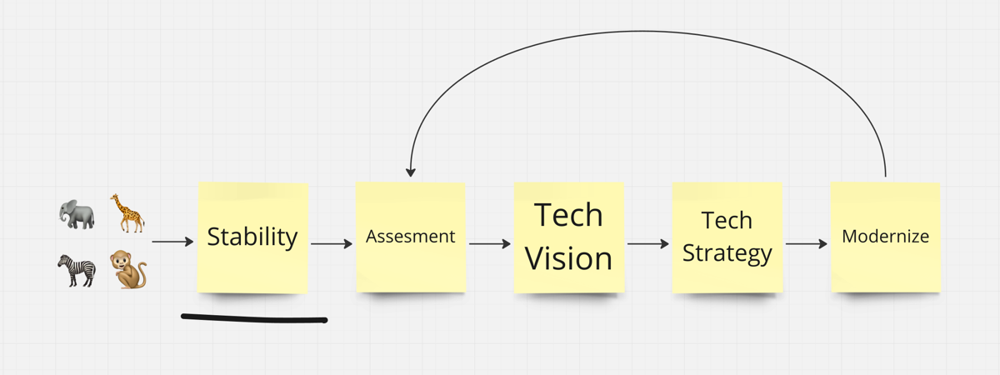

When I read inspiring stuff like Stephan's [radicalsimpli.city](https://www.radicalsimpli.city/), I always think about all the situations where wrong decisions have already been made, some of them from my past—stuck with a zoo of tech and frameworks that are either unsuited or unmaintained or facing significant version changes close to a rewrite.

In short, it is a setting where many things are messed up, and tech decisions have been made that you wouldn't have made or would not make again. A situation where you know of the value of "radical simplicity" :)

Just recently, I inherited a tech zoo, and this is my mental model of how I tackled it - together with the team.

## 1. Stability

The first short-term goal for the first 1-2 weeks is to improve stability. Focus on observability, reducing cognitive load for developers, improving debuggability,

Every bug reported is a chance to improve debuggability while you are at it.

Everything you stumble upon that causes cognitive load is an invitation to spend some time thinking about improving it.

But really, just the basics. Keep it pragmatic. Don't over-engineer just yet.

## 2. Assessment

If you are more familiar, assess. Be sure to separate your personal opinion from objective analysis. Are these terrible decisions, or are they just different from my preferences or current technological trends?

It is best to write down your assessment, as you will have something to compare against when defining your tech vision later.

You can use my template:

> **Using** three different Javascript frameworks is a terrible decision
> **because** the best one will still be released next year.
> **This will cause us problems down the line:** developers will no longer feel cool.

Assessment is something one should do with others. It is a team effort. After all, everyone on the team must carry out the implications.

## 3. Tech Vision

Then, define the tech vision. For me, on a high level, this covers infra, architecture, and framework choices.

1. I first try to paint a perfect picture of an ideal world. For example, how would we make decisions with everything we know now?
2. Then I do a reality check. How bad are the choices there? Where do we really need something different? Should we replace React through a server-side framework, or doesn't it matter in our use case?
3. Can we simplify existing things in other ways? Maybe remove other dependencies and go more toward a vanilla reaction to be not dependent on the mood of 100 different package maintainers.

## 4. Tech Strategy

Derived from the high-level vision, there are usually some apparent strategic objectives to get there. For example:

- If there is no continuous deployment, some clear things need to be done to achieve this: CI, test coverage, and feature flags.
- If there are currently five different technologies for hosting stuff, you need to define the future of hosting, etc.

**Check if your vision provides a remedy for everything that you found during your assessment.**

## 5. Modernize: Tooling & Long-Term Refactors

Now, you "just" need to execute it. :)

For some initiatives, it is pretty straightforward: To introduce feature flags, additional tools/tech need to be ready.

For everything that is code-related, I prefer [long-term refactorings](https://max.engineer/long-term-refactors). This involves making gradual and planned changes to the code over an extended period to continuously improve the codebase without disrupting ongoing operations.

Multiple long-term refactorings could co-occur. All of them are organized in a list with the necessary details (e.g., an [ADR](https://github.com/joelparkerhenderson/architecture-decision-record/blob/main/locales/en/templates/decision-record-template-by-michael-nygard/index.md) and additional instructions).

Then, you let them influence the work more or less strongly, depending on how it makes sense.

When a long-term refactor is completed, it is removed from the list.

You will eventually arrive at your vision—if you have not updated it. After all, vision is a moving target.
