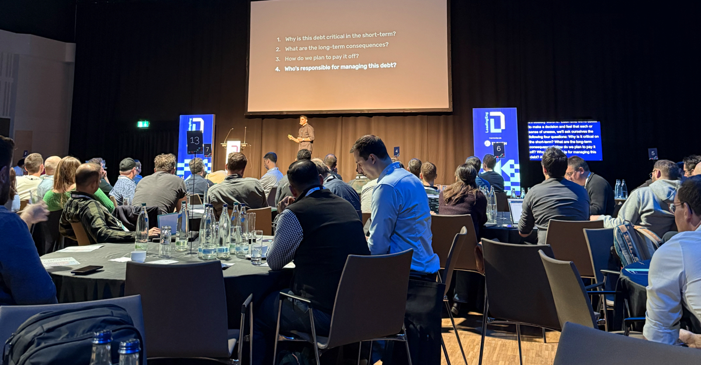
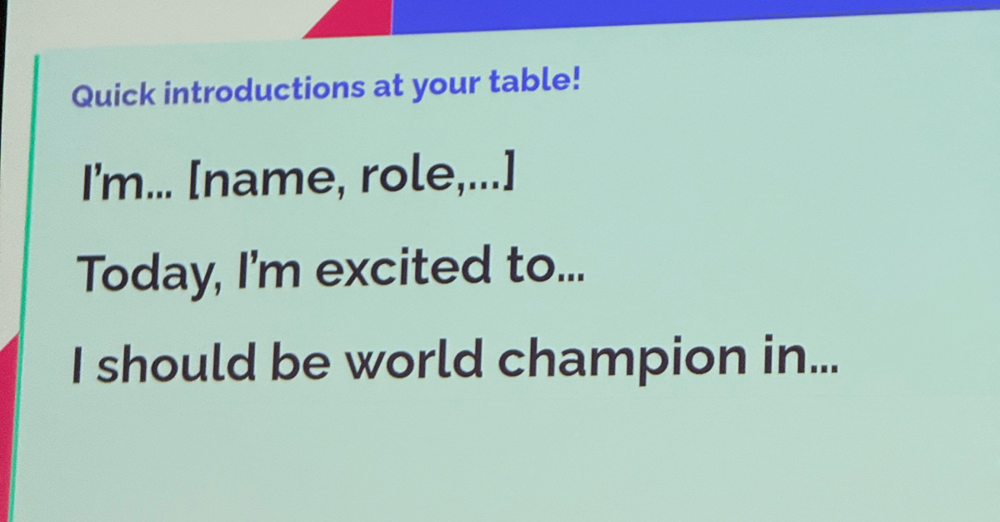
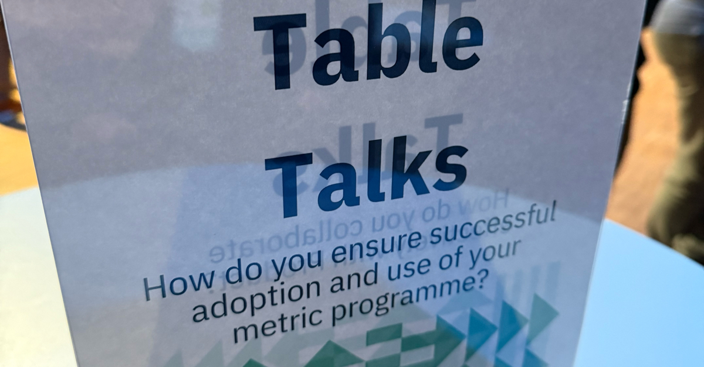

Conferences are everywhere, but some stand out. [The Leading Eng Berlin Conference 2024](https://leaddev.com/leadingeng-berlin/) was one of those rare events, offering actionable insights, meaningful connections, and a fresh take on key topics.

The audience consisted mainly of the middle management layer—directors and engineering managers. There were no pure developers and not many CTOs or CPOs. I didn't spend too much time checking the schedule beforehand because, by experience, I know that the quality of a session often depends more on the actual speaker than on the title. And some of them delivered.

But what truly set this conference apart wasn't just the quality of its content; it was how it was paired with innovative networking formats that made even introverts feel comfortable. If you've ever stood awkwardly by the coffee station at a conference, wishing the earth would swallow you whole, this event might restore your faith in professional gatherings.

### Networking That Works (Even for Introverts)

For me, the most valuable aspect was the networking. I'm not entirely introverted, but I find approaching people daunting. Once a conversation starts, I can talk for hours, but getting to that point often feels like a hurdle. Leading Eng Berlin tackled this challenge with two standout features:

## Assigned Table Discussions   

Attendees were assigned to tables based on their badges, creating a built-in group to connect with throughout the day. After every session, speakers posed a question for the audience to discuss at their tables. These discussions transformed passive listening into active engagement, letting everyone share their perspectives without the pressure of starting from scratch.

## Themed Table Talks

During breaks, themed standing tables encouraged focused conversations on specific topics like AI implementation or team metrics. These discussions were casual yet purposeful, providing a natural way to exchange ideas without the awkwardness of formal introductions or feeling lost in a crowd.

For someone who identifies as a classic "nerd," these formats were a game-changer. They made it easy to have meaningful conversations without the awkwardness of unstructured mingling.

### Keynotes

Not only inspirational ideas but also discussions with practical tools I could implement immediately.

- **Metrics That Matter:** [Lena Reinhard](https://www.linkedin.com/in/lenareinhard/) demystified engineering metrics, from DORA to team health scores.
- **Strategic Positioning:** [Sergio Laranjeira](https://www.linkedin.com/in/sergiolaranjeira/) shared a powerful scorecard for evaluating how well a company is positioned and executing its goals.
- **Business Alignment:** [Italo Vietro](https://www.linkedin.com/in/italolelis/) presented a direct approach to linking day-to-day work with business objectives, making it easier to justify costs.
- **Management Debt:** [Daniel Korn](https://www.linkedin.com/in/daniel-korn-2876a496/) introduced the concept of "management debt"—the result of decisions prioritizing short-term benefits over costly but necessary long-term consequences.

But attending a conference goes beyond simply absorbing information for a day; it’s about the lasting impact that information has on your work and your team.

For me, it felt like a day-long meditation on engineering leadership. It provided an opportunity to reflect on my challenges, connect new ideas to existing problems, and return to work re-energized with actionable plans, even if a particular talk didn't present anything new to me.
