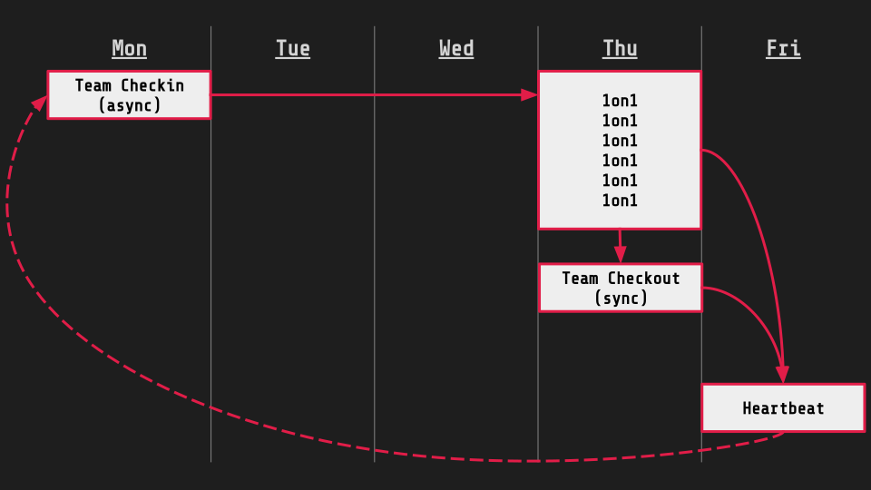

Over the years, I have refined a management approach that is both effective and adaptable, especially in leading remote teams. As Head of Product & Technology at [edding AG](https://www.edding.com), I am currently hands-on managing the interdisciplinary team at [easycheck](https://easycheck-by-edding.com/). But the underlying pattern is not limited to direct team management but also extends to managing managers and reporting to C-Level colleagues.

## Team Check-in (Async)

Our week kicks off with an asynchronous check-in every Monday morning. The goal is for each team member to reflect on their plans for the week and share them with the team. The fundamental question we answer is, “What do you plan on working on this week?”

**Why Asynchronously?** Simply put, meetings early in the morning (before 10 AM) tend not to be taken seriously. Participants often multitask, sorting through their emails and planning their day. Studies support this observation, highlighting that such meetings add unnecessary pressure to appear punctual or busy ([Brand Eins, 2023](https://www.brandeins.de/magazine/brand-eins-thema/it-dienstleister-2023/arbeiten-wie-ich-wirklich-wirklich-will)).

## 1-on-1s

Every Thursday, I dedicate a block of time to conduct 1-on-1 meetings with all team members. Each member and I have a document to jot down topics worth discussing throughout the week. Additionally, I maintain a rough coaching plan for each individual, aimed at their development. This time is also used to dive deeper into actual work, that I can follow up from our async check-ins.

## Team Checkout (Sync)

We maintain a rolling agenda in Confluence, accessible to all team members for adding items throughout the week. However, most topics are generated from my observations during 1-on-1s, indicating a need for team-wide discussion or updates.
During the meeting, we review the rolling agenda, discuss our current product initiatives, and tidy up our boards.

**Why Thursdays?** By holding this meeting on Thursday, we still have time to act on discussions before the week ends. Also, some just prefer to take Fridays off.

## Heartbeat

On Fridays, I send a "Heartbeat" update to the board member I report to (in this case, the Chief Digital Officer). This recapitulates the week using a template from James Stanier's book, ["Effective Software Engineering Manager"](https://amzn.to/3PQ44mq), focusing on Progress / Plans / Problems / People. Inputs for this update are gleaned from my 1-on-1 notes and our team checkout discussions, sometimes augmented by reviewing my external meeting calendar.

## Closing the Loop

The Heartbeat from the previous week lays the groundwork for the next week's check-in, helping me outline goals for the coming week. It's more effective to wait until Monday to prepare the next check-in instead of doing it the week before. Drafting it on Friday often feels too early; perspectives change over the weekend, and taking a fresh look on Monday offers new insights.

This cycle highlights how crucial repetition is, not just for efficiency but for consistent reflection and reassessment. Every step offers an opportunity to pause and consider our stance, identify priorities, decide on actions, and clearly outline what we should avoid doing.
