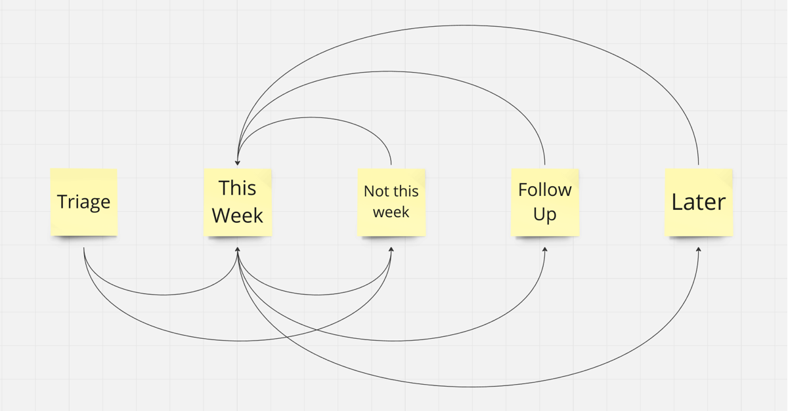

Peter Drucker said in 1967: _"The knowledge worker cannot be supervised closely or in detail. He can only be helped. But he must direct himself.”_

As a serious knowledge worker for a lifetime, I honed how I "direct myself" over the years quite a bit. I have settled on a relatively flat and simple system to manage myself, linking my active project to-dos and my entire knowledge base—comprising everything I've accumulated from YouTube, podcasts, etc.

## Tooling

The cornerstone of my personal knowledge management system is [Obsidian](https://obsidian.md/). I switched from Roam Research a few months ago and have grown to appreciate its simplicity and robustness. It's primarily a tool for managing markdown files, but it also allows linking to other files and shows backlinks within documents. I use it fairly "vanilla" to avoid complications with future changes or if I want to switch tooling in the future, though I subscribe to the syncing feature to use it across multiple devices.

## Core Documents

Adopting an idea from [Cal Newport](https://calnewport.com/), I rely on a set of core documents that I routinely reference. These documents outline their purpose, my review frequency, and update procedures, serving as my operating system.

### Core Values

My 'Core Values' document contains my life values, often including excerpts from books I've read.

### Strategic Plan

My 'Strategic Plan' is crucial for quarterly assessing my current professional situation. It includes a 'Triage' section for new thoughts to consider in the following review that I maintain while life is happening.

### This Week

The 'This Week' document is operationally vital for me. I update it at the beginning of the week and daily before I start work.

I use this feel to organize my week in daily sections, sifting through various project calendars to construct blocks that ensure I achieve one meaningful goal each day while minimizing switching between different themes. For each day, I reference the specific project file I'm working on together with planned tasks and meetings.

Alongside the daily sections, there is a "This Week" Section for important stuff that I don't want to miss, but I don't know yet what day to tackle. This is an idea that was inspired by the  [Hey Calendar](https://www.hey.com/calendar/). Other than that, a "next week" section also helps me de-scope work from the current week for more focus.

### My Craft

This document references other input documents, mainly from the web, with stuff I want to try when time permits.

## Active Projects

I work on only 2-3 projects at any given time. In my case, this usually means a larger consulting project and a startup that I am currently working on. Each project has an index file with the following structure:

- **Triage:** This is where I initially dump everything that comes at me.
- **Do this week:** I regularly refocus on what I still need to do this week and what should be moved to next week.
- **Not this week:** Here, I shift tasks that I no longer want to tackle in the current week.
- **Follow-Up:** This is when I depend on someone else to do something I am responsible for.
- **Later:** This section contains things that I consider essential, but there are better times for them. I revisit these items during quarterly planning, etc.

The additional files in the project deal with various topics related to the project, such as:

- Strategy
- Workshops
- Etc.

Almost every team member also has a file in the project folder. I make meeting notes in these files and jot down items I need to discuss with them.

It's important to mention that I only keep current, evergreen files in the project folders. Once something is over (e.g., a workshop), I move it with the day's timestamp into the "Journals" folder to avoid clutter.

## Processed Knowledge

The files in those folders summarize things I've read, listened to, or consumed. The content comes from podcasts, YouTube, and web articles I've read using the [Readwise Reader.](https://readwise.io/read)

It's important to note that I rarely use direct quotes or excerpts when processing knowledge; instead, I manually summarize the content. This ensures that I have a collection of copied and pasted items and have taken an additional step to understand what I've read (spaced repetition).

For each of these knowledge nuggets, I reference specific other Obsidian files to retrieve the knowledge.

(Usually, I do this in German, but for this example, I have translated it into English)

## Referenced Knowledge

My referenced knowledge is organized into business, product, and tech categories. In those folders, for example, within the product folder, I have files named "Vision," "Discovery," and "User Experience." For tech, this could be "What I Think philosophically About AI," "How I Conduct 1-on-1s," etc.

Sometimes, the files in these folders do not contain content. However, I use all the back-references that Obsidian offers when searching for the knowledge I have collected on a topic.

This can be very useful when I'm writing a blog article about a topic or coaching a direct report on how to conduct one-on-one meetings with their team, etc.

Whatever it is - I find everything that I know about this topic!

Oh, and then there is also this folder named "Me," containing a lot of self-reflective stuff. I have thoughts on death, sleep, what I think when I experience imposter syndrome, when I'm too stressed, etc.

## Notes

In the 'Notes' section, I summarize things like journals, which helps me when drafting emails. I keep them out of project folders but maintain necessary references.

## Journals

I do not regularly journal, but sometimes, a journal-like format helps me. For example, when I write an email, I first draft it in a note (translating and editing it as necessary), but I prefer to keep it from the project folder. The references from the journal to the project are sufficient.

## Conclusion

That concludes the overview of my knowledge management loops and practices. With its two-way linking, Obsidian has been a fantastic tool in this regard.

But the most important part of the daily doing is the file structure with the Triage Section at the top of every file and explicitly de- and re-scoping stuff from the current week
