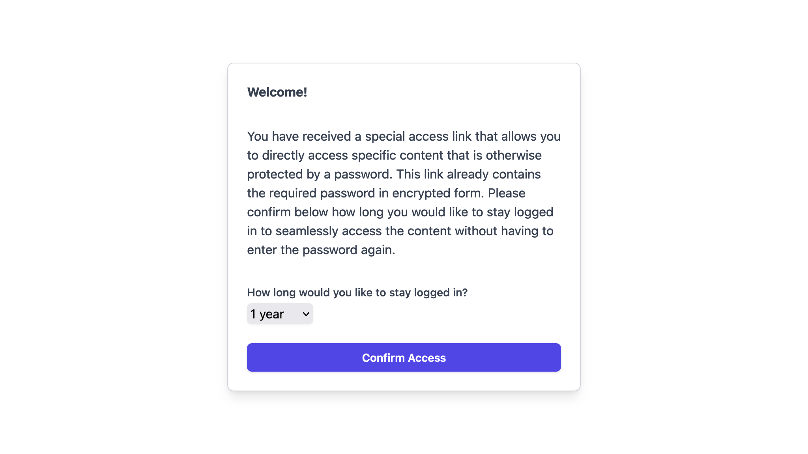

Ensuring the security of your WordPress content is essential, especially when sharing sensitive information. To address this need, I’ve developed [Password Protection with Shareable Links](https://github.com/klausbreyer/password-protection-shareable-links), a WordPress plugin that allows you to protect any post, page, or custom content type with a password. Additionally, the plugin generates encrypted links that provide direct access to your protected content, bypassing the need for manual password entry. ([WordPress](https://wordpress.org/plugins/password-protection-shareable-links/))

**Key Features:**
- **Password Protection:** Secure any post, page, or custom content type with a password.
- **Shareable Links:** Generate encrypted links for direct access to protected content without manual password entry.
- **Caching Control:** Disables caching on protected content to ensure the password gate displays correctly and updated content is served as expected.
- **Admin Access:** Logged-in administrators can view all normal pages without restrictions.
- **Feed Restriction:** Restricts feed access to prevent unauthorized external access to the site’s content.

For a hands-on test of the plugin, visit the [test installation](https://password-protection-shareable-links.plugiplugi.com/) (password: 1234). Alternatively, access a protected page directly with a shareable link: [Direct Access Link](https://password-protection-shareable-links.plugiplugi.com/2024/10/25/hello-world/?password=UGxmb1l4NlJoWEM2dFJ3aEZ5Y0wrUT09). Please use incognito mode or clear cookies if the password was previously entered. ([WordPress](https://wordpress.org/plugins/password-protection-shareable-links/))

For more details and to access the source code, visit the [GitHub repository](https://github.com/klausbreyer/password-protection-shareable-links).
