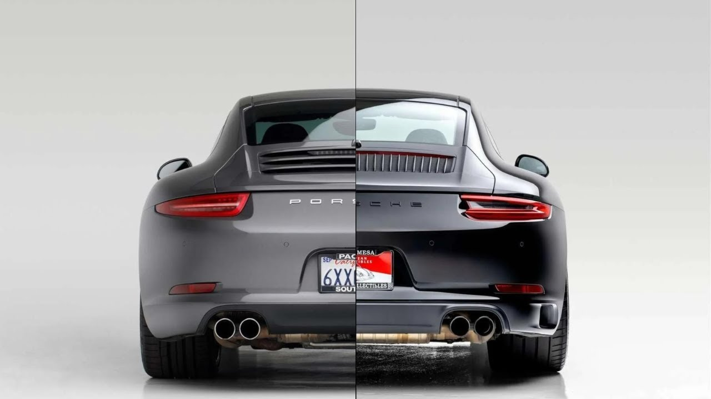
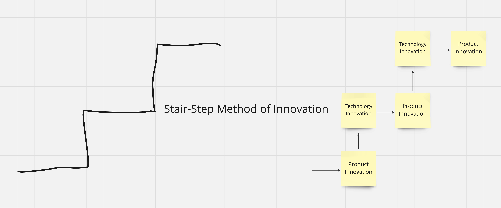

The picture above is from a YouTube video in which [I learned about Porsche's strategy](https://www.youtube.com/watch?v=k0OZ2hhoEkY) for managing innovation. They use a decimal point system for model releases. Instead of launching entirely new cars, Porsche introduces a ".1" model with an updated design but the previous generation's engine. A few years later, they release a ".2" model with the same body and interior but a new engine.

This strategy reduces risks by always using one proven major component. It keeps customers happy with familiar yet advanced models and avoids issues [typical of entirely new (re-) launches]().

I assume that when they think of the .2 for the current generation, they probably already have the .1 draft for the next generation.

So I wonder - how does this apply to product and tech strategy?

## Boring Tech for Innovative Customer Value

Suppose I launch a completely new product or make innovative changes to something that provides customer value.

In that case, I will not use entirely new experimental technologies that no team member has worked with. Instead, [I will use boring tech](https://boringtechnology.club/) that has long been proven and with which every developer is familiar.

## Innovating Tech While Retaining Customer Experience

Often, developers refactor large parts while changing the functionality simultaneously, resulting in chaos.

(This is the most crucial rule for refactoring, and everyone almost always ignores it. It is so tempting. I get it. But it needs strong leadership to enforce it.)

In such a case, the team needs test coverage to ensure the experience remains the same while innovating on the tech side (or using this opportunity to build test coverage).

## Staircase Approach

This creates a nice staircase—product innovation with proven technology. Improve technology without changing something for the customer.

Of course, it is essential to have at least a rough direction for the following product innovation to innovate the tech accordingly in the right direction.

(Disclaimer: I don't drive one (yet), but I am certainly interested. I am a big car racing fan and became a fan of Porsche while staying on top of electric vehicle developments. I love [how they constantly push the limits](https://www.youtube.com/watch?v=MTh0hEwH1Do) and make them available for the road.)
