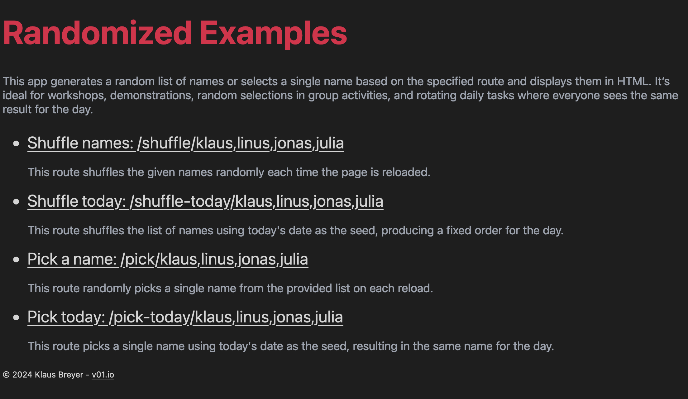

Organizing workshops and group activities often requires randomizing participant lists to ensure fairness and engagement. To facilitate this, I’ve developed [randomized](https://github.com/klausbreyer/randomized), a Go-based web application that shuffles and displays names in a random order. This tool is particularly useful for assigning tasks, forming teams, or selecting individuals randomly during events.

[randomized](https://github.com/klausbreyer/randomized) operates as a web server, allowing users to input a list of names via the URL. You can try it out on the live example [here](https://randomized.fly.dev/). Upon accessing the specified route, the application processes the names and presents them in a randomly shuffled sequence on a simple HTML page. This ensures an unbiased and transparent method for random selection, enhancing the interactive experience in group settings.

For more details and to access the source code, visit the [GitHub repository](https://github.com/klausbreyer/randomized).
