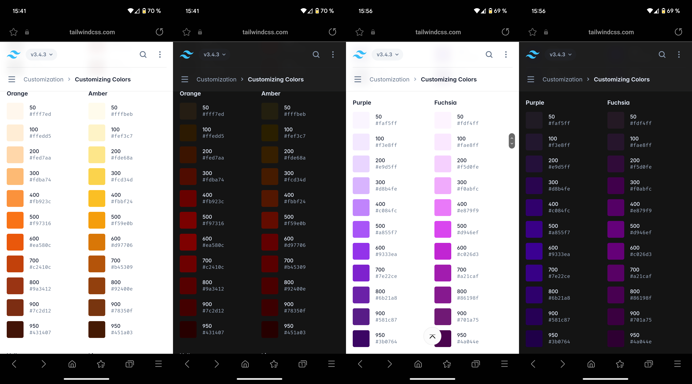

**TL;DR:** Samsung Internet's dark mode ignores CSS for `prefers-color-scheme: dark`, instead renders light theme CSS and applies a proprietary transformation algorithm to simulate dark mode. This leads to unintended visual outcomes on websites, disrupting carefully designed user interfaces.

## Context

As the Head of Product and Technology at [edding AG](https://edding.com), I manage a team that owns the [easycheck](https://easycheck-by-edding.com/) product. Part of it is a mobile-only frontend for driver's license verification, so the team is used to facing continual challenges with mobile web environments. However, there is a significant issue with the Samsung Internet browser and its forced dark mode.

## Identifying the Problem

Samsung's forced dark mode, intended to facilitate nighttime reading and conserve battery life, automatically alters websites' color schemes without allowing developers to influence them. While well-meaning, this feature can distort the design and usability of web applications, especially when precise visual presentation is critical.

This became problematic when we attempted to place dark text over an animated bright video for a tutorial. The forced dark mode changed the color of the text but to almost no extent the tone of the background, making it nearly invisible against the bright background.

I have reproduced this issue in a detailed example to understand the behavior.

Try it for yourself: [Live](https://klausbreyer.github.io/samsung-internet-dark-mode/) / [Github](https://github.com/klausbreyer/samsung-internet-dark-mode).

The results:

- Everything that is behind `prefers-color-scheme: dark` is ignored.
- Everything that is behind `prefers-color-scheme: light` is rendered.
- Texts and Backgrounds are changed by an unknown algorithm.
- Videos, Images, and SVGs are toned down, which makes sense. Inverted pictures would look really stupid. The funny thing is that even when a CSS class colors an SVG, it still counts as an image resource and behaves like an image, not like text that is colored by a CSS class.

I don't know what algorithm they use, but it is bonkers and unforseable. In general, brighter colors (yellow, orange) seem to be more inverted, but other colors (blues, greens, purples) are just a little bit toned down.

## Expected Behaviour

As a heavy dark mode user (mainly on iOS), I don't have a problem with the magic that Samsung applies here - for websites with only a light and no dark theme! But when website developers provide a dark theme via [a preferred color scheme](https://developer.mozilla.org/en-US/docs/Web/CSS/@media/prefers-color-scheme), it should always be preferred (hence the name!), and a forced dark mode should only be a fallback. Currently, Samsung ignores web standards, and developers can't override this.

## Seeking Resolution

I hope it is a bug because they mention a (in my opinion, more) correct behavior on  [Samsung Internet's blog](https://developer.samsung.com/internet/blog/en/2020/12/15/dark-mode-in-samsung-internet).

Besides that, nobody on  [Stack Overflow](https://stackoverflow.com/questions/66094087/samsung-internet-forces-dark-mode) can find it out, and  [Hacker News](https://hn.algolia.com/?q=samsung+internet+dark+mode) also lacks an outrage about this topic.

I contacted the lead developer of the forced dark mode feature at Samsung Internet. However, he has not been associated with Samsung for over four years and redirected me to his boss, whom I have now contacted.

This letter calls Samsung to urgently address and rectify their browser's forced dark mode functionality. Developers must be able to control how their sites are displayed to ensure all users, especially in specialized B2B applications like ours, receive the intended experience without compromise.

## Call to Action

I encourage everyone to try this out and visit the product they are responsible for in a Samsung internet browser (it can be downloaded for every Android phone, not just Samsung).

Also, Please challenge my [code](https://github.com/klausbreyer/samsung-internet-dark-mode). Perhaps I have made an error, and there is a way to make it work correctly after all?

## Update, 2024-07-09:

After this article, I investigated who could be responsible for this. After a couple of relays, I was able to contact the lead developer of the Samsung browser and exchange some mail (and, most importantly, a support ticket) with him.

The good news:
They now offer an experimental flag for an "Enable Adaptive Force Dark". **This adaptive Dark mode respects the preferred color scheme!**

Everybody can activate it via [internet://flags/#enable-adaptive-force-dark](internet://flags/#enable-adaptive-force-dark) in the beta v26 or newer.

They have not provided a release timeframe for the feature. However, based on my experience with browser feature flags, I expect it to be generally available in 1-2 years, possibly by 2026.

