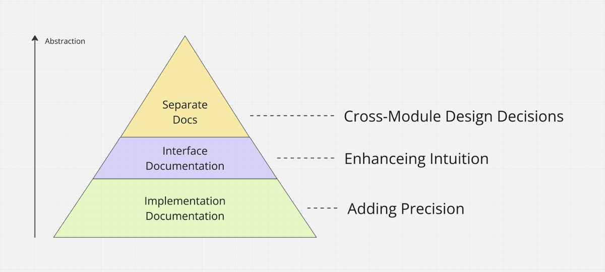

Hopefully, every development team reaches a point where they discuss their guidelines and policies. Part of this discussion, hopefully, includes expectations around documentation.

So far, so good. Unfortunately, many teams (and I have made this mistake in the past as well) take the easy route and claim they don't need extensive documentation if they write self-documenting code. Besides the fact that this is just an easy way to avoid a discussion (because everyone interprets this differently), it is just plain wrong. Let's debunk this myth.

## I Call Bullshit

If users have to read a method's code before they can use it, that's not an abstraction! Good abstractions must be documented outside the actual code, or they do not abstract anything at all.

## Implementation Documentation for Precision

Documentation should be as close as possible to the code for the nitty-gritty details. At the bottom level, this includes variable units, boundary conditions, null value implications, resource management, and invariants. These specifics are essential to ensure a precise understanding and correct code usage.

## Interface Documentation for Abstractions

Striking the right balance with documentation is crucial. Interfaces should not be cluttered with implementation details. Instead, higher-level comments should enhance intuition by explaining concepts and the rationale behind the design.

## Central Documentation for Cross-Module Design Decisions

Ultimately, more than code alone will be required for documenting cross-module design decisions. I prefer central documentation referencing all relevant code sections, such as "See XYZ" annotations. This centralized approach ensures that anyone can understand the broader design context, which can only be captured partially through code.

True clarity comes from well-placed comments and good documentation at the right level.
