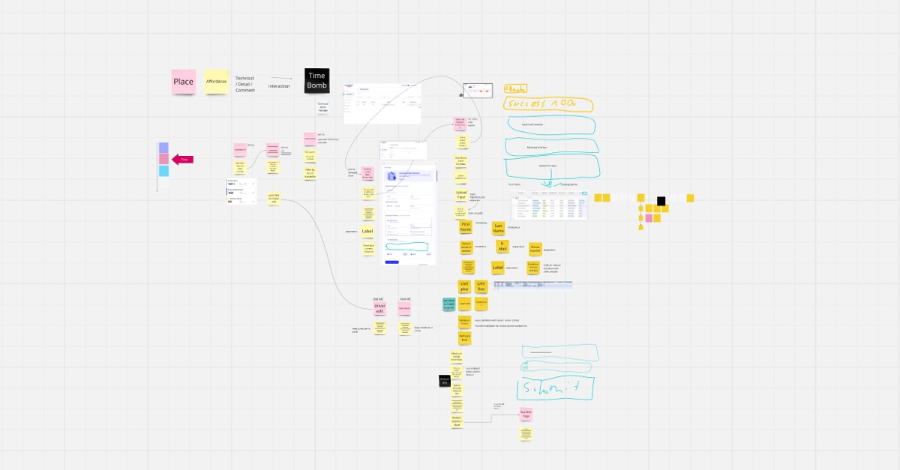

Marty Cagan has been vocal in his books and [online](https://www.svpg.com/discovery-when-working-remotely/) about his belief in co-locating empowered product teams. While I respect him and am fundamentally thankful for everything he shares on empowered product teams, I disagree with him on this precise aspect.

First, I understand why he takes this position. Many managers who haven't seen a robust remote culture in action assume it's impossible, [pushing for a return to the office policy](https://www.forbes.com/sites/karadennison/2024/07/10/how-return-to-office-policies-are-impacting-employees-in-2024/). They've been burned by their remote experiences—and not without reason. In year 4, after COVID-19, most organizations have failed at remote work.

- They have not taken this unique opportunity but failed at implementing a remote-first culture.
- Therefore, employees treat hybrid setups with 1-2 days of "home office" as a chance for personal downtime rather than serious work, making the issue worse.
- When senior leadership consistently works from the onsite office, it sends a clear message: being present in person gives employees an edge. This undermines any attempt to build a meaningful remote culture.

But it is not a failure of remote work—it's a failure of leadership and organizational design.

Strong remote teams are possible, and Shape Up is the framework that makes it happen. Created by [37signals, a fully remote company](https://37signals.com/podcast/the-challenges-of-remote-work/), [Shape Up](https://basecamp.com/shapeup) provides the tools and structure for remote, empowered product teams to thrive.

## Shaping Sessions

Shaping sessions are crucial to making remote work. These sessions bring together the senior product team—product, engineering, and design—to collaboratively shape features at a high level. There are no endless Figma screens thrown over the wall to the developers or detailed tickets; there are just tools like [breadboarding and fat marker sketches](https://basecamp.com/shapeup/1.3-chapter-04) to shape ideas quickly and effectively without going into too much detail too early. (Small, autonomous teams of designers + developers then figure out the details.)

Shaping sessions are perfect for remote work. Tools like Miro make collaboration seamless. In fact, I've never run a shaping session in person.

A typical flow involves 2-3 hours of shaping, then some asynchronous work on spikes, and reconvening for another session. It's efficient, focused, and remote by design.

## Small, Autonomous Teams

Small teams of 2-3 (designer + developer) working independently are a no-brainer in a remote setup.

[Because communication scales exponentially](https://www.corporate-rebels.com/blog/metcalfe-law), These teams can communicate informally and remain highly productive.

The key is ensuring they work end-to-end on the same scope simultaneously, like [cake layers](https://basecamp.com/shapeup/3.3-chapter-12).

## Appetite, Not Estimates

Shape Up shifts from traditional estimates to [appetite](https://basecamp.com/shapeup/1.2-chapter-03). Instead of asking, "How long will this take?" teams ask, "How much time do we want to spend?"

The scope is then adjusted to fit the timebox because the tradeoffs are discussed at the beginning of the shaping session—not at the end when the developers run out of time.

Mastering this skill ultimately helps with the main angst of their managers - that they can only control people if they can see them in their chairs in the office. Because it is like a contract: something (the best version) will be delivered after the timebox.

## It is all about Leadership

What makes remote teams succeed isn't just the framework. It's leadership. Staying connected with teams, conducting effective check-ins, bridging gaps, showing progress, and facilitating decisions are all classic leadership tasks. They're necessary whether you're onsite or remote. But for remote, you need another toolset; it is more like a facilitator. And we need more remote leadership skills out there!

## The Future Is Remote

Most startups I mentor or advise today are remote by default. It's not a question of whether remote teams will become the standard—it's just a matter of time.

The companies that embrace this shift, invest in frameworks like Shape Up, and build remote solid cultures will thrive. The rest will be left chasing outdated models, forcing the ass of their employees into the chair to retain control.
