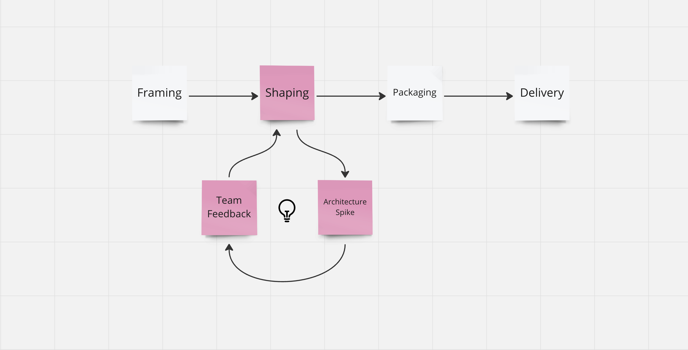

I often discuss how and when to address software architecture while building a new feature. I answer this here with the terminology of Shape Up, but the answer is not specific to Shape Up but applies generally (however you call this stage your process).

TLDR: Architecture needs to be addressed during the shaping of an feature. Only then can the implementing team work autonomously during the delivery cycle. It would be unfair to throw things at the team, without even remotely clarifying how to implement them.

I have outlined the Shape Up process above in white stickies: Framing → Shaping → Packaging → Delivery.

With pink stickies, I highlighted a sub-cycle I use for software architecture.

## Shaping

One core idea behind Shape Up is having all the necessary people from the start to shape a product :

- A senior engineer, whom I often call the tech lead, excels at coding and *is willing to participate* in discovering a feature.
- A senior designer focused on interaction design.
- Someone with access and knowledge about the customer (most of the time called "Product Manager")

In this group, an idea is collaboratively "shaped," meaning Mitigating risks and defusing ticking time bombs (which could blow up later during delivery). However, there's a constant battle against diving into details too early.

Furthermore, in Shape Up, there are no estimates (fixed scope that ends up with variable time), only an "appetite (fixed time, variable scope)." It's about how many resources one wants to invest. For example, two programmers and one designer should spend six weeks on this.

## Architecture Spike

When I assume the role of tech lead, I always address the feature's architecture during the shaping phase. I use tools like Miro or write an [Architecture Decision Record](https://github.com/joelparkerhenderson/architecture-decision-record/) (ADR) and consider how we will implement the feature.

## Team Feedback

Then, I present this ADR to my team and discuss my initial approach with them. The team then gave me valuable feedback on where my thoughts were flawed.

## Loop

With the team's feedback, I refine my architecture.

Better informed, I dive into the next shaping meeting, being able to shape the feature in question more earnestly and concretely and make sure it fits the appetite.

And as always with shaping, there comes a point again when you can't go any further. Then, with new knowledge about the feature, I go back to the drawing board, optimize my architecture, discuss it with the team once more, and go back even more informed.
