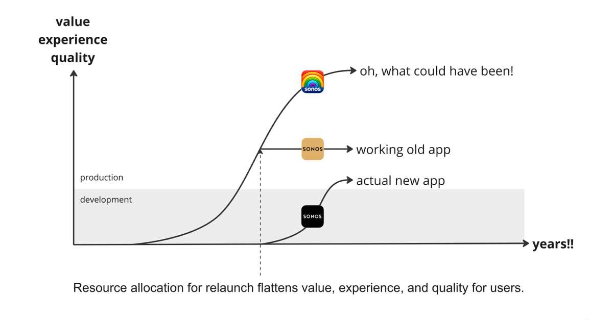

I have been a loyal Sonos customer for years, with several thousand euros of Sonos hardware in my home. For years, there have been big complaints about the Sonos app quality: too slow, poor search functionality, etc.

I've defended the app and the concept to my wife for almost a decade: Fundamentally, the idea that the speakers fetch music from the internet is superior to streaming audio content via AirPlay.

So, I have a vested interest in having a functional app!

Unfortunately, even after a major relaunch, Sonos still hasn't managed this, and the internet is in an uproar: [The new app is a dumpster fire](https://www.reddit.com/r/sonos/s/kPXqQcLcCA).

Sonos themselves claim that the relaunch took "[courage](https://www.macrumors.com/2024/05/10/sonos-said-rolling-out-widely-criticized-app-redesign-took-courage/)."

But courage from Sonos doesn't help me as a customer. A good product strategy would, though.

At the most fundamental level, developing a digital product is about continuously investing resources (time and money) into continuously increasing value for the user through a better experience and higher quality.

## Theory

## What Sonos Did

- They redesigned the app from scratch.

A major error.

Now, all users are overwhelmed with a new app, can't find features, or the features don't exist yet. Sonos didn't use its resources to tackle actual quality problems.

When Sonos started using resources to develop the new app, they stopped providing better value, experience, or quality for existing customers.

## What Sonos Should Have Done Instead

- Many small releases.
- Engage in dialogue with customers and understand their problems.
- Address quality and performance issues in parallel.

Sonos should have gradually worked towards a higher joint value, experience, and quality bar.

Even a big relaunch vision can and should be implemented in thousands of minor releases, addressing thousands of small risks, tested on multiple small user groups, and learned from that.

Is it easy? Definitely not. But it is well worth it.

And it takes the product organization to the next level.
