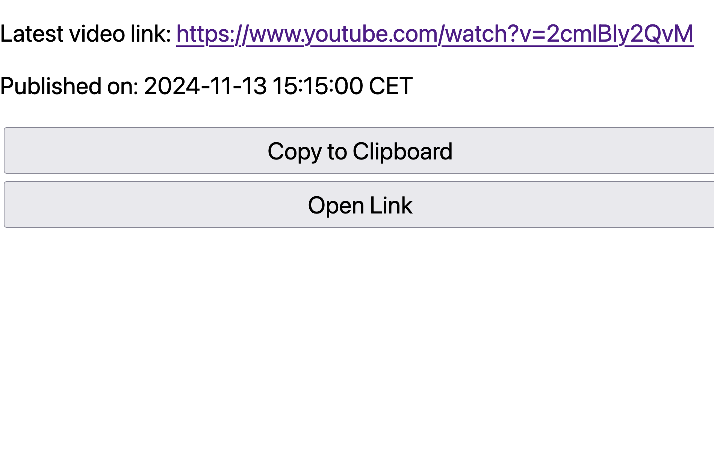

As a Formula One fan, I often find it challenging to avoid spoilers when following YouTube channels like Sky Deutschland. They frequently post videos with clickbait or even reveal race results in the title, which can ruin the experience for those of us who want to watch later.

To tackle this, I created [Unspoiled](https://github.com/klausbreyer/unspoiled), an open-source tool that fetches and displays the latest video from a specified YouTube channel without exposing spoilers. This way, I can stay updated without the risk of unintended spoilers.

You can see an example of this in action with the Sky Deutschland channel: [Latest Video](https://unspoiled.fly.dev/latest?regionCode=DE&channelId=UCmaItsxNPLEQ-NIjv5gPScg).

For those interested, the project is available on [GitHub](https://github.com/klausbreyer/unspoiled) for further exploration and contributions.
