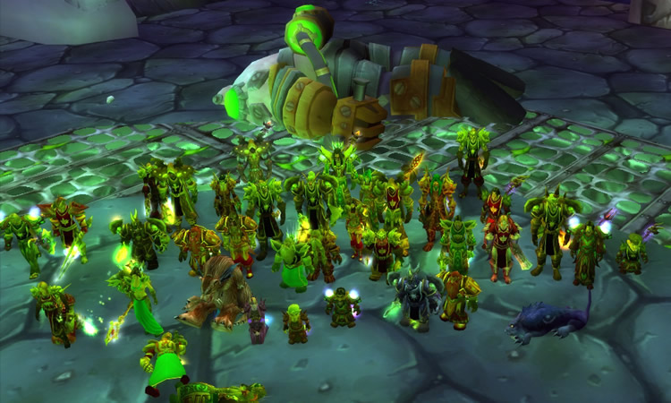

I often state that I have over 20 years of experience leading remote teams, which, if you do the math, means since 2004.

The catch: I’ve been at it since I was 16, but I was leading remote teams while playing World of Warcraft.

Without this spoiler, you would have been impressed.

While I know the title sounds cheezy, especially since the ‘[I proposed [and] here’s what I learned about B2B sales’](https://cheezburger.com/25743109/i-proposed-and-heres-what-i-learned-about-b2b-sales-linkedin-lunatic-uses-a-marriage-proposal-as-a) incident, playing World of Warcraft was a serious affair for me back then. And not just for me, but for a lot of players who took this game more seriously than their job (or school).

I was in the leadership of the guild and had led numerous raids. I played it quite successfully back then, and it was not less competitive than establishing a digital product in a market.

We had to coordinate 40 people, not just during the scheduled raid times, which occurred several times a week. In between them, everyone needed to do their homework, prepare the in-game character with necessarypotions, or be informed about strategies.

Here are the lessons learned:

- **Interpersonal Relationships Matter**: A team needs to function as a unit. You have to like each other.
- **Not Everybody is Made for Remote Work**: Good communication skills are essential.
- **Team Is Crucial:** Rely on the Reliable and boot the troublemakers. You need good taste in people and to coach those with potential (who have skill + reliability).
- **Tools Are Crucial**: Back in WoW, we had add-ons to aid us through our battles. Now, it is essential to master the "remote stack" (Slack, Miro, Confluence, Google Docs, etc.).
- **Objectives Are Essential**: Strategy is critical. The world is vast, and the context is ever-changing (basically, with every patch level). Often, there were multiple options to bring a raid group to the next level.
- **Work-life balance**: You might think this wasn't an issue back then, but it was. People had families, friends, and hobbies. Their raid group needs to match their personal life as well. In remote teams, choosing an employer that fits the individual lifestyle is even more crucial.

This playful yet pointed approach to remote team management might make you smirk. Still, don't underestimate the lessons learned from leading virtual legions through pixelated peril—it's serious business.

If I could choose who would join one of my product teams nowadays, I would always choose the multiplayer veteran.

(In case you are wondering, I was a (human) priest.)
