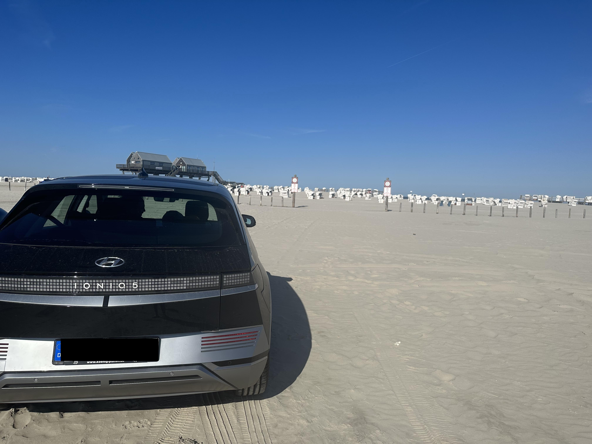

Nach drei Jahren und 42.000 km von Kopenhagen bis Maranello mit dem IONIQ 5 möchte ich einmal meine Erfahrungen teilen – die guten, die weniger guten und die Gründe, warum ich mich jetzt für ein neues Auto entschieden habe.

## Defekte

Insgesamt hatte ich vier Rückrufaktionen. Dafür musste ich quer durch Berlin zum Händler fahren, meist während der Rushhour.

Nach nur wenigen Wochen ging das Schnellladen nicht mehr. Ich glaube, eine Sicherung war kaputt. Das dauerte jedenfalls fünf Wochen, in denen wir uns als Familie in einen Kona als Ersatzwagen quetschen mussten, den wir zum Glück aus Kulanz vom Händler bekommen haben.

## Verarbeitungsqualität

Nach 1,5 Jahren hat alles angefangen zu klappern. Manchmal musste ich an der Kreuzung die Fahrertür öffnen und wieder schließen, damit das Klappern aufhört. Gurte schlagen gegen irgendwas. Es war nie ruhig, und meine Frau und ich sind beide akustisch empfindlich.

Das Lederimitat ist ebenfalls enttäuschend. Es gibt noch immer Flecken von Sonnencreme. Das mitgelieferte Netz im Kofferraum? Die Haken sind schnell abgebrochen.

Die Heizung riecht nach Plastik. Anfangs dachte ich, das sei normal, weil das Auto neu ist. Aber auch nach drei Jahren wurde es nur minimal besser.

Die Lackqualität: Es gibt unzählige Steinschläge auf der Motorhaube, und an mindestens zehn Stellen ist der Lack abgeplatzt.

## Lüftung

Eine grauenhafte Kleinigkeit, die aber nervt. Es ist unmöglich, sie so einzustellen, dass sie einem nicht ins Gesicht pustet, ohne dass sie komplett wirkungslos ist. Zudem reguliert die Richtungseinstellung gleichzeitig die Menge, was einfach unpraktisch ist. Hier wollte der Hersteller besonders clever sein, aber hier hätte mehr die Funktion und weniger das Design im Fokus stehen sollen.

## Software und Bedienung

Beim Hochfahren dauert es ewig (manchmal bis zu 30 Sekunden), bis das Touchdisplay endlich Input entgegennimmt. Und dann muss man erst mal die AGB bestätigen. JEDES MAL. Vorher kann man nicht mal die Sitzheizung anmachen. Supernervig.

Das Fehlen von genügend haptischen Tastern ist ja inzwischen leider Standard, erwähne ich aber trotzdem noch mal, da manche Hersteller es ja hinbekommen.

## Assistenzsysteme

Der Autobahnassistent ist schlicht schlecht. In Kurven mit Verkehr denkt das Auto ständig, es gäbe ein Hindernis, und bremst abrupt ab. Auf deutschen Autobahnen bei höheren Geschwindigkeiten (ab 160 km/h) oder auf Alpenautobahnen ab 120 km/h ist das extrem nervig – vor allem für meine Mitfahrer. Meine Frau findet es stressig, und eines unserer Kinder, das auf langen Fahrten manchmal ohnehin anfällig fürs Übergeben ist, findet es besonders schlimm.

Auch auf Landstraßen ist das Spurhalten stressig. So stressig, dass ich es regelmäßig komplett deaktiviere. Man kämpft konstant gegen das Lenkrad, und wenn man es machen lässt, schaukelt es ständig zwischen rechts und links.

## Laden und Verbrauch

Er lädt super schnell. Und genau das macht das Auto auf langen Strecken praktikabel. Aber: Man verbringt ja viel mehr Zeit im Auto, als dass man mit Laden verbringt. Deshalb habe ich bei meinem nächsten Auto auf die Fahrt optimiert und nicht auf die Ladestopps.

## Fazit

Grundsätzlich ist der IONIQ 5 ein gutes Elektroauto mit mehr als genug Platz für unsere Familie mit zwei kleinen Kindern. Man kann auch niemandem wirklich davon abraten, denn man bekommt eine Menge Auto für das Geld – zumindest zum damaligen Preis. Aber wer sich an Kleinigkeiten stört und die Möglichkeit hat, viel Geld auszugeben, wird auch einiges finden, was stört.

Großartig und erwähnenswert ist vor allem das Raumkonzept. Ohne Kardantunnel und ohne Mittelkonsole, die ein Getriebe beherbergen muss, hat man so unglaublich viel Platz – vorne und hinten. (Und man kann auch mal bequem vom Beifahrersitz einsteigen und durchrutschen.)

## Und jetzt?

Der IONIQ 5 war ein toller Start in die Elektromobilität – inklusive aller oben erwähnten Punkte. Elektro ist die Zukunft.

Allerdings bin ich überhaupt kein Freund von SUVs. Zwei Drittel meines Leasingzeitraums habe ich bereits mit der Recherche nach dem nächsten Auto verbracht, und jetzt kann ich sagen: Das perfekte Auto gibt es noch nicht. Jeder Hersteller nimmt bewusst sehr grobe Trade-offs in Kauf.

Schlussendlich habe ich mich dazu entschieden, das Problem jetzt mal vom anderen Extrem her anzugehen, und ich sehne mich einfach wieder nach einem BMW: Deshalb wird das nächste Auto ein rechts-unten ausgestatteter BMW i4 M50 (Jahreswagen) werden.

Mir ist klar, dass ein i4 nicht so schnell lädt wie ein IONIQ 5. Aber die Coupé-Bauform spricht für sich, denn er braucht auch nicht so viel – sodass ich den Kompromiss gerne eingehe.

Aber ehrlich gesagt: Das Laden war für uns nie ein Problem. Wir hätten immer noch zehn Minuten länger stehen können. Die Stunden zwischen den Ladevorgängen, in denen man im Auto sitzt und genervt ist – vor allem vom Autobahnassistenten und der Lüftung – sind das eigentliche Problem.

