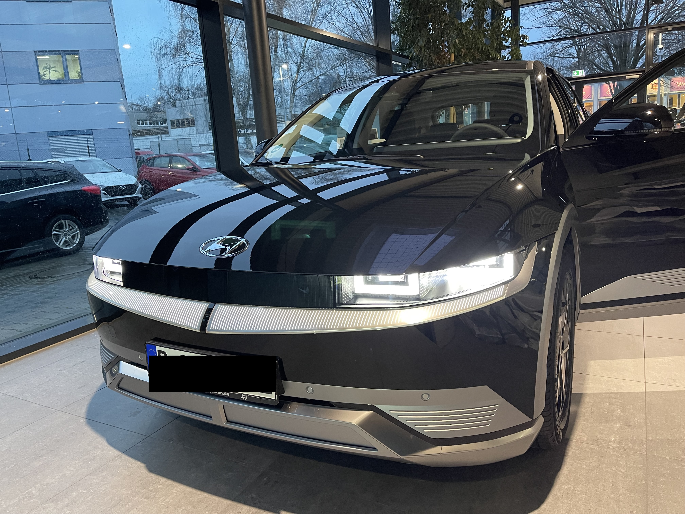
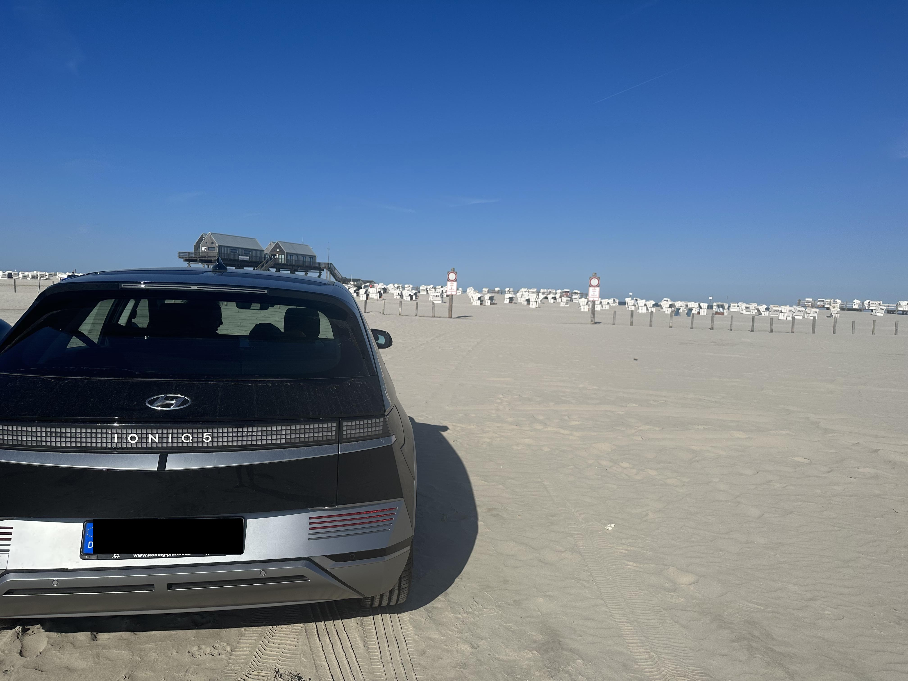

After three years and 42,000 km from Copenhagen to Maranello with the IONIQ 5, I'd like to share my experiences – the good, the not-so-good, and the reasons why I've now decided to get a new car.

## Defects

I had four recall actions in total. For these, I had to drive across Berlin to the dealer, usually during rush hour.

After just a few weeks, fast charging stopped working. I think a fuse was broken. Anyway, it took five weeks, during which we had to squeeze our family into a Kona as a replacement car, which we fortunately received from the dealer as a courtesy.

## Build Quality

After 1.5 years, everything started rattling. Sometimes I had to open and close the driver's door at intersections to stop the rattling. Seat belts hit against something. It was never quiet, and both my wife and I are acoustically sensitive.

The faux leather is also disappointing. There are still stains from sunscreen. The included net in the trunk? The hooks broke quickly.

The heater smells like plastic. At first I thought that was normal because the car was new. But even after three years, it only got minimally better.

The paint quality: There are countless stone chips on the hood, and the paint has chipped off in at least ten places.

## Ventilation

A horrible little thing that's annoying. It's impossible to set it so it doesn't blow in your face without being completely ineffective. Plus, the direction setting simultaneously regulates the amount, which is simply impractical. Here the manufacturer wanted to be particularly clever, but function should have been more in focus than design.

## Software and Operation

When starting up, it takes forever (sometimes up to 30 seconds) until the touch display finally accepts input. And then you have to confirm the terms and conditions. EVERY TIME. Before that, you can't even turn on the seat heating. Super annoying.

The lack of enough haptic buttons is unfortunately standard by now, but I'll mention it anyway, since some manufacturers do manage it.

## Driver Assistance Systems

The highway assistant is simply bad. In curves with traffic, the car constantly thinks there's an obstacle and brakes abruptly. On German highways at higher speeds (from 160 km/h) or on Alpine highways from 120 km/h, this is extremely annoying – especially for my passengers. My wife finds it stressful, and one of our children, who is sometimes prone to motion sickness on long trips anyway, finds it particularly bad.

Lane keeping is also stressful on country roads. So stressful that I regularly deactivate it completely. You constantly fight against the steering wheel, and if you let it do its thing, it constantly sways between right and left.

## Charging and Consumption

It charges super fast. And that's exactly what makes the car practical on long trips. But: You spend much more time in the car than you do charging. That's why I optimized for the drive in my next car, not for the charging stops.

## Conclusion

Basically, the IONIQ 5 is a good electric car with more than enough space for our family with two small children. You can't really advise anyone against it, because you get a lot of car for the money – at least at the price back then. But anyone who gets bothered by little things and has the opportunity to spend a lot of money will also find things that bother them.

Great and worth mentioning is above all the space concept. Without a driveshaft tunnel and without a center console that has to house a transmission, you have so incredibly much space – front and back. (And you can also comfortably get in from the passenger seat and slide through.)

## And Now?

The IONIQ 5 was a great start into electromobility – including all the points mentioned above. Electric is the future.

However, I'm not a fan of SUVs at all. I spent two-thirds of my lease period already researching the next car, and now I can say: The perfect car doesn't exist yet. Every manufacturer consciously accepts very rough trade-offs.

Ultimately, I decided to approach the problem from the other extreme now, and I simply long for a BMW again: That's why the next car will be a right-hand drive BMW i4 M50 (used car).

I'm aware that an i4 doesn't charge as fast as an IONIQ 5. But the coupe body style speaks for itself, as it doesn't need as much – so I'm happy to make that compromise.

But honestly: Charging was never a problem for us. We could have stood there for ten minutes longer. The hours between charging sessions, when you're sitting in the car and annoyed – especially by the highway assistant and ventilation – are the real problem.

