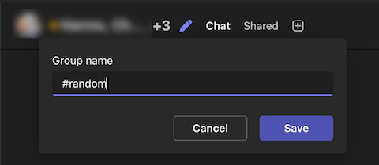

I've ranted about Teams often enough. As much as that always generates good LinkedIn engagement ([here](https://www.linkedin.com/posts/klaus-breyer_how-do-you-make-ms-teams-usable-ive-complained-activity-7300880574569697280-s-OS/) and [here](https://www.linkedin.com/posts/klaus-breyer_am-i-the-only-one-struggling-to-use-ms-teams-activity-7264615223251156994-gE_l/)), I can provide a remedy this time.

To summarize the rants, MS Teams has multiple UX challenges:

- Forced threaded conversations make casual, spontaneous exchanges cumbersome.
- Older replies bump threads to the top, burying new updates.
- Public visibility in channels often makes users hesitant, reducing open discussions.
- Lost transparency because people default to direct messages instead of discussing things publicly.

Slack handles all of this elegantly by making threads optional, keeping the flow of communication by default lightweight.

## The Solution: Strategic Use of Channels and Chats

We broke the paradigm of using channels for everything and created multiple topic-based group chats to emulate Slack's lightweight feel within Teams:

- **Group chats** where we want fast, easy, and casual communication: roughly one channel per team.
- **Channels** where structured conversion is helpful: support cases and alerts.

**Rules:**

- Everyone joins all official channels (documented in confluence) while muting irrelevant channels to their day-to-day tasks.
- Pinning essential group chats or organizing them into new custom sections keeps channels in place to prevent them from being moved down after inactivity.

## The Channel Creation Hack

Teams prevent creating multiple group chats with identical member lists. Our workaround? **Create the channel initially with one member missing, and give the channel a custom name** before adding the missing member afterward.

We decided to name every channel with a hashtag to make it more straightforward that they are permanent.

Voilà - we have built our own Slack!

## In Remote, Context Matters

Why go through all this trouble? Remote teams face unique challenges.

Office workers can compensate for MS Teams' poor user experience. Information naturally spreads around in an office setting, sometimes even the information you don't want to spread ;)

However, in a remote team, communication must be intentionally designed to be effective.
