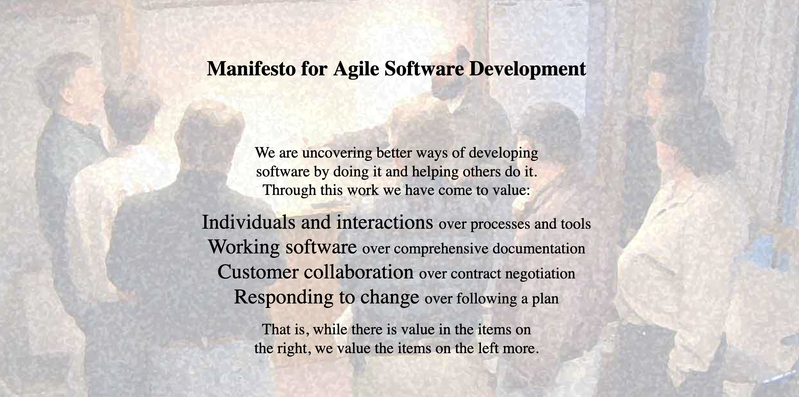
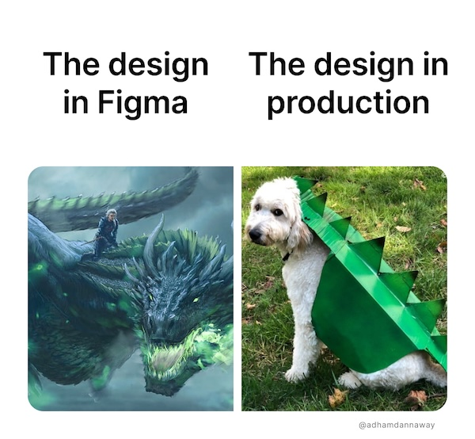
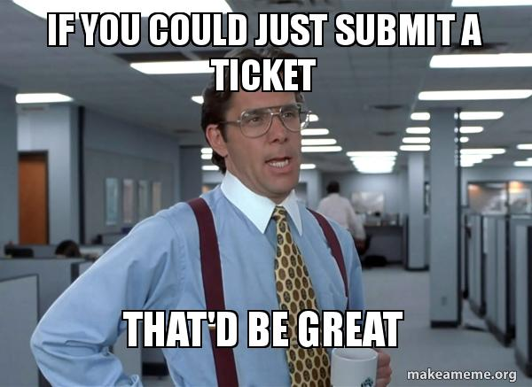
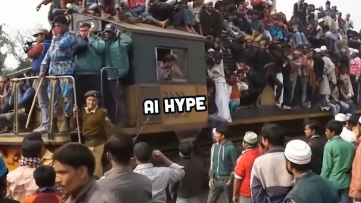

> Agile now means, we do half of Scrum poorly and Use Jira.

(Andy Hunt, [2017](https://x.com/tobyglaser/status/923177806527205377))

## Coders had a vision, but business took over.

Remember the [Agile Manifesto](https://agilemanifesto.org/)? It wasn't about Jira tickets or stand-up meetings. It was about values—like individuals and interactions over processes and tools.

But somewhere along the way, Agile got hijacked.

Coders had a vision, but business took over, and Scrum became the interface between business and engineering.

Scrum cared about:

- Managing the whole team
- Planning  Game
- Acceptance Tests
- Small Releases

I hate to break it to you, but those are business practices, not software engineering ones.

Scrum doesn't mention and doesn't care about:

- Continuous Integration
- Collective Ownership
- Test Driven Development
- Pairing
- Refactoring
- Simple Design
- Sustainable Pace
- Metaphor

# Agile became a micromanagement tool.

With everything managed in one big backlog, strategic resource allocation is impossible.

All too often, "urgent" requests just became "planned urgent" requests at one point, causing Developers to make tradeoffs at the last minute without context.

And like [Stephan Schmidt pointed out, caused by the pressure,](https://www.amazingcto.com/why-we-always-endup-with-waterfall-even-scrum/) teams accidentally reinvent the waterfall with extra steps. And in my experience, this happens even in the smallest of teams - starting at the threshold of 3 people. A designer creates all 30-40 figma screens of a feature initiative at once instead of working together with the engineers on the same thing simultaneously.

But not only designers are to blame. Engineers with a "Just write me a ticket" attitude are also part of the problem.

The ticket system is where collaboration goes to die: One side writes. The other side implements. Everyone stops thinking beyond the edges of their responsibility.

Sometimes, this makes sense. When the problem is well-understood or when there are a lot of different requests (reactive work).

But when building software together—interdisciplinary, exploratory, and user-driven—it's a disaster.

## We Don't Just Have Silos. We Have Chaos.

In theory, silos mean peaceful focus: everyone doing their 8-hour shift.

But in reality, it's a _Hyperactive Hive Mind:_

Everyone needs something from someone else right now. So everybody pings each other on Slack, interrupting deep work across the team. No one can move forward without pulling five others out of their flow.

Cal Newport coined this term in his brilliant book [A World Without Email.]()

## And no, AI won't save us here.

It could worsen it: Besides engineering, UX and AI must collaborate to make meaningful products. That does not work with a handoff; this needs true collaboration among disciplines.

## The Real Challenge: Who Makes What Decision, When, and With Whom?

Building software means making decisions in continuously evolving systems. That's what makes it hard—and beautiful. But it also means the [assembly-line metaphor](https://www.v01.io/posts/2025-software-assembly-line-design-process/) is fundamentally broken.

We need new ways of working that reflect our craft's creative, adaptive nature. We need to rethink how we are slicing work to make it fit small, interdisciplinary teams that can drive their own decisions.

Explaining those principles and giving tools is at this blog series's core.

---

**The Move Fast and Break Silos Series:**

- Chapter 1: [Building Software Isn’t an Assembly Line. It’s a Design Process.]()
- Chapter 2: [Tickets Create Silos]()
- Chapter 3: Slicing Work
- Chapter 4: Aligning Teams
- Chapter 5: Scaling Orgs
- Chapter 6: Emancipating People

Image Credits:

- [Honk Meme](https://www.reddit.com/r/IdiotsInCars/comments/es2fxz/saw_this_posted_on_fb/)
- [Figma Design](https://www.reddit.com/r/FigmaDesign/comments/16hh6k4/is_it_just_me/#lightbox)
- [Jira Meme](https://makeameme.org/meme/if-you-could-rjhp2x)
- [AI hype train](https://www.youtube.com/watch?v=Nl7aCUsWykg&t=132s)
