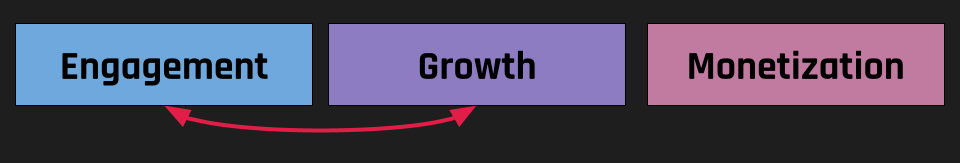
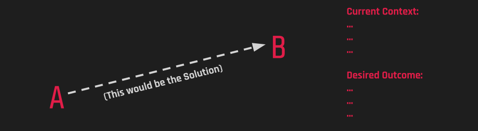
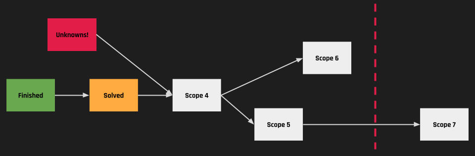

Building software is [fundamentally different from manufacturing](). Software development is an exploratory and creative process where decisions are made continuously within evolving systems. Rigid assembly-line thinking focusing on ticket-driven workflows is not suited and only [creates silos]().

To empower small, interdisciplinary teams, we need to rethink how we slice work so that it aligns with the way we build software. This chapter lays out the first principles and practical tools for slicing work effectively.

## Slicing Objectives

When tackling complex projects, clear objectives are not just crucial; they are the backbone of your project. Force ranking these objectives in order of importance provides a structured way to prioritize what matters most, keeping your team focused and determined to achieve success.

(I am aware that this is easier said than done. However, this is the foundation for everything else. )

## Slicing Problems

## What is your Problem?

First, let's address the most critical principle: differentiating between problems and solutions.

Clearly defining your current context involves understanding your starting point, constraints, and available resources and articulating your desired outcome, specifying exactly what success looks like.

### Variable Scope Guarantees Quality

Scope, quality, cost, and time are interdependent. Allowing scope flexibility within fixed timelines protects quality and maintains realistic cost structures, thereby facilitating sustainable and valuable outcomes. (In [Shape Up](https://basecamp.com/shapeup/1.2-chapter-03), this is called Appetite.)

## Slicing Solutions

### De-Risking

Always reduce uncertainty upfront by identifying unknowns early through research, user interviews, or prototypes. Addressing uncertainties early mitigates risks and enhances project control.

### Always Ready to Cut

Always be ready to cut. Ensure each scope slice is independently shippable. "Done" means deployed, adding immediate value. Regularly test smaller increments for independent release capability, ensuring that functionality is not compromised. This proactive approach keeps your team prepared for any situation.

### Collaboration

Effective collaboration across **Product, Design, and Engineering** is essential. Not just an empty phrase. With the problem clearly defined, start with all 3 of them on a blank slate to design the solution.

Only then is there complete buy-in from all parties, and the team ends up with a solution that not only provides value to the customers but also works.

## Slicing Delivery

Implement by structure, not by person. Distribute tasks based on functional areas to ensure continuity and scalability, promoting end-to-end accountability and clear ownership and fostering effective and timely Delivery.

**To put it more precisely,** never do the entire design, prepare all the APIs, and perform the integration and all the testing at the end. The team will always run out of time or need to make tradeoffs that do not align with the strategic intention.

Do it scope by scope.

## The Full Pictures

Slicing work is just one piece of the puzzle. In the next chapters, I will explain how to align teams around it, scale organizations, and create an environment where people can truly thrive.

---

**The Move Fast and Break Silos Series:**

- Chapter 1: [Building Software Isn’t an Assembly Line. It’s a Design Process.]()
- Chapter 2: [Tickets Create Silos]()
- Chapter 3: [How to Slice Work - First Principles to Build The Product Process]()
- Chapter 4: Aligning Teams
- Chapter 5: Scaling Orgs
- Chapter 6: Emancipating People
