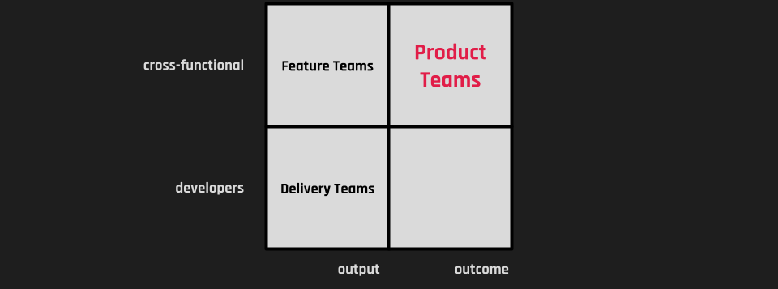

Let's start with one of my favorite quotes:

> Organizations [that design systems] produce designs that mirror their communication structures.

This is Conway's Law  from 1968 and fifty years later, it's still true.

That's why designing systems ([slicing work]()) and designing teams must go hand in hand. If they don't, your architecture will follow your organizational chart rather than your product vision.

## Big Picture: Empowered Product Teams

Empowered product teams ([as of the playbook from Marty Cagan]()) are what I believe is the best default unit for product building:

- **1 Product Manager (not a PO!):** Owns _customer value_ and _business viability risk_.
- **1–2 Designers:** Own _usability_ and _experience risk_.
- **3–8 Engineers (insourced):** Own _feasibility risk_ and _delivery_.

### Why This Shape?

The smallest unit of planning for outcomes that makes sense. This team can run a complete cycle of _Discovery → Delivery_ on their own.

Optimized for value streams and not specialties. The team delivers value _end-to-end without handoffs between "_the designers" or "the engineers." The team owns the outcome together.

## In the Weeds: Optimize for Small Cells in Long Cycles.

[Brooks's Law](https://en.wikipedia.org/wiki/Brooks%27s_law) tells us _communication overhead scales exponentially with team size_.

So, you almost always want fewer people making more decisions together rather than big groups trying to coordinate across silos.

Scrumfall (Scrum in name, waterfall in practice) happens when you run large teams in small cycles: The trade-offs come late. You optimize for project management, not product outcomes.

When I look at healthy product organizations, I see this pattern:

Small but interdisciplinary cells run long cycles:

**Multiple delivery cells focus on a roughly shaped and de-risked solution for a fixed timebox.** More concretely, this means 2–3 engineers, 1 designer, and 1 PM (partially involved) working together to [ship value by working scope by scope](), starting with the most important thing.

**Enabling such a working mode requires the right cells for de-risking the tasked problem:** 1 Senior PM, 1 Senior Engineer, and 1 Senior Designer to shape the solution collaboratively, focusing not on complete requirements but on tackling unknowns early.

Both cell setups require the right people, and then trade-offs can occur _constantly_, not just at the end, when time is running out.

## Separate Strategic Allocation and Reactive Work

One of the worst patterns I observe is treating all work as a single, giant backlog.

It helps to separate clearly:

- _Enablement & reactive work_ (support, shared infra, migrations)
- _Strategic product bets_ (the work that small empowered cells do)

Mixing these is death by a thousand cuts (and delayed deadlines).

## Recognize This Pattern? Startups When They Start.

Startups naturally excel in this area: small cells working in long cycles aligned around concrete outcomes.

The challenge is keeping this shape as you grow. Many orgs start breaking it as they scale. But it can be reintroduced. Start with slicing the work correctly!

## One more Thing: Did you see what I did there?

I started using cells to differentiate from teams.

- A team is a stable organizational unit.
- A cell is a temporary working group.

A cell is the slice of the team that's currently collaborating on a specific piece of work.
I've found this distinction extremely helpful when explaining these concepts, as it avoids the confusion that sometimes people think they need to organize three-person teams in a 50+ organization.

---

**The Move Fast and Break Silos Series:**

- Chapter 1: [Building Software Isn’t an Assembly Line. It’s a Design Process.]()
- Chapter 2: [Tickets Create Silos]()
- Chapter 3: [How to Slice Work - First Principles to Build The Product Process]()
- Chapter 4: [Aligning Teams around Work - An Optimization Problem Solved by Smaller Cellss]()
- Chapter 5: Scaling Orgs
- Chapter 6: Emancipating People
