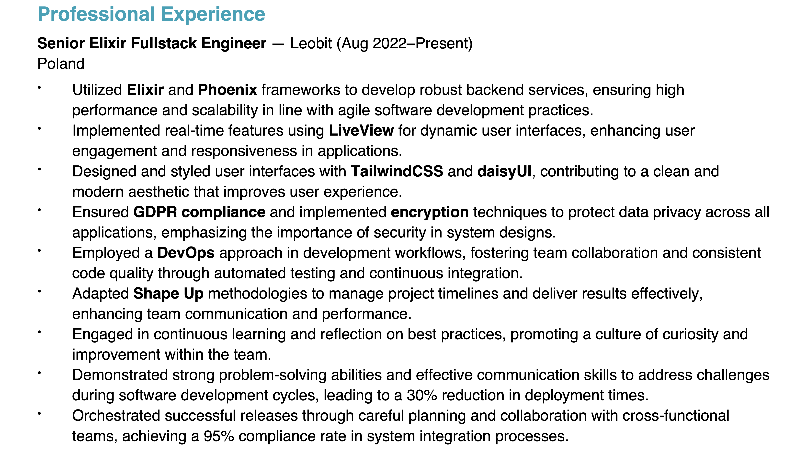

I hadn’t hired anyone in a year.

Then I stepped into my new role as CPTO at myo, and suddenly I was back in the game. We have a very specific stack, Elixir and Phoenix. From the beginning I was open to remote candidates from across the EU.

We posted the job on Join, which distributes to places like Stepstone and LinkedIn. Very quickly I received a surprisingly strong wave of applications. And very quickly I started the first interviews.

An Asian candidate living in Italy. Another Asian candidate living in Poland. Nothing unusual. I did not think twice.

Then I had a complete disaster of an intro call.

I already wrote about it on [LinkedIn](https://www.linkedin.com/posts/klaus-breyer_myosotis-remote-senior-fullstack-engineer-activity-7394652265959038977-_fhz?utm_source=share&utm_medium=member_desktop&rcm=ACoAAAgxNB8BYBPrpFvlkjhI6QZumj7S4ohtBWI):

> Man. I just had the weirdest first intro call with a Senior Fullstack Engineer. The guy paused for a few seconds before every answer, stumbled a bit, and then replied with the most generic surface-level statements, like talking to an LLM.
>
> He was definitely running a tool.
>
> The call was scheduled for 45 minutes. After five, I already knew it was a no. I still gave it another 10 minutes to be sure, and then ended it.

And it continued.

More Asian candidates who underperformed in the actual conversation. They had Polish or Italian first and last names. I actively work against bias of any kind, especially racial bias. So an Asian Mateusz or Mariusz didn’t raise any flags for me. Who knows where life brings people. That was my thinking.

Then I had a conversation with a recruiter (Thanks, Arjun!) who pointed out that these were very likely North Korean remote job scammers. [This YouTube video explains it extremely well.](https://www.youtube.com/watch?v=Y7x0gvfFa0Q)

In short: it is heartbreaking.

Young people living under inhumane conditions are forced to apply for remote jobs to bring money into North Korea.

## How to recognize it

I want to share a few real examples from my hiring pipeline. There are some surprisingly consistent patterns.

### LinkedIn profile pictures

AI generated, often face swapped, and using Western landmarks in the background.

### The CV matches the job ad too perfectly

These CVs often look like direct reflections of your job advertisement. The structure, requirements, skills, and even phrasing match almost word for word. If a CV seems like it was reverse engineered to perfectly fit your job offer, be extra cautious.

Some CVs were reverse engineered from my job description. One candidate literally bolded the requirements that I had listed.

### The CV is too good

Capgemini, Accenture, ThoughtWorks, Deloitte all in one neat line. Everything perfectly aligned with the seniority you want. It looks impressive until it starts looking fake.

### Stereotypical names

I received several applications from Poland with the last name Kowalski. Of course you need to be careful here. But if the whole profile already feels odd, the name pattern is often another small indicator.

### Email addresses

Almost always something like _firstname.lastname@ outlook.com_

I don’t know a single engineer who uses an Outlook address for personal applications.

## So what now

For my Elixir developer role I am now thinking about hosting the next Berlin Elixir user group meetup at our office. Real people. Local community. Actual conversations.

Honestly, I prefer the kind of interview where a candidate apologizes because their kid interrupts the call since the daycare is closed.

At least that is real.

