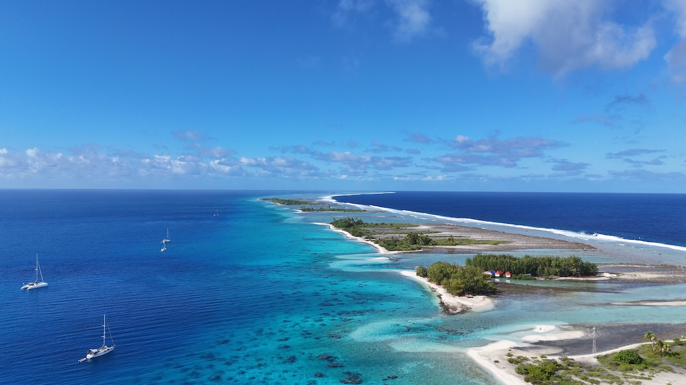

Heute möchte ich von der Reise mit meiner Frau nach Französisch Polynesien berichten. Die Reise war schon lange geplant - Sehnsuchtsziel mit familiärer Backstory: Meine Schwiegereltern waren dort, als sie in unserem Alter waren und deshalb haben sie unsere Kinder liebend gerne für 3 Wochen Ferien übernommen, um uns das selbe zu erlauben.

Französisch Polynesien ist ein Ziel, dass nicht jeder kennt – geschweige denn weiß, wo es überhaupt liegt. Deshalb möchte ich euch mitnehmen auf meine Reise.

Die gewählte Form hier ist ein Excerpt meiner Gedanken, wie ich sie während meiner Reise hatte – ursprünglich veröffentlicht im privaten Familienblog, nur minimal für den Lesefluss redigiert und von für euch wahrscheinlich eher langweiligen Aktivitätsbeschreibungen gekürzt.

Die Eckdaten:

- 27.07.2025: HAM → CDG → LAX → PPT
- 27.07.–02.08.2025: Moorea
- 02.–06.08.2025: Tikehau
- 07.–10.08.2025: Fakarava (Süd)
- 10.–14.08.2025: Fakarava (Nord)
- 14.08.2025: Tahiti (PPT) (Übernachtung)
- 15.–16.08.2025: Rückflug PPT → LAX → CDG → HAM

–

Meine Schwiegermutter hat gesagt, Französisch-Polynesien sei der exotischste Ort, an dem sie je war. Und ich muss ihr zustimmen. Aber ich konnte anfangs noch nicht genau in Worte fassen, warum.

Ich fragte mich die ganze Zeit, was konkret anders ist als z. B. in Indonesien. Das ist ja auch schon exotisch! Korallen bis zum Strand und dann Dschungel.

Ein Aspekt wird sicherlich sein, dass die Gesellschaft in der Breite diesen exotischen Lifestyle lebt.

In Indonesien gibt es eine relativ arme Bevölkerung auf der einen Seite und Touristen auf der anderen Seite – wenig dazwischen. Die Orte, an denen man sich aufhält, sind vor allem für Touristen gemacht. Vieles davon ist „künstlicher Prunk“ und es wird auch sehr viel mit Plastik gearbeitet.

Das, was man hier hat, ist irgendwie „natürlicher“. Man merkt, dass es eine eigene Kultur ist. Die hatte 100–200 Jahre Zeit, sich gemeinsam aus dem Französischen und ursprünglich Polynesischen zu entwickeln. (ob das gut ist oder schlecht, behandle ich hier nicht)

Ein paar Beispiele:

- Die meisten Gärten zur Straße hin sind tiptop gemacht – nur halt mit tropischen und fremden Elementen.
- Die meisten Dinge sind aus Holz oder aus hochwertigerem Plastik als in Indonesien. Und handwerklich sehr hochwertig gearbeitet.
- Genauso die Prints, die man auf den T-Shirts im Souvenirshop findet. Auf jeden Fall für das westliche Auge gemacht, aber mit ganz starken Einflüssen eben.

Also vielleicht sorgt ausgerechnet das Französische, also das Westliche, dafür, dass es für uns vergleichbarer wird – und deshalb noch exotischer wirkt? Solche Gedanken beschäftigten mich.

–

Wale sind unglaublich majestätische Tiere. Vor allem wenn sie einem bis auf ein paar Meter nahekommen. Beim Schnorcheln im offenen Meer. Mit unglaublichen Wellen. Das war es wert, für die restliche Fahrt noch zwei weitere Stunden nur zu kotzen.

–

Das Land hat ja viel zu bieten. Unter anderem: Pomelos. Bzw. Pampelmuse. Ich bin ja ein großer Fan! Dort wächst die ursprüngliche Form. Die Pomelos, die es hierzulande gibt, sind Kreuzungen mit Grapefruit. Unsere Hosts in unserem Airbnb hatten immer welche zum Frühstück – so konnte ich auch mal lernen, wie man sie dort vor Ort schneidet!

Abends haben uns die Hosts dann noch eine Pomelo/Pampelmuse gebracht. So konnte ich auch mal sehen, wie sie die schneiden. Man lernt nie aus!

–

Die Menschen dort sind ja so nett und so geduldig und haben so die Arschruhe weg bei allem. Sehr bewundernswert. Man ist immer kurz davor, sich über die Langsamkeit aufzuregen, aber dann klappt ein Schalter im Kopf rum und man bewundert sie stattdessen eher.

Das bezieht sich nicht nur auf die Freundlichkeit der Hosts mit der Pomelo, sondern auch z. B. auf einen Laden mit Wassersport-Equipment auf Moorea, bei dem wir nach einem GoPro-Griff gefragt hatten. Der Typ hat uns auch total freundlich auf einen Laden auf Tahiti weiterverwiesen und hat sich sogar nicht die Mühe gemacht, nachzufragen, ob wir die Location auf Google Maps gefunden haben.

Ein Berliner hätte es in derselben Zeit wahrscheinlich schon geschafft, 5–10 Kunden abzuwimmeln…

–

Wenn so ein Atoll gerade mal eine Straße hat und alle nur mit Schrittgeschwindigkeit fahren, dann fahren hier auch mal Autos (aus China), die man schon im Neuzustand nicht mal in Frankreich zugelassen bekommen hätte. Der Zustand auf einem Inselatoll nach vielen Jahren wird nicht besser. So zum Beispiel der Bus, der uns zum Tauchen immer abholte. Dessen Radlager würde durch keinen deutschen TÜV kommen.

–

In der Not lernt man sich ja zu helfen. ChatGPT ist ein guter Zugang zum Internet, vor allem in Situationen wie hier, wenn das Internet schlecht ist. Weil es ist selbst mit Edge immer noch gut genug für ChatGPT, und dann kann man ChatGPT recherchieren lassen und fragt einfach die Dinge, die man wissen möchte, anstatt selbst ewig zu recherchieren und zu warten.

–

Die Unterkünfte, die man für die Preise von hiesigen Luxusferienzielen erhält, sind auf einem Airbnb-Niveau, das ich in Deutschland nicht ohne schlechte Rezension akzeptieren würde.

–

Man kann wohl froh sein, dass Polynesien von den Franzosen kolonisiert wurde. Ich lese gerade in meinem Buch, das auf Kiribati spielt, dass der Autor sich gewünscht hätte, die Insel wäre von den Franzosen kolonisiert worden. Stattdessen waren es die Engländer. Deshalb wird der Fisch (und es gibt wenig anderes) dort gekocht(!).

–

Auch eine ganz nette Geste: Als ich mein Buch im Flugzeug vergessen hatte, ist eine Flugbegleiterin den Fluggästen nachgelaufen und mit dem Buch durch die Ankunftshalle (Hütte) prozessiert und hat gewartet, bis es jemand erkannt hat. Jemand hatte sie wohl darauf aufmerksam gemacht – vermutlich fallen wir als die einzigen Deutschen hier schon auf, und das Buch hatte einen deutschen Titel (_Hund Wolf Schakal_).

–

Ich glaube, ich weiß jetzt, was anders ist. Anders als bei anderen Urlauben. Es ist die Atoll-Welt. Das hier ist nicht eine Insel, wo direkt dahinter Dschungel ist wie in Indonesien.

Ein Atoll, das ist im Prinzip eine Insel, die aus einem Korallenriff entstanden ist. Und das Korallenriff basiert auf einem ehemaligen untergegangenen Vulkan. Wunderschön fürs Auge. Es gibt eine Meerseite (Pazifik, Südsee) und eine Lagunenseite.

Das Atoll an sich ist prinzipiell ein ziemlich lebensfeindlicher Lebensraum. Wären Menschen nicht hierhergekommen, würde hier wenig mehr wachsen als Kokosnüsse.

Aus dem Blickwinkel ist es eigentlich eine ziemlich wüste Landschaft, eine ziemlich karge Landschaft, die hier bewohnbar gemacht wurde. Und selbst das nur mit vielen Kompromissen. Wobei die Menschen das durch ihre Flexibilität wieder wettmachen (als durchorganisierter Deutscher verzweifelt man des Öfteren daran).

Allerdings auch eine sehr hübsche Landschaft. (Deswegen sind wir ja hier.)

Und wenn man sich für so eine Landschaft interessiert, dann ist Französisch-Polynesien auf jeden Fall die beste Variante. Die zivilisierte. Wenn man sich die anderen Inseln in der Gegend anschaut, z. B. Kiribati, englische Kolonie, ist der Lebensstandard deutlich geringer.

Aber gut, dafür zahlt man dann am Ende auch. Da alles hierhergeschifft oder geflogen werden muss, zahlt man ungefähr Schweizer Preise. Vielleicht noch ein wenig mehr. Ein Bier im Supermarkt? 3–4 €.

Aber es ist nur konsequent, es lädt auch zum Sparen ein. Genauso wie die Menschen, die seit Urzeiten auf Atollen leben, mit dem haushalten müssen, was es hier gibt, so fühlt es sich auch für uns an wegen der Preise.

–

Die Zeitverschiebung ist sowohl anstrengend als auch entspannend.

Wir sind ja 12 Stunden hinterher.

Wenn man morgens aufsteht, ist alles schon passiert. Alle Schlagzeilen in den Nachrichten, alle Kommentare, alle Mitteilungen in WhatsApp.

Dann passiert den ganzen Tag gar nichts. Bis Europa abends (unserer Zeit) wieder aufsteht.

Dementsprechend also auch entspannt – tagsüber.

–

Ich habe ganz bestimmt ganz viele Aspekte vergessen. Das waren eben nur meine Gedanken, wie ich sie beim Besuch hatte. Kein Schulaufsatz und kein Reiseblogger, der hier Affiliate-Links unterbringen muss.

Wenn ihr noch etwas wissen möchtet, fragt mich gerne :)
