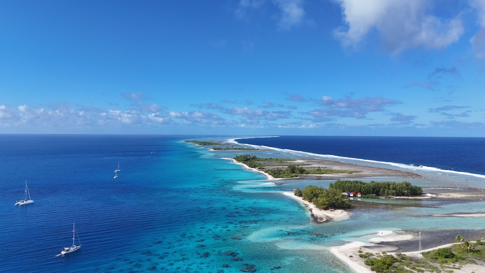

Today I want to share about the trip with my wife to French Polynesia. The journey had been planned for a long time – a dream destination with a family backstory: my parents-in-law went there when they were our age, so they were more than happy to take care of our kids for three weeks to let us experience the same.

French Polynesia is a place not everyone knows about – let alone knows where it even is. That’s why I’d like to take you along on my trip.

The format here is an excerpt of my thoughts as I had them during the journey – originally published in a private family blog, only lightly edited for flow and shortened by cutting some of the probably boring activity details.

The key facts:

- 27.07.2025: HAM → CDG → LAX → PPT
- 27.07.–02.08.2025: Moorea
- 02.–06.08.2025: Tikehau
- 07.–10.08.2025: Fakarava (South)
- 10.–14.08.2025: Fakarava (North)
- 14.08.2025: Tahiti (PPT) (overnight)
- 15.–16.08.2025: Return PPT → LAX → CDG → HAM

–

My mother-in-law said French Polynesia was the most exotic place she had ever been. And I have to agree. But at first, I couldn’t quite put into words why.

I kept wondering what exactly makes it different from, say, Indonesia. That’s already exotic enough! Coral reefs right up to the beach and then jungle.

One aspect might be that here, the broader society lives this exotic lifestyle.

In Indonesia, you have a relatively poor population on one side and tourists on the other – with little in between. The places you spend time at are mostly designed for tourists. Much of it is “artificial glamor,” with a lot of plastic involved.

Here, things feel more “natural.” You can sense that it’s a culture of its own. It had 100–200 years to evolve, combining French and Polynesian influences. (Whether that’s good or bad is not what I’ll get into here.)

Some examples:

- Most front gardens along the street are pristine – only with tropical and unfamiliar elements.
- Many things are made of wood or of better-quality plastic than in Indonesia. And they’re crafted with real skill.
- Same goes for the prints on the T-shirts you find in souvenir shops. Definitely made with Western eyes in mind, but strongly influenced by local style.

So maybe it’s precisely the French, the Western influence, that makes it more comparable for us – and therefore feel even more exotic? That’s the kind of thought I had.

–

Whales are incredibly majestic animals. Especially when they come within just a few meters of you. While snorkeling in the open ocean. With massive waves. That moment alone was worth the two extra hours of seasickness (and throwing up) that followed.

–

The land has a lot to offer. Among other things: pomelos. I’m a big fan! There, the original fruit grows. The pomelos we get back home are hybrids with grapefruit. Our Airbnb hosts always had some for breakfast – so I also learned how they’re cut locally.

One evening they even brought us one. So I got to see again how they sliced it. You never stop learning.

–

The people there are so kind, patient, and incredibly calm about everything. Very admirable. You’re always on the verge of being annoyed by the slowness, but then a switch flips in your head and you start to admire them instead.

That applies not only to the kindness of the hosts with the pomelo, but also to, say, a watersports shop on Moorea where we asked about a GoPro grip. The guy kindly referred us to a store on Tahiti and didn’t even bother to check if we’d found the location on Google Maps.

A Berliner would probably have brushed off 5–10 customers in the same amount of time…

–

When an atoll has just one road and everyone drives at walking speed, you also get cars (from China) that wouldn’t even be street-legal in France when brand new. After years on an island atoll, their condition doesn’t exactly improve. For example, the bus that always picked us up for diving had wheel bearings that wouldn’t pass any German TÜV inspection.

–

Necessity teaches you to adapt. ChatGPT is actually a great way to access the internet, especially in situations like here, when the connection is bad. Even on Edge, it’s good enough for ChatGPT. So instead of endlessly waiting and searching yourself, you just let it look things up and ask directly what you need.

–

The accommodations you get here for the price of luxury resorts elsewhere are at an Airbnb level I wouldn’t accept in Germany without leaving a bad review.

–

One could say Polynesia was lucky to have been colonized by the French. I’m currently reading a book set on Kiribati, and the author writes he would have preferred if the French had colonized his island. Instead, it was the English. That’s why fish (and there’s not much else) is boiled(!) there.

–

Another nice little gesture: when I left my book on the plane, a flight attendant walked through the arrival hall (hut) with it, asking passengers until someone recognized it. Someone must have pointed her toward us – we probably stood out as the only Germans, and the book had a German title (Hund Wolf Schakal).

–

I think I know now what makes it different. Different from other vacations. It’s the atoll world. This isn’t just an island with jungle right behind the beach like in Indonesia.

An atoll is essentially an island formed from a coral reef that grew on top of a sunken volcano. Beautiful to look at. There’s an ocean side (Pacific, South Seas) and a lagoon side.

But the atoll itself is basically a pretty hostile environment. If humans hadn’t come, little more than coconuts would grow here.

From that perspective, it’s actually a barren, almost desert-like landscape that people made habitable – and only with many compromises. But the locals make up for it with their flexibility (which, as a well-organized German, can be frustrating at times).

At the same time, it’s a very beautiful landscape. (That’s why we’re here, after all.)

And if you’re into that kind of landscape, French Polynesia is definitely the best version of it. The civilized one. Compared to nearby islands like Kiribati, a former English colony, the standard of living is much higher.

Of course, you pay for it. Since everything has to be shipped or flown in, you pay about Swiss prices – maybe even more. A beer at the supermarket? €3–4.

But in a way, that’s consistent. It encourages frugality. Just as people who’ve lived on atolls for centuries have to make do with what’s there, so do we as visitors – because of the prices.

–

The time difference is both exhausting and relaxing.

We’re 12 hours behind.

When you wake up in the morning, everything has already happened. The headlines, the comments, the WhatsApp messages.

Then nothing happens all day. Until Europe wakes up again in the evening (our time).

So in a way, it’s also relaxing – during the day.

–

I’m sure I’ve forgotten plenty of aspects. These were just my thoughts as I had them during the trip. Not a school essay, not a travel blogger trying to sneak in affiliate links.

If you’d like to know more, feel free to ask :)
