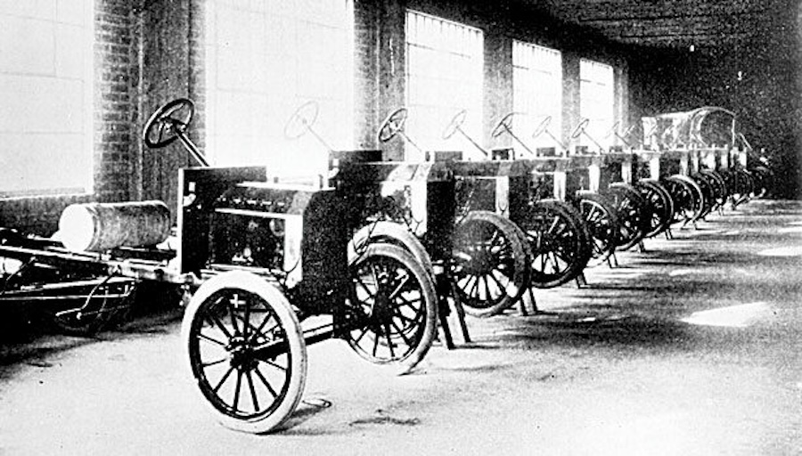
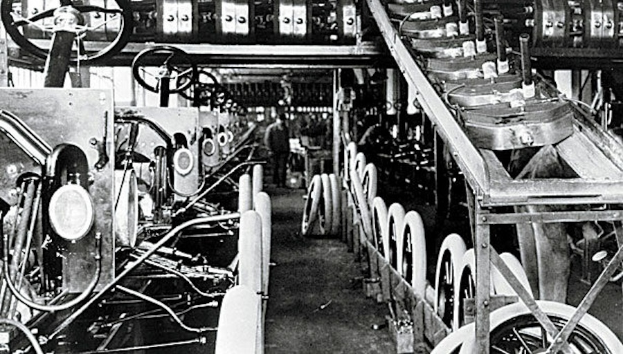

Let's rewind to 1913.

Henry Ford was already a successful car manufacturer but was far from the global icon he would later become.

At that time, his factory floor looked quite different from what we imagine today. Cars stood still while workers walked around them, building each car in a single place. The process was slow and tedious. It took 12 hours to complete just one vehicle.

But then Ford had a brilliant idea.

## What if the cars came to the workers instead of the other way around?

Ford revolutionized production by introducing the conveyor belt and assigning workers to specialize in one task. [The result was a 900% increase in productivity between 1913 and 1915.](https://www.assemblymag.com/articles/91581-the-moving-assembly-line-turns-100)

As Cal Newport pointed out in his brilliant book [A World Without Email](), Ford didn't invent the conveyor belt. He didn't have more capital. He just connected existing ideas in a powerful new way to leverage how people were working - and kicked off the era of mass production.

This model of efficiency, which divides, specializes, and optimizes, became the gold standard for the manufacturing industry. But here's the thing:

## It doesn't work for software.

A lot of software engineering today still clings to the conveyor belt metaphor. This mindset shows up as rigid specialization, siloed teams, and a mechanical view of the development process.

We can use this misguided metaphor even today when we refer to a "Feature Factory."

## Building Software Is Not an Assembly Line. It's a Design Process.

The challenging design work is complete before manufacturing a car. All major decisions have been finalized. The job now is to execute efficiently and reliably.

Software is different.

Building software **is** the design process.

We aren't assembling predefined parts. We're solving problems constantly. We make creative, often ambiguous decisions all day in a system that evolves while working on it in interdisciplinary teams.

To set up teams for success, we all (managers and people within the teams) must shift our mindset. We need to stop optimizing for "manufacturing" speed and start optimizing for decision quality.

Keep this in mind the next time you are unhappy with how something goes in a team.

(Photo courtesy Ford Motor Co)
