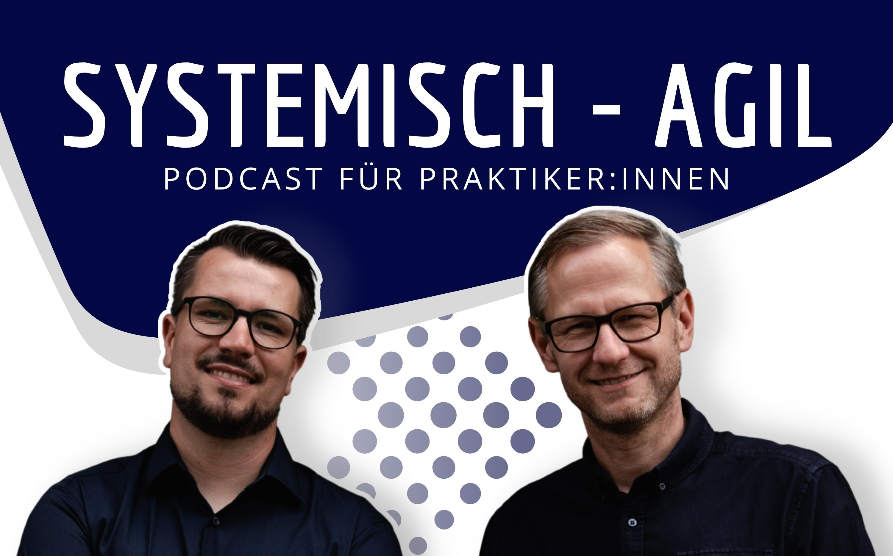

Im Podcast "Systemisch Agil" berichte ich, wie wir bei der [edding](https://www.edding.com/) mit Empowered Product Teams und Shape Up arbeiten, insbesondere im Kontext des Produkts [easycheck](https://www.easycheck-by-edding.com/).

[Hier geht es zur Episode](https://systemisch-agil.podigee.io/94-new-episode)
