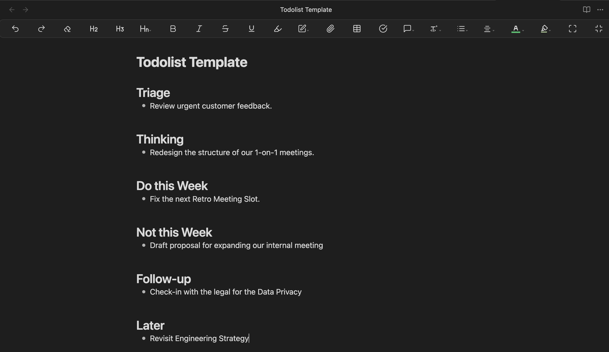

While managing product & tech at edding AG, my work sometimes spans from the strategic to the operational level.

Balancing these different levels of responsibility often led to context switching and a confusing to-do list that lumped everything together—making it hard to focus on what truly needed deep thought versus what just required quick action.

That’s when I discovered a simple yet effective hack.

## Separating Tasks Into “To-Do” and “To-Think”

Instead of treating all tasks equally, I now divide them into two clear categories:

- **“To-Do”** – Execution-focused tasks that are operational and quick to complete, such as:
  - Rescheduling meetings
  - Approving supplier agreements
  - Sending follow-up emails
- **“To-Think”** – Tasks that are input for extended, uninterrupted deep work time slots (2+ hours), such as:
  - Rethinking the structure of our 1-on-1s
  - Crafting the agenda for a key strategy meeting
  - Spending dedicated time with a product we are developing

This simple differentiation helps me stay in the right mental mode and prevents me from mixing high-focus work with routine operational tasks.

## My Obsidian Setup

I organize all my to-dos in a plain text file in **Obsidian**, using the following structure:

- **Triage** – A catch-all for new thoughts and ideas. When something comes up in a meeting, I write it down here.
- **Thinking** – Reserved for tasks that need deep focus and creative problem-solving.
- **Do This Week** – High-priority tasks that must be completed within the week.
- **Not This Week** – Explicitly de-scoped tasks to reduce mental clutter.
- **Follow-up** – I’ve delegated tasks but need to track them.
- **Later** – Lower-priority items to revisit in the future.

I maintain one file for my main job and another for everything else - side projects, my public persona, etc..

## Try It Yourself

If your to-do list feels overwhelming or unstructured, try separating your tasks into **“To-Do” and “To-Think.”** A simple shift that can bring significant clarity and efficiency to your workflow
