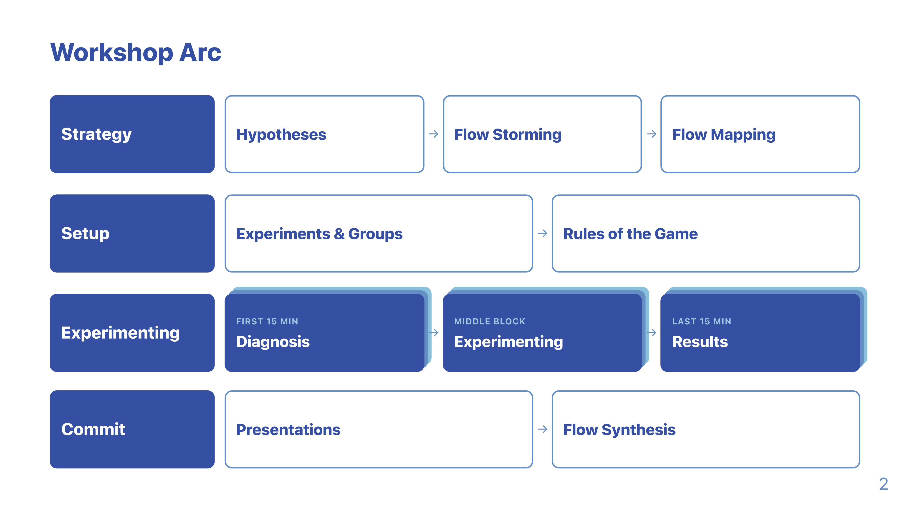
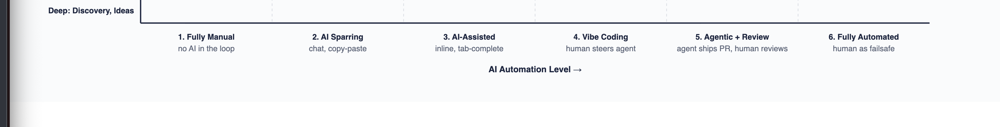

In the [previous post]() I shared the keynote that opened our two-day team offsite: a barrage of theses on how AI changes the product development lifecycle.

A keynote does not change how a team works. This post is the other half: the concrete workshop format we used to turn "interesting" into "what do *we* actually change on Monday".

## Motivation

The theses came from my bubble. They were not answers for us.

There is no standard process to copy anymore. Every decision is more individual now, so importing someone else's playbook is exactly the wrong move. The only thing that helps is looking honestly at our own flow and deciding, station by station, what to keep human and what to hand to AI.

So the workshop had one job: map our real process, find the friction, run small experiments against it, and walk out with commitments that have an owner and a date.

And one strong intention: get the whole team into doing. Too many offsites end with two inspiring days and a hundred open to-dos that nobody touches afterwards. I wanted the opposite. In every experiment we kept pushing each other to actually finish something, small and concrete, that you could use the very next morning. Not a plan to build it later. The thing itself.

## The basic flow

Two days, four phases:

- **Strategy** - Flow Storming, then Flow Mapping. See how we work today.
- **Setup** - pick the experiments, form groups, agree the rules.
- **Experimenting** - hands-on, the bulk of the time. Try real things, not theory.
- **Commit** - presentations, then Flow Synthesis. Decide what sticks.

One rule held everything together: the output is not slides. Every group writes into a shared Confluence page as they go. That page is the single source of truth afterwards.

## Flow Storming

A sober look at how we work today. No solutions yet, just an honest picture.

We split into two teams: one mapped our cycle work, the other our reactive work. Each team drew its flow as 10 to 15 stations, from "an idea comes in" to "we learned what happened". Short titles per station, not sentences.

A station is a state the work is in, not a calendar entry. Plenty of meeting formats came up here (dailies, refinements, retros), and we deliberately hung them to the side. They are how we coordinate, not where the work sits, and rethinking our meetings was not the focus this time.

The two teams drew their flows in parallel breakout sessions right at the start:



Then we walked the flow and marked the friction with colored dots:

- **Red** - bottleneck: work waits or capacity is tight.
- **Blue** - coordination friction: handovers, specs, rubber-stamp reviews.
- **Green** - judgment friction: architecture, taste, ownership.

The split matters. Blue friction is what you want to automate away. Green friction is what you protect.

## Flow Mapping

This is where it gets concrete. We borrow the idea from Wardley Mapping: every station from both flows gets a position on one shared 2D map, and the position itself carries meaning. Two axes.

**The vertical axis is the value chain.** Top is what the user directly sees and values, a shipped release, a feature in their hands. Bottom is the deep internal work nobody outside ever notices: discovery, ideas, refinement, architecture. A station sits high when it is close to the user and low when it is plumbing. That is the standard Wardley convention.

**The horizontal axis is the AI automation level**, in six concrete steps from fully human to fully machine:

1. **Fully Manual** - no AI in the loop at all.
2. **AI Sparring** - you bounce ideas in a chat window, copy-paste in and out.
3. **AI-Assisted** - AI sits inline in your tool: tab-complete, suggestions.
4. **Vibe Coding** - a human steers an agent that does the actual work.
5. **Agentic + Review** - the agent ships a PR, a human reviews it.
6. **Fully Automated** - it runs on its own, the human is only the failsafe.

These six steps are the heart of the exercise. They turn a vague "should we use more AI here?" into a precise question: "this station is at level 2 today, do we want it at level 4?"

The mapping itself, step by step:

- Each group presents its flow in five minutes. Clarifying questions only, no debate.
- We place every station onto the shared map, keeping the friction colors from Flow Storming. A red bottleneck or blue coordination point stays marked.
- For each station we ask two things: where does it sit today, and where should it sit next?
- We draw an arrow from the current spot to the target spot.

The result is decision-ready. Red and blue friction sitting near the manual end of the axis is exactly what we want to push to the right, toward automation. Green judgment friction we deliberately leave where it is, sometimes even keep fully manual on purpose. Architecture and tech strategy, for instance, we never want automated. The movement arrows then become the direct input for which experiments we run next.

The whiteboard is the working artifact, and that is fine during the session. Afterwards it pays to clean it into a proper map you can actually share and revisit. Here is my version of ours: same two axes, every station placed, friction marked, and the red arrows showing where each one should move.

## Experiment time

This is where most of the two days went.

From the map we had a set of candidate experiments. Some prepared upfront, some added on the spot, each one pointing at a real red or blue mark on the flow. We dot-voted and formed small groups of one to three people around the winners.

Every experiment followed the same shape:

- **Diagnosis** - one honest sentence about the real situation.
- **Hypothesis** - "if we do X, then Y".
- **Artifact target** - the concrete thing you walk out with: a rules file, a prototype, a pilot, a verdict.

The themes ranged across the whole lifecycle: AI guidelines for what output is acceptable, getting small tickets agent-ready, a shared Design.md, a cloud coding environment that non-engineers can use too, AI review tooling, a prototyping base for product and design, and more.

Two rules kept it moving:

- **Unblock yourselves.** No permission needed for anything reversible.
- **Build experience, do not dwell on theory.** Make it concrete.

Each slot ran the same way: first 15 minutes to write the diagnosis, the middle block to build, the last 15 minutes to capture results. Results closed with a guiding policy in a strict format: "We will X, by Y, and deliberately not Z." The "deliberately not Z" is mandatory, because deciding what *not* to do is the harder half.

Groups then presented. The presentation was never the point, the discussion was: where does this touch your work, where does it conflict, what do you adopt? Every commitment landed on the shared page with a name and a date. No owner, no date, no commitment.

## Flow Synthesis at the end

We closed by pulling the map from day one back up, now seen through everything the experiments taught us.

Station by station: did the experiment actually move it? Mark where it sits today. Where should it go next? Draw the arrow. Anything that surprised us gets noted.

That is the whole loop. We started with a map built on opinion and ended with a map corrected by evidence, plus a set of commitments we own.

## What we walked out with

Not a framework. Our own updated map of how we build, a handful of running experiments, and concrete commitments with owners and dates.

The format is reusable, and the theses behind it are in the [first post](). If you want help running something like this with your team, just reach out.
