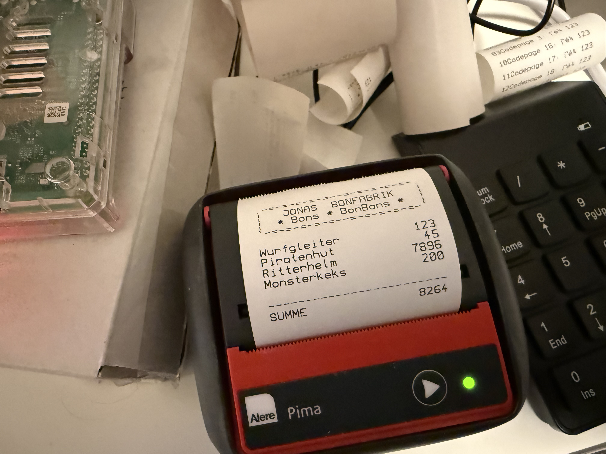

My son is absolutely fascinated by the scales in the fruit and vegetable section at Kaufland - the ones that print those little stickers with prices and barcodes.  
Watching numbers turn into a printed label feels like pure magic to him.

That fascination became the inspiration for a small DIY project.

I bought a cheap thermal printer, connected it to a Raspberry Pi, and added a simple USB numpad. The result is a tiny “checkout system” designed for a child’s room.

Here’s how it works:

- He can enter numbers using the numpad  
- Press + and add them together step by step  
- Press Enter to calculate the sum  
- And out comes a receipt with the sum

Instead of prices, the receipt prints a random list of objects that *could* exist in a kid’s room - toys, books, mysterious items you’d definitely find under a bed.

[The entire project is open source and written in Elixir.](https://github.com/klausbreyer/bonbonbon)

(Now that I have a small thermal printer hooked up to a Raspberry Pi, my head is overflowing with ideas what else to do)
