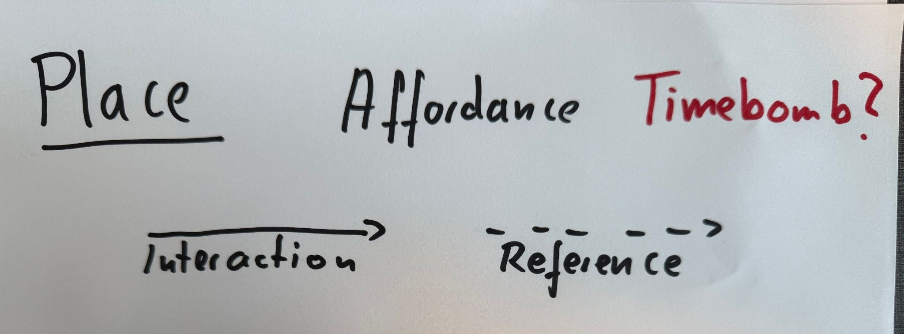
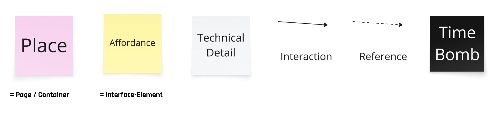

Here is a pattern I have seen too many times: A designer produces 30 or 40 Figma screens. The engineers review them, give a little bit of feedback, and then start implementing. Somewhere along the way, they discover parts that nobody thought through, because the solution was designed by one discipline and handed off to the next.

Breadboarding flips this. The name comes from electronics: a breadboard is a prototyping board where you figure out which components you need (how many LEDs, which transistors, which prefabricated parts) before you commit to mass production. You test the circuit cheaply before you invest in the real thing.

(Source: [Breadboard, Reichelt](https://www.reichelt.de/de/en/shop/product/development_boards_-_voltage_supply_for_plug-in_boards-202832))

In Shape Up, breadboarding works the same way. You start with a blank slate. Pink stickies for places (pages, containers), yellow stickies for affordances (buttons, inputs, copy), arrows for interactions. That is the entire notation. No wireframe tool, no design expertise required. You figure out the components and their connections before anyone commits to building the real thing.

## Engineers Take the Lead

This is the part that surprises people: in a breadboarding session, engineers naturally take the lead. Not because they are in charge, but because they are closest to what is technically possible and what is not.

The flow through an application is shaped by technical realities. Can we send emails at this point? Do we have this data available? Can we run these two things in parallel or does one depend on the other? Engineers know this. When they develop the interaction flow from scratch on a whiteboard, they are actively shaping the solution, not just receiving it.

When I was an engineer myself and got handed 30 or 40 Figma screens, I gave a little bit of feedback, sure. But I was not really part of the solution. I always discovered things during implementation that had not been considered from a technical perspective. Parts nobody thought through, because everyone just assumed they would work.

If you develop the flow together, in this deliberately cheap format, that stops happening.

## Designers Can Finally Focus on Users

Here is the other side: when engineers lead the technical flow, designers are free to do what they are actually best at.

Instead of worrying about whether an API can deliver certain data, or whether a database schema supports a particular view, designers can focus on the user experience. They can constantly ask: does this flow make sense from a user's perspective? Are we losing someone at this step? Is this interaction intuitive?

A designer who has to think extensively about whether something is technically feasible is wasting their expertise. That is not their job. Their job is usability risk. Engineering owns feasibility risk. Product owns business viability. Breadboarding is the format that lets all three disciplines operate at their actual strengths, at the same level, at the same time.

## The Notation

The notation is deliberately simple. Depending on your setup, you can do it on paper or digitally in a tool like Miro.

On paper, with a marker:

Or virtually, with digital stickies:

## Why Stickies, Not Wireframes

The inclusive aspect is the whole point. When you only see pink and yellow stickies, every engineer can contribute. Every product manager can sketch an alternative flow. Nobody needs to know Figma, nobody needs UX taste. An arrow and a rephrased sticky note is all it takes.

This does two things at once:

**It prevents overproduction.** If a designer creates 40 detailed screens before the team has figured out the actual flow, those screens have internal dependencies. You cannot remove one screen later and expect the rest to still make sense. All that effort, wasted. With stickies, changing direction costs nothing.

**It forces everyone to think it through.** Not one profession moves forward too early. Not a complete PRD from product, not 30 Figma screens from design. Everyone works at the same altitude. The strategic decisions happen first, together. The tactical decisions (where exactly is the button, what color, what copy) get pushed into the delivery phase where the team can make them autonomously.

## A Fundamentally Different Way of Collaborating

Engineers lead the technical flow. Designers lead the user perspective. Product leads the business case. Nobody is stuck doing someone else's job. Nobody is reviewing something they had no part in creating. And the result is a solution that all three disciplines actually own, because they shaped it together.

That is not a process improvement. That is a fundamentally different way of collaborating.
