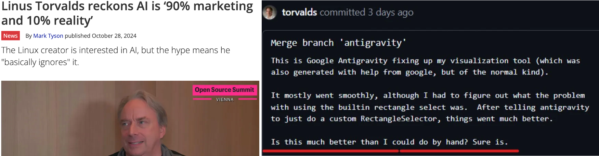
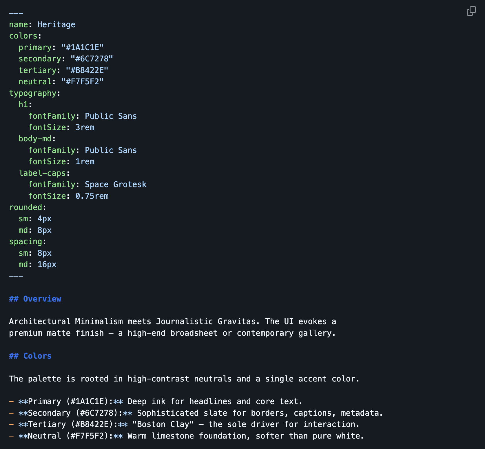
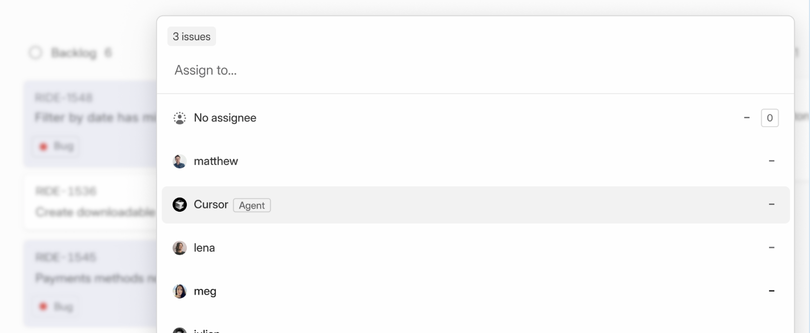
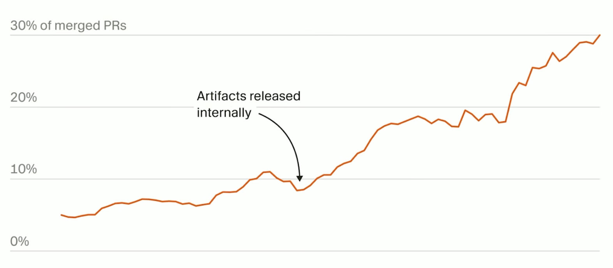
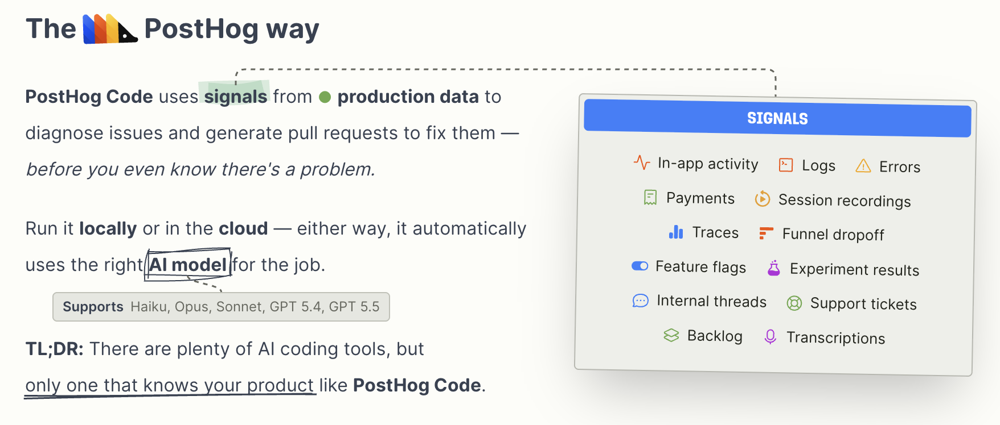

This week I ran a workshop with my team. 

The topic: the transformation of the product development lifecycle through AI.

To open it, I gave a keynote. 

No neat framework, no finished playbook. 

Instead, a barrage of hypotheses I had collected from my own bubble over the previous months: things people I trust were writing, building, and arguing about.

Some of these theses contradict each other, and that is on purpose. 

At the moment (and in the future), there is no single right answer anymore - every decision becomes far more individual.

This post is that keynote, written down. Each thesis, my speaker notes , and the source linked so you can go deeper. 

(If you want me to give this talk to your team, just reach out and we can arrange something)

In the [next post]() I will explain the concrete workshop format: how we mapped our process to find the friction we want gone and the judgment we want to keep, so both become deliberate decisions rather than defaults.

# Act 1: Why now?

## The cost of inaction is higher than the cost of the wrong action.

**Always be in motion.**

- Self-discipline is the highest form of self-care.
- You do not need another podcast or book. You need the moment where it hurt and you grew.
- Insight without change is just a more sophisticated form of laziness.
- You need less of what is not relevant, not more.

*[Mark Manson, author of The Subtle Art of Not Giving a F*ck](https://www.youtube.com/watch?v=hXgLk4TnAlM)*

## The last holdouts have flipped.

**If DHH and Linus use AI heavily, the resistance debate is over.**

- End of 2025, both publicly revised their position. Not two voices, THE two voices.
- Anyone still saying "I am critical of AI" internally is not critical, they are behind.
- The people who were against it and are now for it bring the better arguments. Those are the people we need to listen to.
- October 2024: "AI is 90% marketing and 10% reality". December 2025: merging an AI-built branch into his own visualization tool.

*[David Heinemeier Hansson (creator of Ruby on Rails) on LinkedIn](https://www.linkedin.com/posts/david-heinemeier-hansson-374b18221_at-the-end-of-last-year-ai-agents-really-activity-7414594514411114496-uYCo)*  
*[Linus Torvalds (creator of Linux), 2024 to 2026](https://www.tomshardware.com/tech-industry/artificial-intelligence/linus-torvalds-reckons-ai-is-90-percent-marketing-and-10-percent-reality)*

## This is the most normal it ever gets.

**This is the worst AI you'll ever use.**

- Whatever cadence feels reasonable today is already lagging the field.
- Six months from now this conversation will look quaint.

*[Cat Wu (Head of Product at Anthropic) on Lenny's Newsletter, How Anthropic's product team moves faster than anyone else](https://www.lennysnewsletter.com/p/how-anthropics-product-team-moves)*  
*Sam Altman (OpenAI CEO)*

# Act 2: The ground is shifting

## Work costs nothing to an LLM. They bury us in code, docs, decks.

**Good builders optimize for future time. Less of everything. More leverage.**

- Cantrill: "LLMs inherently lack the virtue of laziness. Work costs nothing to an LLM."
- Good developers optimize for their own and others' future time. Less code, more leverage.
- LLMs happily dump more stuff on top. Left unchecked, systems get bigger, not better.
- Principled laziness has to go into the rules, into review, into evaluation criteria. Otherwise we clog up.

*[Bryan Cantrill (Oxide Computer co-founder)](https://bcantrill.dtrace.org/)*

## Code is no longer the bottleneck. Our judgment is.

**Friction in the right place is what produces quality now.**

- The tools did not buy us slack, they raised the baseline.
- Every engineer now has an agent amplifying their output. Responsibility has not been amplified. We are outnumbered by entities that cannot carry responsibility.
- We want coordination friction gone. We want judgment friction higher. Without friction you cannot steer.
- The moments where you want to skip thinking are exactly the moments where thinking matters most.

*[Armin Ronacher (creator of Flask) & Cristina Poncela Cubeiro on Earendil, The Friction is Your Judgment](https://earendil.dev/posts/friction-is-your-judgment/)*

## Cognitive debt lives in people, not in code.

**Velocity outpaces understanding. Shared understanding is the new bottleneck.**

- Storey: cognitive debt is the gap between a system's evolving structure and the team's shared understanding of how and why it works.
- Refactoring does not fix it. Theory has to be carried by people, docs, tests, tooling and agents at the same time.
- This is the deeper version of "can we still change it in 12 months". Sometimes the code is fine and the team simply no longer holds the model.
- AI lowers production cost, structure evolves faster than understanding stabilizes. If we do not actively reinvest in shared theory, we go fast and dumb at the same time.

*[Margaret Storey on margaretstorey.com, What I'm Hearing About Cognitive Debt](http://margaretstorey.com/blog/2026/02/18/cognitive-debt-revisited/)*

## Good patterns scale linearly. Slop scales exponentially.

**Our codebase and documents are infrastructure for the agents.**

- The models copy patterns. They have to find them in our codebase. Put good code in first, then let the AI loose.
- Small codebases. Leave out what does not belong. If it smells, kill it, no matter who is mad.
- Incentivize new project creation, not old project slopification.
- Engineering principles: tolerate nothing.
- Matt Pocock: "Code is not cheap. Bad code is the most expensive it's ever been. Good codebases matter more than ever. Software fundamentals matter more than ever."
- The tension worth holding: the amplifier itself is not stable ground. Even Claude Code regresses, breaks, ships slop between versions. 

*[Theo (t3.gg) on YouTube, Cursor, Claude and Codex have a big problem](https://youtu.be/73F6ZURl1MQ)*  
*[Mario Zechner on YouTube, Building pi in a World of Slop](https://youtu.be/RjfbvDXpFls)*  
*[Matt Pocock on YouTube, Software Fundamentals Matter More Than Ever](https://www.youtube.com/watch?v=v4F1gFy-hqg)*

## The real failure modes are invisible.

**Not "does it work?" But "can we still change it in 12 months?"**

- AI code works today. That is not the problem.
- The problem shows up in maintenance and adaptability over time. That is the invisible killer.
- We do not have to check "does it work", we have to check "can we still change it in 12 months".

*[Simon Wardley (inventor of Wardley Mapping) on LinkedIn](https://www.linkedin.com/feed/update/urn:li:activity:7443943633810247680/)*

# Act 3: How we write code from now on

## Agentic Engineering: turn intent into software, with full control and accountability.

**Spec-driven. Guardrails. Verify. Own it at 3 AM.**

- Five steps. Intent: a brief statement of what you want.
- Defining functionality: not vibe-prompting, not delegated to ChatGPT. Full brainstorm with the coding agent in the context of the project. Result is a detailed spec that fits the existing codebase.
- Code quality: feed in your conventions and docs first. Install programmatic guardrails (linters, sniffers). Define acceptance criteria for test coverage. The code must be exactly how you would have written it.
- Verify correctness: agent writes a full test plan including edge cases, then runs it. Playwright for browser regressions.
- Accountability: hardest part. You didn't write it, but you own it. Get up at 3 AM and fix the bug, even if Claude is down.
- Mental model is built upfront in the spec brainstorm and through review of the load-bearing parts (schema, migrations, complex logic), not by reading every controller or DTO.
- Basics in one or two days. Real fluency: two to three months of daily practice.

*[Fabian Wesner (ex-CTO at Spryker) on LinkedIn, Agentic Engineering](https://www.linkedin.com/posts/fabian-wesner_let-me-break-down-what-agentic-engineering-share-7459550531535921152-pNfO)*

## Not every task is an agent task.

**For critical code we review every single line. Slow the fuck down.**

- Good agent tasks are scoped, closed loop, not mission critical, boring stuff or things you would never have time to try, reproduction cases, rubber duck for bouncing ideas.
- You evaluate, take what is reasonable, finalize. The agent does not ship directly.
- Non-critical code: go nuts. Critical code: review every line. No middle ground.
- Cap generated code to what you can actually review. If the PR is too big to read honestly, it is too big.

*[Mario Zechner on YouTube, Building pi in a World of Slop](https://youtu.be/RjfbvDXpFls)*

## Encode the rules. The linter and AI rules are the new code reviewer.

**Humans only review what needs critical thinking. Migrations, auth, destructive ops.**

- Agents excel at clearly defined problems, compact APIs, tight constraints. They struggle at interacting concerns (flags, permissions, billing).
- Concrete rules: no bare catch-alls, no raw SQL outside the abstraction, no raw input boxes in the UI, no dynamic imports, unique function names enforced.
- PR-review split: agent handles style, mechanical bugs, clear rule breaks. Human handles only the call-outs: migrations, new dependencies, auth changes, destructive ops.

*[Armin Ronacher (creator of Flask) & Cristina Poncela Cubeiro on Earendil, The Friction is Your Judgment](https://earendil.dev/posts/friction-is-your-judgment/)*

## Coding agents demand every bit of your 2025 skills.

**Writing code is cheap. Making sure it is good and useful is expensive.**

- Writing code is cheap. Making sure it is good and useful is more expensive, not less.
- When you orchestrate X agents, the old skills are mandatory, not optional.
- AI does not just help us code faster. It helps us produce better software. If we have the skills.

*[Simon Willison (Django creator) on Lenny's Podcast, An AI state of the union](https://simonwillison.net/2026/Apr/2/lennys-podcast/)*

## Tips and tricks for AI harnesses are noise.

**The tools adapt to us faster than we adapt to them.**

- Naval: the tools adapt to us faster than we adapt to them. Esoteric prompt and harness tricks are time wasted, they will not be true in two weeks.
- AI is the patient teacher. Anyone can now learn anything, explained at their level. The democratization is real and irreversible.
- Like photography: anyone can take a photo, but the masters still stand out, and the bar in the broad market rises with the access.
- Don't optimize the harness, optimize the judgment, the standards, the differentiated work. The harness is a commodity. Our taste is not.

*[Naval Ravikant (AngelList founder) on nav.al, A Motorcycle for the Mind](https://nav.al/ai)*

## We rewrite codebases faster than we maintain old ones.

**Rewrite is in the toolbox now. Not in the fear zone.**

- Lines of code are no longer the bottleneck.
- If slop scales exponentially and good code scales linearly, at some point it is cheaper to rewrite the good one than to maintain the bad one.
- This does not mean "rewrite everything". It means rewrite is now a normal option.

*[Mario Zechner on YouTube, Building pi in a World of Slop](https://youtu.be/RjfbvDXpFls)*

# Act 4: The work itself changes shape

## Critical thinking is the skill we need now.

**Not everyone can drive a sports car. The right to ship fast has to be earned.**

- This is also where we have to focus in skill development.
- "Code it once, dirty, throw it away, write it proper" worked pre-AI too. But that is not Plan Mode.
- Not just the right to ship fast: the right to work fast at all has to be earned.

*[Theo (t3.gg) on YouTube, We all fell for it](https://youtu.be/lNVa33qUzZ8)*  
*[Mike Spitz on YouTube, Agents Don't Do Standups: Building the Post-Engineer Engineering Org](https://www.youtube.com/watch?v=VMemhtlsoNk)*

## Engineers code on the go, from phones, with cloud agents.

**The local machine is no longer mandatory.**

- Claude Code Cloud, factory.strongdm.ai, Codex GUI. The workplace moves into the browser and onto the phone.
- Async agent runs overnight, on a train, between meetings. Parallel, not serial. Multiple versions at the same time.
- Culturally: the line between "I sit at my computer" and "I have an idea and fire it off" starts to dissolve.

*[Simon Willison (Django creator) on Lenny's Podcast, An AI state of the union](https://simonwillison.net/2026/Apr/2/lennys-podcast/)*

## Figma: rigid schemas in a "just vibes" costume.

**Claude Design is honest: HTML and JS all the way down.**

- Sam Henri's core point: the design medium is shifting back to code, and that is more honest than Figma's pretend-flexibility.
- Figma is: "a set of extremely rigid schemas with a free-form 'just vibes, man' costume over the top. Like a Type-A personality physically incapable of relaxing, forced to perform chill while internally screaming that your frames aren't nested and your tokens are detached and nothing is on the grid."
- Claude Design "for all its roughness, is at least honest about what it is: HTML and JS all the way down."
- For the designers: this is the rationale for the prototype codebase. The honest medium beats the simulated medium.

*[Sam Henri Gold on X, on Claude Design](https://x.com/samhenrigold)*

## Designers and PMs have their own prototype codebase.

**Notion.** Real reactions, real edge cases: working prototypes instead of static frames.

- Schoening (Notion): the goal is not that designers push code to production. The goal is that designers and PMs grasp the actual medium with full interactivity, not a static frame of it.
- Separate prototype codebase, real reactions, real edge cases. The thing they hand off then is reality, not a hypothesis.
- PMs are about to be the biggest token spenders in the company. Get designers and PMs into the terminal, not into more meetings.
- Figma stays for design system tokens and rules. Feature exploration moves to code.

*[Max Schoening (Head of Product at Notion) on Lenny's Newsletter, Why cultivating agency matters more than cultivating skills](https://www.lennysnewsletter.com/p/why-cultivating-agency-matters-more)*

## Design.md: agentic design tokens.

**Stitch / Google Labs.**

- One Design.md file: frontmatter with colors, typography, rounded, spacing as machine-readable tokens, then prose (Overview, Colors) describing the intent. 
- Not a tool to adopt tomorrow. A shape to recognize: the design medium becoming a file the agent reads, the same way conventions and docs are files the coding agent reads.
- For us: if designers and PMs get a prototype codebase, what is our Design.md? Who owns it, where does it live, how does it stay in sync with Figma tokens?

*[Design.md, github.com/google-labs-code/design.md](https://github.com/google-labs-code/design.md)*

## PMs ship code.

**Alasco.** Cursor Cloud Agents for every PM and designer. UI fix shipped in 10 minutes via Slack.

- No local dev setup. No branch management. A Slack @cursor mention is enough. The agent clones the repo, makes the change, pushes a merge-ready PR.
- Two PM examples in 10 minutes: a broken multiselect on a table, fixed. An export button with a "released soon" tooltip, added.
- Limitation: needs a well-defined topic and a clean prompt. Not a playground, no instant UI feedback like Lovable. PMs stay in product mode, not DevOps mode.
- "Roles are being redefined right now. Instead of huge discussions and concepts, we're figuring it out while doing it." 
- Question for us: where do we draw the line. What should PMs ship, what shouldn't they touch.

*[Julia Bastian (CPO at Alasco) on LinkedIn](https://www.linkedin.com/feed/update/urn:li:activity:7458044218905890817/)*

## The agent is just another assignee.

**Linear.** Delegate issues, but not accountability.

- Cursor sits in the assignee picker, right next to the human names. Same dropdown, same delegation flow.
- Tickets no longer wait for human capacity.
- Accountability does not transfer with the assignee. Whoever delegated still owns the outcome.

*[Linear Agents, linear.app/agents](https://linear.app/agents)*

## 30% of merged PRs at Cursor come from async cloud agents.

**Cursor.**

- Internal data from Cursor itself: a year ago async cloud agents were a curiosity, today they ship roughly a third of all merged PRs.

*[Cursor (Anysphere) on YouTube](https://www.youtube.com/watch?v=8h9j2rskP14)*

## An analytics tool opens pull requests based on user behavior.

**PostHog.**

- Interesting "Sideline"-Competitor for Code Generation.
- The product analytics tool watches user behavior and proposes a PR that addresses what it sees.
- "PostHog Code uses signals from production data to diagnose issues and generate pull requests to fix them, before you even know there's a problem."
- The path from "users struggle here" to "here is a PR" no longer routes through a human PM or engineer.
- Same shape as Linear: the agent shows up where the work is already happening. Linear meets the work in the issue tracker, PostHog meets it in product analytics.

*[PostHog, posthog.com/code](https://posthog.com/code)*

## Step one: you may not write code. Step two: you may not read code.

**StrongDM.** Simulating a QA department through a swarm of agents. Specs in, working software out.

- Dark factory = a manufacturing plant that runs without human presence on the floor. Lights off, no workers, only machines and software running 24/7.
- Applied to software: a development pipeline where humans no longer write or read code. Specs go in, working software comes out, AI agents handle the entire build, test, and ship loop.
- Writing code is cheap now. The question is not "how do I code faster", but "how do I make sure it is good and useful".
- Simulate a QA department via a swarm of simulated employees.

*[Simon Willison (Django creator) on Lenny's Podcast, An AI state of the union](https://simonwillison.net/2026/Apr/2/lennys-podcast/)*

# Act 5: Everyone becomes a builder

## There will only be four jobs left.

1. Product Eng / Vibe Coder / PM / Slop Cannon.
2. SREs / Infra / Security / Systems. 
3. Adults. 
4. Hot People.

- Product Eng / Vibe Coder / PM / Slop Cannon: the high-velocity generalist. PMs and designers included.
- SRE / Infra / Security / Systems: whoever keeps it stable, secure, integrated will be scarce.
- Adults: Legal, Finance, Governance. Someone has to say "hey, come on" when the org accelerates.
- Hot People: Sales, People, CX. Easy UX to the world. There are many ways to be hot.
- Question for the team: which of these are you today, and is it the right one for you?

*[99d on Substack, There will only be four jobs](https://99d.substack.com/p/there-will-only-be-four-jobs)*

## It is not that every other field uses more AI.

**Software engineering principles move into every other field.**

- Programmers do not become obsolete. Their workflows move into every other discipline.
- This is also the only way the big labs are tackling the new areas, by sending engineering thinking into them.
- If engineering workflows become the default shape of work, then everyone in every role becomes a builder. Not because they become engineers, but because the workflow is now universal.

*[Max Schoening (Head of Product at Notion) on Lenny's Newsletter, Why cultivating agency matters more than cultivating skills](https://www.lennysnewsletter.com/p/why-cultivating-agency-matters-more)*

## Writing specifications is the new craft.

**Every carpenter becomes an architect. So everyone in our team must, too.**

- The job has not changed: find problems, solve problems, evaluate, work with the team. Only the artifact changes.
- The real art is the bandwidth: when to specify tightly, when to leave room for the AI to spar with you.
- This does not remove the responsibility to understand the system, language, framework deeply. Quite the opposite.

*[Jensen Huang (Nvidia CEO) on Lex Fridman Podcast](https://lexfridman.com/jensen-huang-transcript/)*

## Everyone becomes a builder. In their own domain.

**PMs build tools and automations. Designers build prototypes and interfaces. Engineers ship systems.**

- "Builder" does not mean "everyone codes". It means everyone builds the leverage they need in their own discipline.
- The PM stops shuttling information through Slack and Notion and builds a small tool that does it. 
- Individual contributors (the people who actually build, not those who manage) are in higher demand than managers. Judgment beats routing.
- The old PM job was moving information from A to B. The new PM job is finding where we create value and prototyping it yourself.

*[Nikhyl Singhal (Meta, Google) on Lenny's Newsletter, Why half of product managers are in trouble](https://www.lennysnewsletter.com/p/why-half-of-product-managers-are-in-trouble)*

## Engineers have their agentic loop.

**What will be the agentic loop for PMs?**

- PMs will be the biggest token spenders in the company. But they still lack a closed loop the way engineers have one (spec, build, test, review, ship).
- The PM loop is not "use ChatGPT more". It is the equivalent of the engineering inner loop: a tight cycle from hypothesis to artifact to learning, with the agent inside.

*[Max Schoening (Head of Product at Notion) on Lenny's Newsletter, Why cultivating agency matters more than cultivating skills](https://www.lennysnewsletter.com/p/why-cultivating-agency-matters-more)*

## At one point, having worked at a big company could be considered harmful.

**Advantage lies in a modern approach inside a smaller, fast-changing company.**

- Big-company experience used to be a credential. In a world where modernity of approach matters more than the institution you came from, it can become a signal that you may be slow to adapt.

*[Nikhyl Singhal (Meta, Google) on Lenny's Newsletter, Why half of product managers are in trouble](https://www.lennysnewsletter.com/p/why-half-of-product-managers-are-in-trouble)*

## AI doing the work is not the problem. How the whole organization adapts to it is.

**Shopify.** The agent works only in public. No DMs. The whole company becomes the apprentice.

- River: Shopify's Slack agent.
- No DMs by design. Public channels only, so everyone learns by watching.
- The point: risk is not AI doing the work, it is only the keyboard person learning. A private window locks everyone else out.
- "Org speed = speed of its lowest-bandwidth channel." Private DMs are slow for the org.

*[Tobias Lütke (Shopify CEO) on X, River: a Lehrwerkstatt at scale](https://x.com/tobi/status/2053121182044451016)*

## Every leader becomes a maker again.

**Pure people managers don't survive AI.**

- Chesky: managers whose primary function is holding recurring meetings and coordinating teams, without producing work themselves, lose their purpose when AI handles coordination and information flow.

*[Brian Chesky (Airbnb CEO) on Invest Like the Best Podcast, AI Founder Mode](https://www.perplexity.ai/page/airbnb-ceo-says-ai-will-make-p-mI1FLzYmTgiZ4lhbfAYuXA)*

# Act 6: Our product and process

## Everyone can vibecode software now.

**When everyone can build everything, only user value differentiates.**

- What differentiates our product when everyone can build everything? The question applies to us directly.
- The answer cannot be "better features". It has to run through user value and strategic positioning.
- Naval: pure software is no longer where investment goes. Everyone builds software. Many niches will be filled by vibecoded apps, and the bar for "real" services rises with that. The features alone are not the moat.

*[Naval Ravikant (AngelList founder) on nav.al, A Return to Code](https://nav.al/code)*

## Cheap code means we ship the wrong things faster. Learn to say no.

**Fewer features, but the right ones, polished. More discipline about what to build, not less.**

- Mario Zechner: learn to say no. Fewer features, but the right ones, polished.
- Andreas Stryz / FINN: cheap production demands expensive selection. Every "we could just have the agent do it" needs a counterweight question. Should it exist at all. Who carries it after launch. What does it displace.
- Counterintuitive shift: more disciplined about what to build, not less.

*[Mario Zechner on YouTube, Building pi in a World of Slop](https://youtu.be/RjfbvDXpFls)*  
*[Andreas Stryz (CTO at FINN) on LinkedIn, AI-native engineering org](https://www.linkedin.com/posts/andreasstryz_engineeringleadership-ai-orgdesign-share-7455542713841565696-YLA1)*

## Build it three times. Throw the first two away.

**Issue trackers prevent exactly this kind of exploration.**

- New workflow: first vibecode a version, then understand what we actually want, then build it cleanly. Spec after the prototype, not before.
- Jira is not built for this workflow. If we want exploratory building, the process has to allow it.

*[Theo (t3.gg) on YouTube, Jira and Linear are legacy software](https://www.youtube.com/watch?v=pzUn9wTCgcw)*

## We will consciously sacrifice product consistency.

**Anthropic.** Ships 100 prototypes in parallel. Form factors clash, features overlap, on purpose.

- Minimize the time between idea and the user holding it. Sometimes that means inconsistent shapes living next to each other in the product, knowingly.
- This is uncomfortable. It is also the price of running 100 prototypes in parallel and learning fast.
- We need to decide which kinds of inconsistency we accept (overlapping features, different form factors during exploration) and which we never accept (broken trust, broken data, broken brand promise). Strategic call, not a brand call.

*[Cat Wu (Head of Product at Anthropic) on Lenny's Newsletter, How Anthropic's product team moves faster than anyone else](https://www.lennysnewsletter.com/p/how-anthropics-product-team-moves)*

## Scrum was a buffer for when code was expensive.

**FINN.** Killed all of it: sprints, standups, retros, grooming, planning. Micro teams own one KPI instead.

- Scrum was invented for a world where code was expensive. When building takes weeks you need ceremonies as a buffer: PMs time to think, stakeholders time to align, engineers a predictable rhythm.
- AI compressed the build cycle from weeks to hours. The buffer disappeared overnight. Engineers finish faster than anyone can define the next task. Sprints became a waiting room.
- Stryz killed it outright, not tweaked: no sprints, no standups, no retros, no backlog grooming, no sprint planning. Gone.
- Replacement: micro teams. 1 PM, 2-3 Product Engineers, shared Design Engineer and Platform Engineer. Each team owns one business KPI, not a backlog, not a feature set. A measurable outcome.
- PM figures out what moves the number. Engineers build it, ship it, measure if it worked, repeat. Coordination async, no two-week planning cycle in between.
- "Does it get messy? Yes. Figured out completely? No. But three weeks in, sharper decisions and more ownership than in years."

*[Andreas Stryz (CTO at FINN) on LinkedIn, I killed Scrum at FINN](https://www.linkedin.com/posts/andreasstryz_engineeringleadership-ai-orgdesign-share-7455542713841565696-YLA1)*

## The manager as information router is dead.

**Block.** Runs three roles: ICs, DRIs, player-coaches. A world model replaces the hierarchy.

- This explicitly includes the product manager: the PM as information router between people, tools and stakeholders is the role that goes away first.
- Block normalizes to three roles. ICs with deep expertise in a specific layer. DRIs who own cross-cutting outcomes for 90 days or longer and can pull resources. Player-coaches who combine craft and people.
- The world model routes the information that used to flow through management. That changes the evaluation question radically.
- No longer "did the person do what I said", but "does the person make good decisions with the context the system provides".

*[Block on block.xyz, From Hierarchy to Intelligence](https://block.xyz/inside/from-hierarchy-to-intelligence)*

# Act 7: Make it ours

## AI scales what is already there.

10 × 0 = 0. 

10 × 5 = 50

10 × 10 = 100. 

Invest in standards, structure, judgment, taste before you scale it with AI.

- AI does not lift a weak engineer to average. It scales whatever is already there, in both directions.
- Same for the codebase, same for the org. A weak architecture amplified is worse, not the same.
- Practical consequence: invest in the multiplicand before you scale the multiplier. Standards, structure, judgment, taste.

*[Neal Ford (author of Building Evolutionary Architectures) on Alphalist Podcast, AI Writes Code, Who Architects the Consequences](https://alphalist.com/podcast/136-136-ai-writes-code-who-architects-the-consequences-with-neal-ford-software-architect-author)*

## The more generic a product operating model, the less it helps us.

**We cannot copy a playbook. We have to build our own.**

- Generic models are either too generic to help, or specific and then you have to adapt them anyway.
- "It never gets easier. It's just another problem."
- That is exactly why this workshop is built the way it is: we do not import a framework, we work it out on our own case.
- What we end up with is a myo-specific mode, not "Block's model applied to us".

*[John Cutler (Head of Product at Dotwork) on Untrapping Product Teams Podcast, Multi-Lens Thinking, Model Building, and the Copy-Paste Trap](https://dpereira.substack.com/p/john-cutler-multi-lens-thinking-model)*

## Collaboration is a simulation of collective effort.

**Ownership is one individual making a call and carrying it.**

- Personal motivation and mantra for building teams: I am a high-agency builder myself. I want to build a team where this is true for every single one.
- Collaborating means the failure belongs to the process, and nobody carries it.
- Ownership looks like someone who deeply gives a shit, making the call without waiting for group consensus. Right sometimes, wrong other times, always owning it.
- If everyone here becomes a builder and a spec writer, we have to rethink ownership. Otherwise nothing scales.

*[Joan Westenberg on westenberg.com, Collaboration is Bullshit](https://westenberg.com/p/collaboration-is-bullshit)*

## Insight without change is just a more sophisticated form of laziness.

**Always be in motion.**

- Reprise of the opener. The cost of inaction is higher than the cost of the wrong action.
- The next two days do not produce slides. They produce commitments with owner and timeframe.
- This was my view. Now let's see together where we actually stand.

*[Mark Manson, author of The Subtle Art of Not Giving a F*ck](https://www.youtube.com/watch?v=hXgLk4TnAlM)*

# Backup theses

A few theses did not make the main cut but are worth keeping on the record.

## A reviewer's job is to obsolete their own comments.

**Every extra review layer adds days of waiting and lets root causes slip through.**

- Wall clock time is the enemy, not work time. More review layers hide root causes.
- Toyota eliminated QA and gave everyone a stop-the-line button.
- "Think of the people who first created mix format for golang (elixir)." That is engineering: eliminating an entire class of review for good.
- You cannot half-adopt a total quality system. You eliminate the reviews AND obsolete them, in one move.

*[Avery Pennarun (Tailscale CEO) on apenwarr.ca, Every layer of review makes you 10x slower](https://apenwarr.ca/log/20260316)*

## No pure managers. 5 layers max. AI-native pods.

**Coinbase.** Every leader is also IC. 15+ direct reports.

- Every leader at Coinbase must also be a strong, active individual contributor. The pure-manager role is gone.
- 5 layers max below CEO/COO: leaders own 15+ direct reports, fewer rungs, leaner cost structure.
- AI-native pods: small, high-context teams. Coinbase is even testing "one-person teams" with engineer, designer, and PM in one role.
- "Humans around the edge, managing fleets of agents." That is the new shape.

*Brian Armstrong (Coinbase CEO) memo, May 2026*

## The org is flattening, fast.

**Gallup: 10.9 → 12.1 reports per manager in one year. Meta: 50:1 ratio.**

- Gallup tracks the global average. 10.9 to 12.1 in one year is a step change, not a drift.
- Meta hit 50:1 employee-to-manager ratios after their flattening initiative. An extreme, but real and announced.
- The math: fewer middle managers, larger spans. Career ladder gets shorter, bands get wider, internal competition gets sharper.

*Gallup, 2025*
