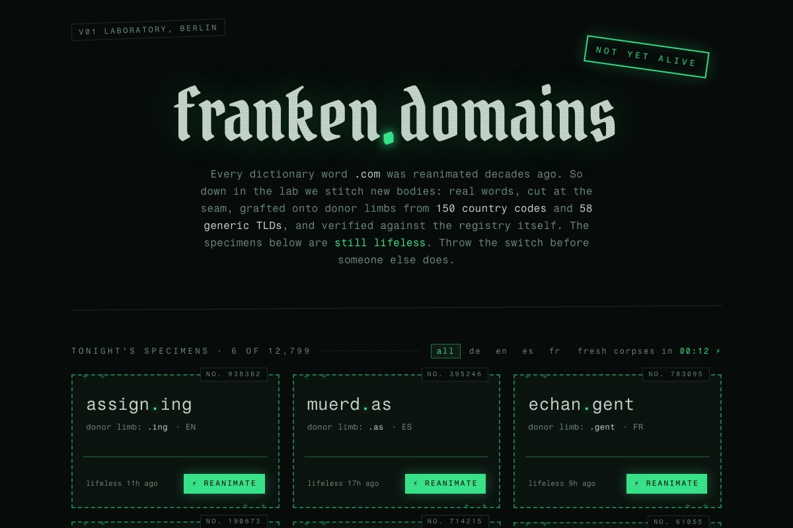

Try it: pick any word from the dictionary and check if the .com is free.

It isn't. It hasn't been for decades. Every real word, in every major language, was registered somewhere between 1995 and 2005. The dictionary is sold out.

But there is a loophole, and I wanted to know exactly how big it is.

## The loophole: cut the word at the seam

A domain hack splits a word so that its last letters become the top-level domain. *Wilderness* becomes **wilderne.ss**. *Uploading* becomes **upload.ing**. *Telephone* becomes **teleph.one**. The word survives, the .com problem disappears.

Everyone knows the famous ones: bit.ly, insta.gram, del.icio.us. What I wanted to know was the inverse question:

**If you take every word in the dictionary and every TLD that exists, how many of these stitched-together domains are still free?**

Nobody could tell me. So I checked all of them.

## The dataset

I started with four word lists:

- **German:** ~240,000 words (the davidak list)
- **English:** ~25,000 common words
- **Spanish:** ~47,000 words
- **French:** ~43,000 words

That is roughly **355,000 words**, normalized to ASCII (umlauts transliterated), filtered to 3 to 14 characters.

For every word, I generated every possible cut: each suffix that is a real TLD from the IANA root zone, with at least two characters left in front of the dot. *Dancing* yields both danc.ing and danci.ng. That expansion produced **124,490 candidate domains across 208 TLDs**: 150 country codes and 58 generic ones.

## The part nobody warns you about: registration policies

Here is where it got tedious. A ccTLD existing does not mean you can register it.

I researched the registration policy for 253 TLDs by hand, with sources. The breakdown:

- **150 open** to anyone, anywhere
- **63 restricted** (residency requirements, local presence, trustee constructions)
- **40 effectively closed**

Plus the fine print: 18 TLDs do not sell second-level domains at all, and 69 have minimum length rules. Some favorites from that research:

- **.er** (Eritrea) exists in the root zone but the registry is inactive. Every *-er* word in English is a dead end.
- **.ly** (Libya) requires at least 4 characters unless you are Libyan.
- **.ss** (South Sudan) only opened to the public in November 2024. That is why wilderne.ss was still on the table at all.

Closed TLDs and impossible lengths never even got queried. No point in checking what you cannot buy.

## Two-stage verification, because WHOIS lies

"The domain does not resolve" is not the same as "the domain is free". To claim *free*, I wanted the registry itself to say so.

**Stage 1 (cheap, massively parallel):** DNS NS lookups against public resolvers (Cloudflare, Google, Quad9). If a domain has name servers, it is definitely taken. This filters out the bulk.

**Stage 2 (authoritative, throttled):** an RDAP query at the responsible registry, discovered via the IANA bootstrap file. RDAP is the structured successor of WHOIS, and its answer is binary: HTTP 404 means free, 200 means taken. Anything else, including timeouts and rate limits, is marked *unknown* and never claimed as free.

Some registries do not offer RDAP at all (.se and .at, for example). Candidates there stay *unverified*, in a separate bucket. The rule throughout: **when in doubt, it is not free.**

The whole pipeline is Elixir, which is a natural fit for this: thousands of concurrent DNS lookups with per-registry rate limiting on the RDAP side, and a worker loop that keeps rechecking every domain so the statuses do not rot.

## The result: 12,799 free domains, hiding in plain sight

At the time of writing, **12,799 domain hacks are confirmed free at the registry level.** Real dictionary words, cut at the seam, buyable right now.

The biggest donor TLDs among them:

- **.ing** - by far the richest vein, over 1,700 free *-ing* words (upload.ing, gossip.ing, assign.ing). Google launched this TLD in 2023 and the market has not fully picked through it yet, though beware premium pricing.
- **.as** (American Samoa) and **.ng** (Nigeria) carry hundreds of Spanish and English endings.
- **.re** (Réunion) donates its limb to words like su.re, pu.re, and wi.re - yes, some two-letter-plus-TLD specimens are still free.
- **.ist**, **.bar**, **.tel** quietly absorb a lot of German.

And the German list is where it gets charming: fixpla.tz, schmierf.ink, teleph.one works in both languages.

## Why the good stuff is still there

My theory after staring at this data: domain hacks sit in a blind spot. Registrar search boxes push you toward .com, .net, and whatever new gTLD has a marketing budget. Nobody types *wilderness* into a domain search and gets offered wilderne.ss, because no registrar wants to explain South Sudanese registration policy in a checkout flow.

The inventory is invisible, so it stays free. Availability is not scarcity. **Discoverability is the scarcity.**

## The lab

I put the whole thing online as [franken.domains](https://franken.domains): a Frankenstein-themed laboratory where the free specimens lie on the slab, "not yet alive", waiting for someone to throw the switch. It shows a small rotating drop of free domains (the same six for everyone within a time window, so the full list cannot be scraped) plus a rate-limited search.

Obligatory fine print, which is also on the site: free at the registry is not a purchase guarantee. Some countries have residency rules, some registrars slap premium prices on short names, and someone may simply be faster than you.

But 12,799 real words are still lying there, lifeless, waiting.

Go on. Throw the switch.
