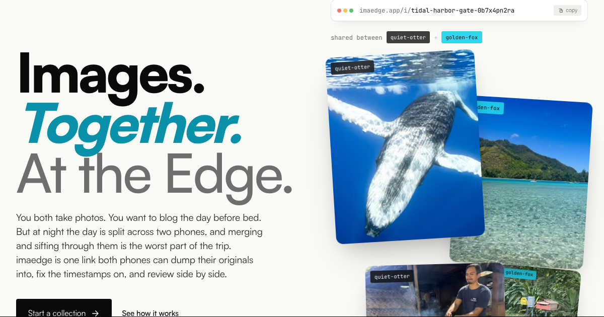

Because we now live in times where you can build a solution faster than you can spend time being annoyed about the problem, I built [imaedge](https://www.imaedge.org/).

The problem was simple, and we have had it on every trip so far: my wife and I want to collect our photos together, but none of the usual options really fits.

Apple does not work for us because shared photo albums compress the images. Google Photos does not work either because you always have to sync everything. On top of that, we need the images back in their original quality afterwards, so we can fill WordPress with them while we are on the road and later turn them into a photo album.

## One secret link for all photos

With [imaedge](https://www.imaedge.org/), anyone can create a secret link and share it with others.

Everyone with the link can upload photos into a shared collection, and the original files stay intact.

No accounts. No compression. No constant syncing.

## Built for bad reception

I paid special attention to the upload itself.

Images are uploaded in small chunks. In the places where we often travel, reception is bad. Normal uploads take forever, break, or leave you guessing what state the upload is actually in.

imaedge is meant to work exactly in those situations: on the road, with two phones, many images, and a connection you should not trust too much.

## The order stays editable

You can also adjust the order of the images by changing the date from the EXIF data.

That sounds like a detail, but it matters a lot for our workflow. When we later write a travel post or build a photo album, the images should not be sorted by who uploaded them. They should be sorted by when the moment actually happened.

## Open source

imaedge is open source, in case you want to host it for yourself.

The code is on GitHub: [github.com/klausbreyer/imaedge](https://github.com/klausbreyer/imaedge)

If you ever want to collect original photos together, without accounts, without compression, without constant syncing, and without a lot of fuss: that is what [imaedge](https://www.imaedge.org/) is built for.
