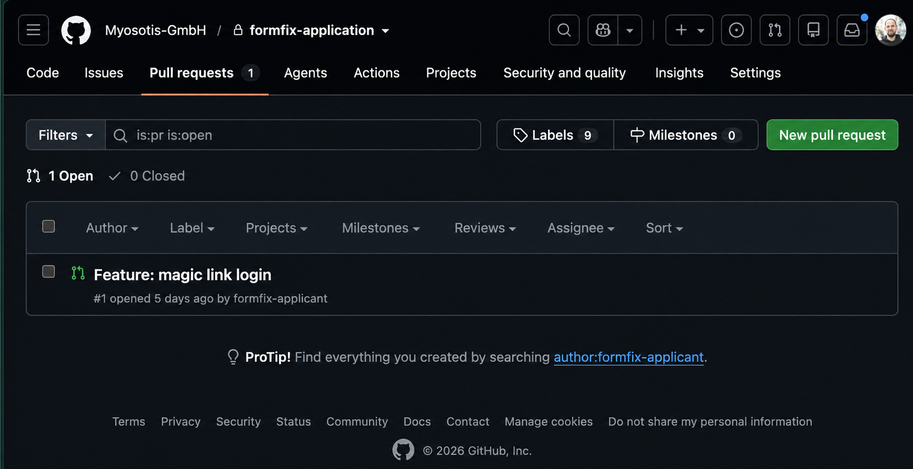

This morning, one of our engineers spent 45 minutes with a candidate.

No algorithm quizzing, no whiteboard, just Pairing in our actual codebase, on a real task.

That session is the core of how I run technical interviews these days. And since I just sent out the emails for the current round, I want to write the whole process down - staying as close as possible to what candidates actually receive from me.

## The whole process fits in one email

This is the email candidates get when they make it to the technical round, verbatim:

> Hey, congratulations, you've made it to the next round!
>
> We'd love to move forward with you into the technical round. The coding task happens directly on our actual codebase. We want to get a realistic sense of how you handle the complexity, and over the course of the process you'll pair directly with one of our engineers, so it's as much about working together as it is about the code itself.
>
> Here's the timeline at a glance:
>
> This week:
> - Today: I'll send you the NDA. I'll need it back signed by tomorrow, along with your GitHub handle so we can give you access to the code.
> - Tomorrow, 4 June: You'll get the task, including a short walkthrough from one of our engineers to get you started.
>
> Week of 8 June:
> - Time for you to dig into it.
> - Thursday, 11 June (morning): a 45-minute session with our engineers for pairing and questions.
> - Afterwards you'll have more time to finish it.
>
> Week of 15 June:
> - Monday evening, 15 June: submission deadline. You hand in your code, plus a short video in which you walk us through your solution (your thinking, the key decisions, anything you'd want to highlight).
> - After that we'll review and decide who to advance to the next round.
>
> Week of 22 June:
> - Tuesday, 23 June (morning): team-fit interview. Here you'll get to meet 2-3 more people from the team, including from PM and design.
>
> I'll already send out calendar invites for the next steps so we can block the time on both sides. If something doesn't work for you, or if anything unforeseen comes up along the way, just let me know and we'll re-schedule, no problem at all.
>
> And of course, feel free to reach out anytime if you have questions. We're really looking forward to working with you!
>
> Cheers,
> Klaus

A few things in there I wouldn't skip anymore:

**The task happens in our actual codebase.** No sandbox, no todo-app clone. Real code has history, compromises, and rough edges, and dealing with exactly that is the job. That requires an NDA and a GitHub invite. (I anonymized our commit history with the help of codex beforehand.)

**The pairing session sits in the middle, not at the end.** If someone gets lost in a corner that has little to do with the actual task, we can steer them back while there's still time. The submission should show what we actually want to see, not punish a wrong turn in the first days.

**The submission is code plus video.** In 2026, the video is the more interesting part. Code alone no longer tells me much about who wrote it. But how someone explains their decisions and trade-offs, that's hard to fake. And not everyone does well under live pressure; a recorded video gives people room to think.

**Team fit comes at the end.** Two to three more people from the team, explicitly including PM and design. Our engineers don't work in a silo, so engineering isn't the only voice in the decision either.

**The full timeline is set on day one.** Candidates usually have a job, often several parallel processes, sometimes a family. A process that drips along in installments ("we'll get back to you") is disrespectful of their time. All appointments go in the calendar on day one, on both sides. Rescheduling is explicitly fine.

## The task: real tech debt, not a puzzle

The task itself comes straight off our board. A recent key-management migration left a corner of our authentication handling in a state nobody is proud of, and candidates get to refactor a slice of it. It's work our team would otherwise pick up next.

To get them started, the task arrives with a recorded walkthrough from one of our engineers, plus real internal documentation, for example our data and encryption concept. Shared the way it actually is:

I could polish the docs beforehand. I don't. Again: it's all about realism here.

## The process is the probation period on steroids.

The whole thing simulates working together, not applying. Both sides see in advance what the collaboration actually feels like: real code, real docs, real people from the team. If it's a match after that, it tends to hold.

And if not, candidates have at least seen how we actually work.

## Update, 10 days later

One of the three candidates dropped out. They realized during the task that this isn't their turf. That's exactly how it should work. Saves both sides a lot of time and false expectations.
