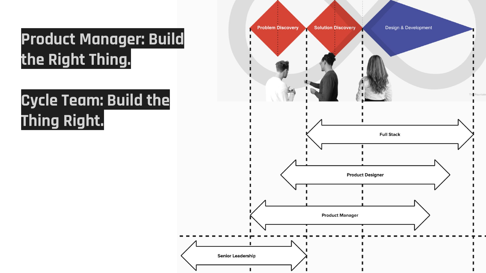

In my mental model, the product manager is primarily responsible for context. They frame the problem, they provide strategic direction, they bridge the gap between what the business needs and what the team builds. That is it.

In reality, I have to push every team I work with towards this model. Because the default is always the same: the PM ends up in the middle of everything, signing off on designs, approving tickets, checking implementations. And then everyone wonders why things are slow.

## The Classic Double Diamond Trap

In most product organizations, the PM sits at the center of everything. They write the PRD. They review the designs. They approve the tickets. They check the implementation. They are in every standup, every demo, every decision.

The result: the PM becomes the bottleneck. Nothing moves without them. Engineers wait for approvals. Designers wait for feedback. And the PM is stretched so thin across all these checkpoints that they cannot do the work that actually matters: understanding the market, talking to customers, and deciding what problems to solve next.

## What the PM Should Actually Do

The PM's core job is providing context. What is the strategic situation? What problem are we solving and why?

This is the framing work. It is high-leverage. It requires talking to customers, to stakeholders, to leadership. It requires synthesizing information from many sources into a clear problem statement. It requires judgment about what matters and what does not.

This is where the PM should spend their energy. Not in the delivery phase, checking if the button is in the right place.

## How to Make This Shift

The shift works in both directions. The PM needs to let go of delivery control. And the engineering and design team needs to step up and take ownership.

Marty Cagan puts it sharply in *Transformed*: "Push decisions down. Do not push tasks down." The PM's job is not to hand off work packages. It is to set the context so that teams can make good decisions autonomously.

**For the PM:** Frame the problem clearly. Set the appetite. Participate in shaping. Then step back from delivery. Trust the team to make the tactical decisions. They shaped the solution together with you. They understand the intent.

**For the team:** This means more responsibility. Own the QA. Own the deployment. Own the scope tradeoffs during the cycle. Do not wait for someone to tell you what to do next. You shaped it, you know the priorities, you decide.

## Why Engineers Need to Want This

Here is the uncomfortable truth: if an engineer's job is just executing tickets, an AI can do that job. As Nikhyl Singhal describes on Lenny's Podcast: "The PM job used to be carrying information from A to B. Builders will have the time of their lives. Everyone needs a builder mindset." Writing code from a specification is exactly what AI coding agents are getting good at. The ticket executor role is being automated away.

What AI cannot do is sit in a shaping session, understand the business context, push back on a product decision because of a technical constraint nobody else sees, or make a scope tradeoff mid-cycle because the team discovered something unexpected. That requires judgment, ownership, and deep context. That is the co-creator role.

In my experience, this shift is also more fulfilling. Making real tradeoffs, owning the delivery from start to deployment, understanding the why behind every scope, that is meaningful work. And it is the kind of work that will matter more, not less, as AI takes over the mechanical parts of engineering.

But it requires a change in mindset. Some engineers are used to someone else making all the decisions. They are comfortable with clear tickets and defined acceptance criteria. Stepping into ownership can feel uncomfortable at first.

Stephan Schmidt argues the same in *Developer Accountability*: commitment must come from the team, and you push decisions to those who can best make them.

The shaping process helps with this transition. If engineers are already part of defining the solution, they naturally take more ownership of delivering it. They shaped it, they understand the intent, they decide how to build it.

## Everyone Does What They Are Best At

When this works, the PM is free to look ahead. While the team delivers one cycle, the PM is already framing the next problem, talking to customers, analyzing what the last cycle taught them. They are not stuck in the weeds of the current delivery.

The team delivers with more autonomy and more focus. No waiting for approvals. No context switches to explain things to the PM. Just building, scope by scope, with the full picture in their heads from the shaping sessions.

Everyone is doing what they are best at. The PM provides context and makes strategic decisions. The team provides execution and makes tactical decisions. Nobody is a bottleneck.

And, let's be frank here: if an engineer cannot own delivery, maybe they are in the wrong job.
