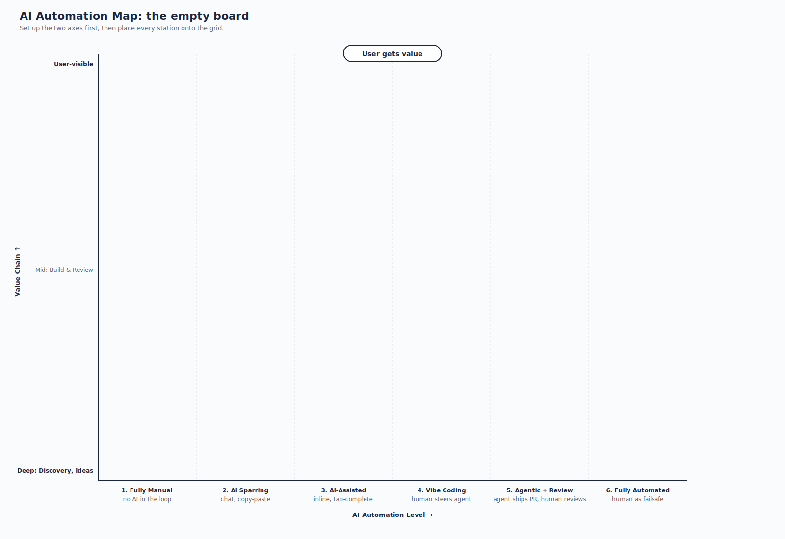
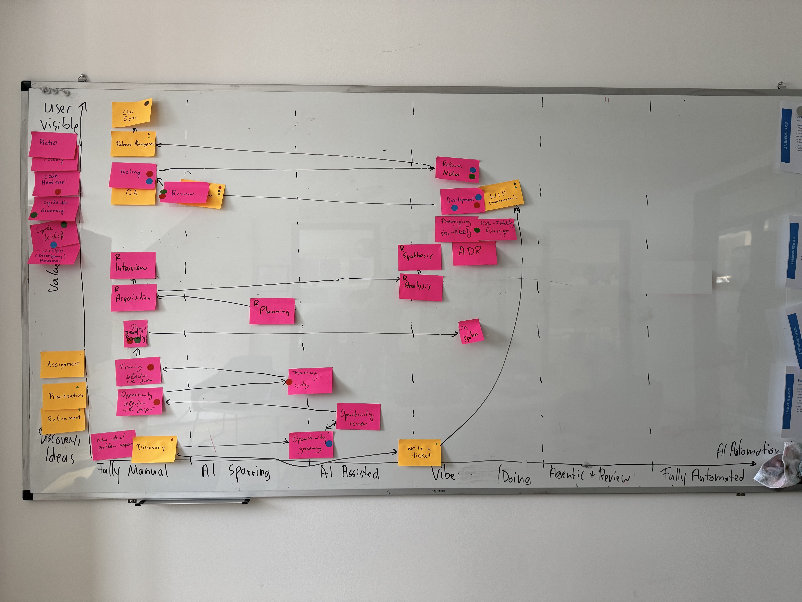
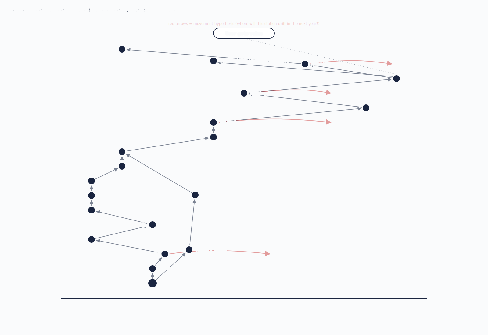

In the [previous post]() I shared the keynote that opened our two-day team offsite: a barrage of theses on how AI changes the product development lifecycle.

A keynote does not change how a team works. 

This post is the other half: the concrete workshop format we used to turn "interesting" into "what do *we* actually change on Monday".

## Motivation

Nowadays, there is no standard process to copy anymore, so the only thing that helps is mapping our own flow and deciding, station by station, what to *deliberately* keep human and where there is potential to automate more with AI.

And one intention above all: get the whole team into doing. Not two inspiring days and a hundred open to-dos, but something small and concrete finished in every experiment, usable the next morning.

## The basic flow

Two days, four phases:

- **Strategy** - Flow Storming, then Flow Mapping. See how we work today.
- **Setup** - pick the experiments, form groups, agree on the rules.
- **Experimenting** - hands-on, the bulk of the time. Try real things, not theory.
- **Commit** - presentations, then Flow Synthesis to decide as a team what sticks.

## Flow Storming

A sober look at how we work today. No solutions yet, just an honest picture.

We split into two teams: one mapped our feature development cycle work, the other our reactive work. Each team drew its flow as 10 to 15 stations, from "an idea comes in" to "we learned what happened". Short titles per station, not sentences.

The two teams drew their flows in parallel breakout sessions. 

Then the team walked the flow and marked the friction with colored dots, the core task of this phase:

- **Red** - bottleneck: work waits or capacity is tight.
- **Blue** - coordination friction: handovers, specs, rubber-stamp reviews.
- **Green** - judgment friction: architecture, taste, ownership.

The split matters. Blue friction is what you want to automate away. Green is where human judgment matters, so you protect it, want to keep it, or sometimes still need to introduce more of it.



## Flow Mapping

This is where it gets concrete. I borrowed the idea from [Wardley Mapping](https://www.wardleymaps.com/): every station from both flows gets a position on one shared 2D map, and the position itself carries meaning. Two axes.

**The vertical axis is the value chain.** Top is what the user directly sees and values, a shipped release, a feature in their hands. Bottom is the deep internal work where ideas start.

**The horizontal axis is the AI automation level**, in six concrete steps from fully human to fully machine:

1. **Fully Manual** - no AI in the loop at all.
2. **AI Sparring** - you bounce ideas in a chat window, copy-paste in and out.
3. **AI-Assisted** - AI sits inline in your tool: tab-complete, suggestions.
4. **Vibe Coding** - a human steers an agent that does the actual work.
5. **Agentic + Review** - the agent ships a PR, a human reviews it.
6. **Fully Automated** - it runs on its own, the human is only the failsafe.

The mapping itself, step by step:

- Each group presents its flow in five minutes. Clarifying questions only, no debate.
- We place every station onto the shared map, keeping the friction colors from Flow Storming. 

Note: 
Meeting formats came up a lot (dailies, refinements, retros), but we parked them: they were not the focus this time.

## Experiment time

This is where most of the two days went.

The map is the perfect starting point to define experiments. 

The stations where we sit on a bottleneck, or on friction we would like to get rid of, are the candidates to innovate on.

So we ran a brainstorming phase where everyone could propose experiments. They all had to follow the same structure.

- **Diagnosis** - What are we addressing here?
- **Hypothesis** - "if we do X, then Y".
- **Artifact target** - the concrete thing you walk out with.

Then we voted on the experiments and formed groups around the winners, making sure each group was interdisciplinary and small, usually two to three people.

A few examples: 

- AI code review tools - run a few candidates on the same PRs, then pick one.
- Cloud agent coding environments - so even non-engineers could ship a small change without a local setup.
- Trying Linear - run real work through it and compare it against Jira.
- A shared design.md - one design-token file ready to use from tomorrow.

Two rules kept it moving:

- **Unblock yourselves.** No permission needed for anything reversible.
- **Build experience, do not dwell on theory.** Make it concrete.

Each slot ran the same way: first 15 minutes to write the diagnosis, the middle block to build, the last 15 minutes to capture results. We had three such slots, each two to three hours long.

## Presentations

Groups then presented, 15 minutes each. (That was genuinely tight, so keep an eye on the clock!)

Each presentation closed on two points:

- **Guiding policy** - a strict format: "We will X, by Y, and deliberately not Z." The "deliberately not Z" is mandatory, to actually change something. 
- **Coherent action** - is anything still open to actually pull it off, and who does it by when?

## Flow Synthesis at the end

We closed by pulling the XY map from day one back up and walking it station by station:

- **Did it move?** - for each experiment, mark where the station sits now.
- **Where next?** - draw the arrow to where it should go from here.
- **Surprises** - note anything that turned out differently than expected. 

This is highly rewarding, because it is the moment the team sees what it accomplished over the two days. 

## Conclusion

The whole team was happy, mostly because they finally had time to work on concrete things, away from the daily grind.

They thanked me for the steady push to actually deliver something usable the next day.

(I think that matters for anyone running something like this with their own team: keep reminding everyone that we are here to change things, not to do desk research.)

The example below shows how it can look in the end. (It is a fictional one I drew up beforehand, not our team's result.)

