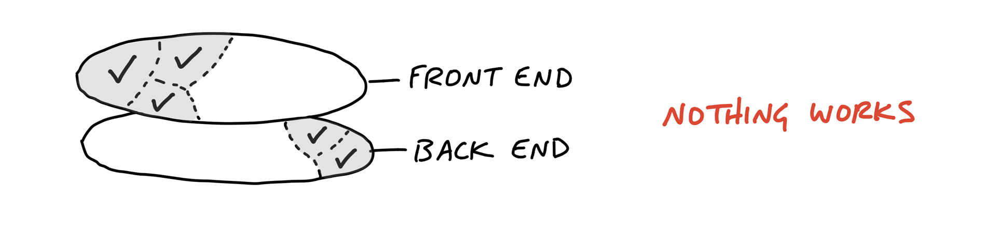
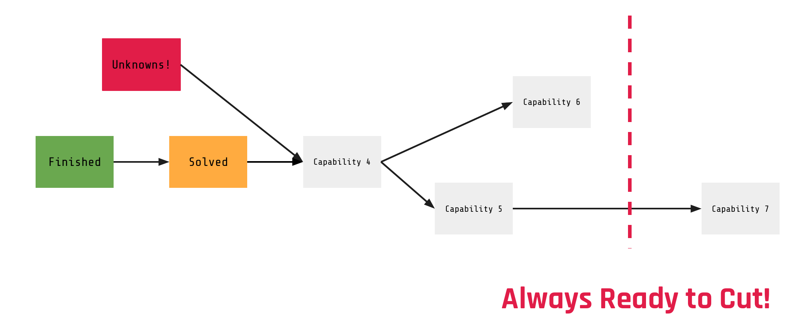

I find Jira horrible. Not because of the UI (though that too), but because of what it does to your thinking. Jira is built to account for work: to do, in progress, done. Three columns. This assumes you already know what the work is.

Ryan Singer describes this in *Beyond To-Dos*: "When work is packaged into todos, the brain switches off." The reality is that most of the uncertainty lives before those columns. Figuring out what to build, in what order, with what dependencies. That is the actual hard part. And no ticket system in the world helps you with it.

## The Cake Mistake

Here is the most common failure mode: teams structure their work by person. Frontend tickets. Backend tickets. Design tickets. Jira encourages this because it organizes around assignees and task types.

But if you structure delivery by person, you end up building your product in layers. First all the APIs, then all the frontend, then wire it up at the end. This is like eating a cake layer by layer, from the top frosting down to the bottom sponge.

Nobody eats cake like that. And nobody should build software like that.

Instead, you want to cut vertical slices. One piece of cake with all the layers in it. A capability that you can build end to end (design, frontend, backend) and deploy. Then the next capability. Then the next.

## Capabilities, Not Tasks

A good scope is not a task. It is a capability. Something the user can do after you ship it. Something that delivers value in isolation.

"Prepare the API" is not a good scope. You cannot ship an API to a user. "User can retry a failed payment on the checkout page" is a good scope. It includes everything: the UI change, the backend logic, the error handling. You build it together, you deploy it, it works.

(Source: [Shape Up, Chapter 11](https://basecamp.com/shapeup/3.2-chapter-11))

The difference matters because of time. If you have a fixed appetite (say, four weeks) and you organize by capability, you can always stop after each one and still have shipped something useful. If you organize by layer, you can only ship when all layers are done. And if you run out of time, you have a half-finished API, half-finished screens, and nothing that works.

## The Guillotine Test: Organize by Capability, Not by Person

When a team presents their delivery plan to me, I always do the same check: can I cut from the back?

If the team has arranged their capabilities in the right order (most important first, least important last), I should be able to remove the last capability and still have something worth shipping. Then remove the next one. And the next. At some point, cutting does not make sense anymore because we would lose the core value. That is the minimum viable scope.

This is impossible to do if your plan is a list of Jira tickets sorted by sprint. It only works if you have a dependency graph of capabilities, arranged by priority and risk.

## Finding Work Happens on a Whiteboard

The actual scoping process looks like this: you take the shaped solution (stickies, arrows, interaction flows) and you extract capabilities from it. What can the user do here? What is a shippable unit? Then you draw the dependencies.

Then you arrange them on a timeline. Unknowns and high-risk items go first, because you want to learn early what could blow up. Low-risk, easy items go last, because they are the ones you cut if time runs out.

David Heinemeier Hansson describes how Basecamp organizes delivery around epicenter, stretch, and integration, the same principle of structuring by what matters most, not by who does it.

None of this happens in Jira. It happens on a whiteboard, a Miro board, a piece of paper. Post-its you can move around. Arrows you can redraw. Once you know what the capabilities are and in what order, then you put them into your tracking tool.

## AI Makes This Worse, Not Better

Here is the uncomfortable part: AI-assisted development makes the "finding the work" problem even more important.

If AI tools make engineers 3x or 5x faster at execution, the bottleneck shifts. The limiting factor is no longer "how fast can we code this." It is "are we coding the right thing." Building the wrong feature faster does not help anyone. Shipping unnecessary capabilities in half the time is not progress.

The proportion of your process that should be dedicated to scoping, shaping, and finding the right work goes up, not down, as execution gets cheaper. The whiteboard session where you figure out what to build becomes the most valuable meeting in your sprint. Not the standup. Not the retro. The scoping session.

Jira will track whatever you put into it. AI will build whatever you tell it to. Neither of them will tell you if you are working on the right thing.

That is your job.
