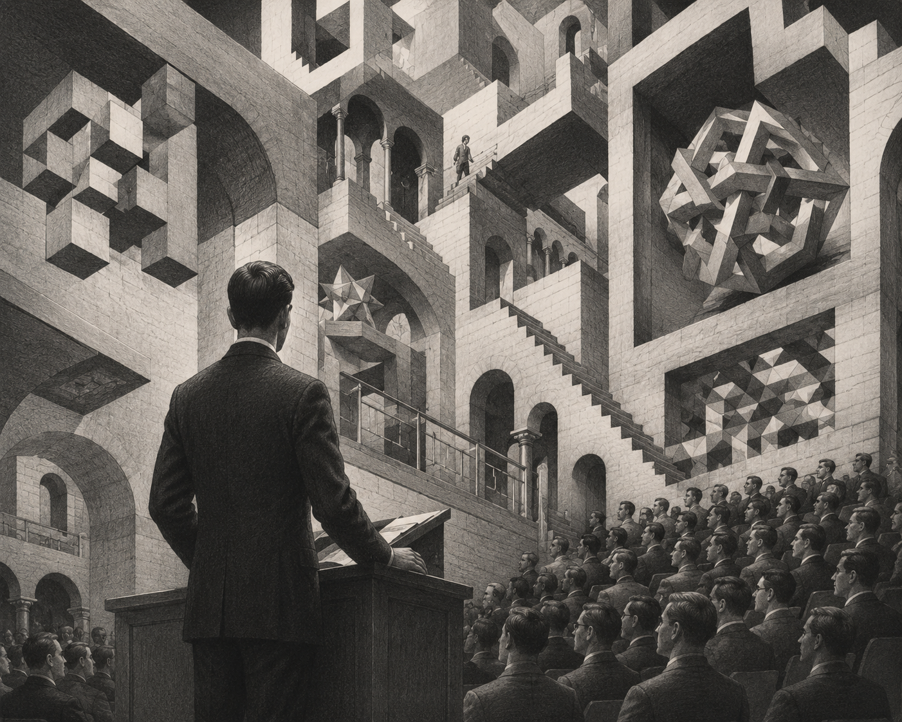
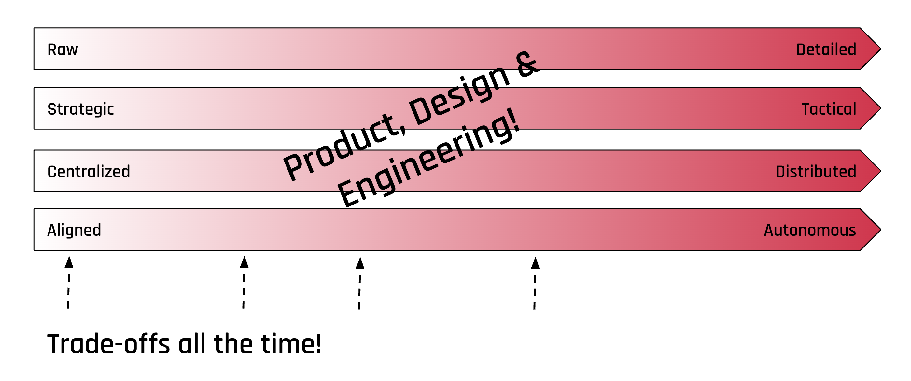

If I say to an image generator: "Draw me a painting from M.C. Escher where a male person stands in front of a conference crowd, geometric architecture structures", then the model has enough information to produce something that fulfills my intent. I did not specify that there needs to be a staircase. I could not even describe that weird Escher thing. But the prompt was good enough.

Shaping a software solution should work exactly like this.

## Enough to Guide, Not Enough to Constrain

A shaped solution needs to contain the right instructions so the delivery team can build what was intended. But it must not over-specify, because we all know what happens when you over-specify a prompt: the details are often wrong, the output is rigid, and it does not feel right.

The same applies to software. If you hand a team 40 Figma screens and detailed tickets, you have over-specified. The team loses flexibility. If your estimates turn out wrong (and they will), there is no room to adjust. You have locked yourself into a specific implementation before the real work even started.

On the other hand, if your shaping is too vague, the team has no guard rails. Requirements shift during delivery. Nobody knows what "done" looks like. That is chaos.

## The Right Altitude

The art of shaping is finding the right altitude. You want to make the strategic decisions early: What is the core flow? What are the places, the affordances, the interactions? Where are the risks?

But you deliberately push the tactical decisions down the road. Where exactly is the button located? What color does it have? What is the exact copy? These decisions belong in the delivery phase, where the team can make them autonomously, with full context from actually building the thing.

## Why This Matters for Delivery

If your shaping is at the right altitude, the delivery team has genuine flexibility. They can make scope tradeoffs. They can discover a simpler approach to one part and invest more in another. They can finish in time, because the solution was shaped with time constraints in mind, not specified down to the last pixel.

The worst case is a team that receives a fully specified solution and then discovers it does not fit the appetite. By then, changing direction is expensive. The Figma screens have dependencies on each other. The PRD is 20 pages. Nobody wants to throw that away.

With a well-shaped solution, you have stickies on a board. Changing direction costs you five minutes of rearranging.

## The Ambiguity Is the Feature

Fight the details, but defuse the time bombs. That is the tension in shaping. You do not want to over-specify, but you do need to address the things that could blow up during delivery. The trick is knowing which is which.

As Ryan Singer describes the designer's role: you need an architect who builds the foundation with interactions and user flows, not an interior designer.

If something needs a decision but carries no risk, push it down. If something could surprise you later, address it now. A risk can mean "we cannot do it in time" or "we have never worked with this provider" or "we do not know if users actually need this." Those are the things worth spending shaping time on. Not the button color.
