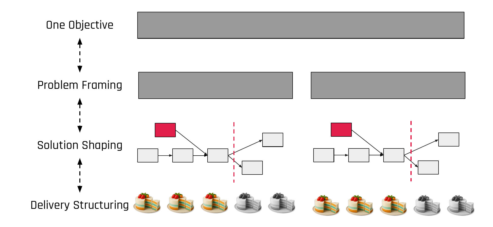

"We need to coordinate with team X." The moment this sentence appears during shaping, you have a problem. Not a coordination problem. A slicing problem.

## Dependencies Are Not a Fact of Life

Most teams treat dependencies between teams as an unavoidable reality. Something to manage, to track in a spreadsheet, to discuss in cross-team syncs. But in my experience, most dependencies are a symptom of how you cut the problem, not an inherent property of the work itself.

If a team working on a problem inside a fixed timebox has a dependency on something external, they cannot guarantee delivery. The dependency is outside their control. Their timeline is no longer their own. And the whole promise of fixed time with variable scope breaks down, because the variable is no longer scope. It is whether the other team delivers on time.

## Slice Differently

The first instinct when you discover a dependency is to manage it. Set up a meeting. Align timelines. Create a shared Jira board. Track it in the standup.

The better instinct is to ask: can we cut this problem differently so that the dependency does not exist?

Sometimes you can. Maybe the problem is framed too broadly. Maybe it spans two domains that you do not need to solve together. Maybe there is a simpler version of the solution that lives entirely within one team's control.

Going back to the framing phase is not a failure. It is the right move. If your shaping reveals that you have dependencies you cannot resolve, your frame was probably not precise enough. Frame it tighter. Frame a smaller, self-contained slice of the problem.

## When You Cannot Avoid It

Sometimes the dependency is real. You genuinely need someone from another team because they own a system or have expertise that does not exist in your team.

(Source: [Shape Up, Chapter 11](https://basecamp.com/shapeup/3.2-chapter-11))

In that case, do not manage the dependency from the outside. Pull the person in. Make them a temporary part of the team for the duration of the cycle. Block their time. Include them in the shaping sessions so they understand the context and can contribute.

This is more disruptive than a polite cross-team request, yes. But it is honest about the cost. A dependency that you "manage" from a distance is a dependency that can fail silently. A person who is part of your team for four weeks is someone you can count on.

## The Problem With Parallel Teams

Running multiple teams in parallel on related problems sounds efficient. But if those teams are working too close to the same part of the product or the same code, they create implicit dependencies. They need to interact. They cause merge conflicts, both in code and in product decisions.

Ryan Singer emphasizes that scopes should be orthogonal: things you can work on independently, not coupled. The slicing of problems across parallel teams is more art than science. You want problems that are distinct enough that the teams can work independently. You want code boundaries that do not overlap. You want product boundaries that do not create conflicting user experiences.

If you find yourself needing a lot of cross-team coordination, you have sliced wrong. Go back and reslice until the teams can operate independently. It is better to tackle fewer problems in parallel with true independence than to tackle more problems with constant coordination overhead.

## The Slicing Principle

Before you build a process for managing dependencies, ask: can we eliminate the dependency by slicing the problem differently?

Before you set up a cross-team sync, ask: can we pull the needed expertise into the team instead?

Before you plan two teams working on adjacent problems, ask: are these problems truly independent, or will the teams step on each other?

The art is in the cutting. Get the cuts right, and the coordination takes care of itself.
