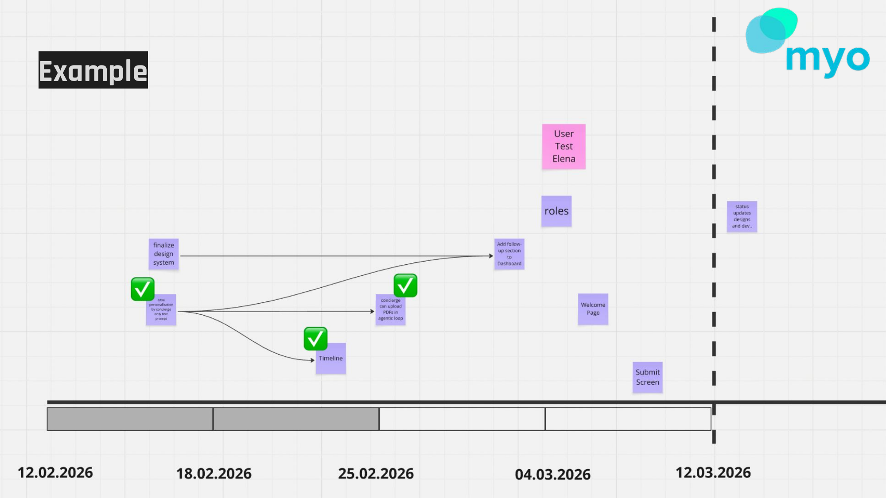

Here is the check I do with every delivery plan my team produces: I start at the end and work backwards. Can we cut the last scope and still ship something meaningful? Yes? Good. Can we cut the one before that? Still delivering value? Good. Where is the point where cutting no longer makes sense?

I call this the guillotine.

## The Setup

After shaping, you break your solution into scopes. Each scope is a capability, something the product does from the user's perspective. Not a task ("set up the API"), but a user-facing outcome ("user receives follow-up notification").

You arrange these scopes on a timeline. The most important ones, and the ones with the most unknowns, go first. The nice-to-haves go at the end. Dependencies determine the order: scope B depends on scope A, so A comes first.

Then you draw the guillotine line. If your appetite runs out after scope five out of seven, you should still have shipped something that solves the core problem.

## Why This Works

The alternative is what most teams do: plan everything, build in parallel, integrate at the end, and then scramble when time runs out. At that point, the engineers are making the tradeoffs. They cut corners on quality, skip testing, or rush the integration. The result is something that technically ships but is fragile, incomplete in unpredictable ways, and often does not even make sense as a whole because the tradeoffs were not made by the people who understand the problem.

With the guillotine approach, the tradeoffs are made upfront, during shaping, by product, design, and engineering together. Ryan Singer calls this scope hammering: "Can we ship without this?" If the appetite runs out, you stop. What you have shipped is a coherent, quality product. Just less of it.

## The Discipline It Requires

This only works if your scopes are truly independent. If scope six depends on scope seven, you cannot cut scope seven without breaking scope six. That is why the ordering matters, and why you need to be ruthless about dependencies.

It also only works if you start at the epicenter. The most critical capability, the thing the whole feature revolves around, must come first. If you build the welcome page first and the core feature last, the guillotine does not help you.

And it requires that each scope is end-to-end. Not "prepare all APIs" and then "build all frontend." Each scope includes its own frontend, backend, and design work. Like a piece of cake: you want every layer in every slice.

## The Uncomfortable Conversation

The guillotine forces a conversation that most teams avoid: what is actually essential, and what just feels essential?

David Heinemeier Hansson organizes Basecamp's delivery around epicenter, stretch, and integration. Same principle: core first, periphery last.

A welcome page feels important. A dashboard feels important. But if the core feature works without them, they are not essential. They are nice. And "nice" goes at the end of the timeline, behind the guillotine line.

This conversation is uncomfortable because everyone has opinions about what matters. But it is much better to have this discussion during shaping, when changing things is cheap, than during delivery, when you are out of time and the engineers are the ones making impossible tradeoffs.

## The Practical Backcheck

When your team presents their scope breakdown, ask these questions in order:

1. Can we cut the last scope and still deliver value? If yes, continue.
2. Can we cut one more? Still valuable? Continue.
3. Where does it stop making sense? That is your minimum viable delivery.
4. Everything between that minimum and your full plan is your flexibility buffer.

If you cannot cut anything from the back without breaking the whole thing, your scoping is wrong. Go back and restructure until the guillotine works.
