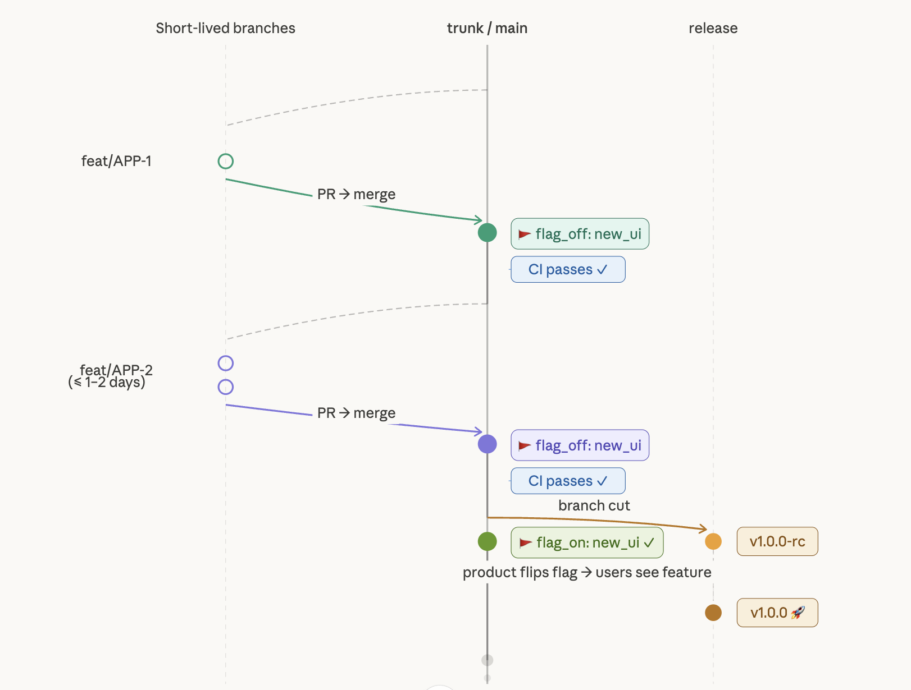

A few months ago, the team had a thorough discussion about our git workflow. Trunk-based development vs. a more traditional branching model with a long-lived secondary branch. The team was split. People had good arguments on both sides.

One engineer had prepared the discussion well, laying out all the pros and cons on a Confluence page. I read through everything carefully and then weighed in, because I had a strong opinion on this.

Here is what I wrote to the team:

> I am a strong proponent of trunk-based development. And I thought a lot about it.
>
> That main stays the single source of truth is essential for real DevOps and continuous delivery. A second long-lived branch introduces drift, coordination overhead, and delayed integration.
>
> For me, this is also a philosophical decision. There is a saying: "Every process in a company is a reminder of a mistake someone once made." I do not want to optimize for avoiding mistakes through the process.
>
> I want to optimize for speed, trust, and end-to-end ownership, and invest in systems that enable this.
>
> In my experience, heavy branching models are often reactions to past failures and tend to create risk-averse cultures. Git Flow comes from a world of long QA cycles and batched releases. That is not how we work and not where we want to go. In the future, we will ship more frequently, not less.
>
> Yes, things have gone wrong. But our current issues are not caused by trunk-based development. They are caused by missing visibility, discipline, and a little automation. We should understand and fix those directly instead of adding branching complexity. I see this even as an advantage, that such flaws are brutally surfaced.
>
> This is not a decision yet, but a strong opinion to weigh in on. Please, challenge my thoughts.

## Why This Matters

The branching model a team uses is never just a technical detail. It reflects how the team thinks about risk, trust, and ownership.

A more restrictive branching model feels safe. It adds a gate. But that gate also adds friction, slows down feedback, and shifts responsibility away from the individual developer toward the process itself.

Trunk-based development does the opposite. It makes problems visible immediately. It forces you to invest in the things that actually make shipping safe: feature flags, automated tests, observability, small increments.

The uncomfortable truth is that process complexity often masks the real problem. If deployments break, the answer is not another branch. The answer is better tests, better monitoring, and smaller changes.

## Update

That discussion was two to three months ago. We stuck with trunk-based development, and it was the right call. Just yesterday, we had a hotfix that went through smoothly, no coordination overhead, no cherry-picking across branches. Straight to main, straight to production.
