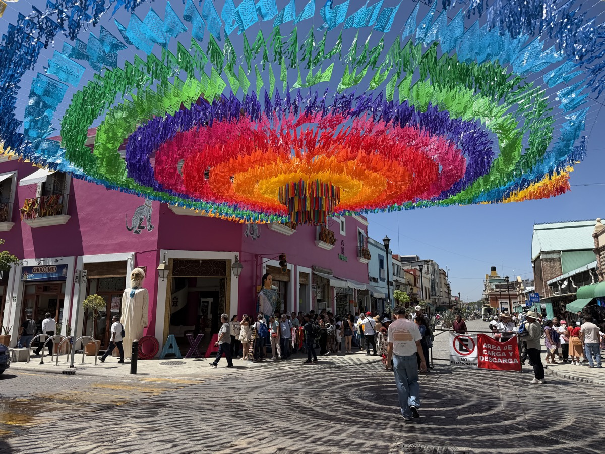

Today I want to share about the trip with my wife to Mexico. As with [French Polynesia](), the format is again an excerpt of my thoughts as I had them during the journey: originally published in a private family blog, only lightly edited for flow and shortened by cutting some of the probably boring activity details.

The key facts:

- 14.07.2026: HAM → CDG → MEX
- 14.-16.07.2026: Mexico City (CDMX)
- 16.-19.07.2026: San José del Pacífico
- 19.-21.07.2026: Oaxaca City
- 21.-25.07.2026: Tulum
- 25.-29.07.2026: Club Med Cancún
- 29.-30.07.2026: Return CUN → YYZ → AMS → HAM

## Journey

Right after arriving in Mexico City we had to open our suitcases. I didn't even realize what was going on and thought it was about explosives. When the inspector looked at the drone a bit puzzled, I explained to her what it was. She wanted to know what the drone costs. I estimated it at 200 dollars. Only later did I understand that this was actually customs and she was looking for valuables. They didn't really wear uniforms though, just high-vis vests.

In the taxi in CDMX I unleashed my first bits of Spanish. Although I have to say that 260 days of Duolingo didn't help as much as I had hoped. But it's better than nothing. I don't think I can even count to ten yet.

\-

From Mexico City we continued to San José del Pacífico, a small town in the cloud forests of the mountains surrounding Oaxaca. The owner of our apartment, [Omar](https://www.airbnb.de/rooms/48246248), picked us up at the airport, and during the three-hour drive we talked a lot with him. On the way he showed us a lunch spot where he likes to eat himself, and which was recently even mentioned by the Michelin guide. So no star, but still a good sign for solid regional cooking.

Once again it shows: discovering a country only works through direct contact with the people.

The cloud forests and the view of the mountains were one of the highlights of the trip for me. Quite moving. And yet another side of Mexico compared to what you usually picture.

\-

On the first evening we had a Temazcal ceremony right away, a local sauna ritual. Omar arranged it with his neighbor. We got the full ritual of his grandparents and ancestors: after being cleansed with copal smoke, you crawl into a clay hut where glowing stones lie in a pit in the ground. Then follow four sauna rounds of 20 minutes each, every one with a different hot herbal brew and its own meaning. This really mattered to him. In between he even explained to us via phone translation which element was up next.

I'm really an intense sauna goer, but on the fourth round, combined with the altitude, I had to breathe very deeply. Afterwards you feel truly cleansed. And actually a bit reborn.

\-

One evening in the mountains I wanted to light a romantic fire in the fireplace. Well, almost. At some point the whole room was full of smoke. My first thought was that the flue wasn't open. But that seems to be a European thing, I simply should have built the fire further back. I'm no professional fire starter (my wife is a cheerleader). Lesson learned. And to get ahead of it: we did not die of carbon monoxide poisoning. The next evening it worked on the first try.

\-

Saying goodbye to San José del Pacífico was hard. We didn't really know what to expect, but our expectations were exceeded (isn't that always the case?!). So much calm, so many kind and helpful people who deeply care about their culture and still love to share it with us strangers, without it feeling like a sellout (for us or for them).

Even though we had no big program items here, the rituals and above all plenty of time gave us a lot. Just the idea of having several hours in the afternoon to sort your thoughts.

\-

In Oaxaca City we then stumbled right into the biggest festival of the year: the Guelaguetza. In hindsight that also explained why finding a room had been so difficult. Delegations from all regions of the state travel in to perform their local dances. We watched the parade, let ourselves drift (Julia tasted mezcal and of course bought some) and in the evening tried the different kinds of mole.

\-

In Tulum we visited the Tulum ruins and Cobá. We learned a lot about the astronomy the Maya already had 5,000 years ago. They had calendars and could even predict solar eclipses, simply by observing the stars.

In Cobá we could even climb the tallest pyramid. Mega steep, and a truly wild feeling when you suddenly look out over the jungle up there. You can really imagine what a sublime feeling that must have been for the priests and rulers of the time.

A temple like this was built on for 800 years. Everyone kept making it bigger and bigger. That alone fascinates me: that you can sustain a religious, political and power system for over 800 years to keep building one single thing. Think of everything that happens in Europe within 800 years. How many empires collapse and get destroyed, before the next bigger empire destroys everything again, before it falls apart itself.

\-

Tulum left us a bit puzzled. Somehow it's not a real tourist hub, and somehow it's not as cute as Bali either. It's definitely not the Instagram spot we would have expected. In general the town is pretty US-flavored, both in its crowd and in how it's built: big gas stations, big supermarkets, even a Walmart subsidiary.

Anyway, as a tourist spot Tulum is already on the declining side of the hype cycle. Of course that changes nothing about how great the cenotes there are for diving. But somehow you don't need to stay any longer either.

By the way, the owner of the dive shop in Tulum didn't even want money for rethreading Julia's backplate, although we insisted. (We left him our remaining change for the coffee fund.)

\-

The final stop was the Club Med in Cancún. On arrival I was overwhelmed at first, mostly by the heat. 33 degrees Celsius is just really hot. And then the adjustment: all inclusive! You no longer have to convert prices at dinner to figure out how expensive everything is. Oh, how we had missed that Club Med feeling!

In the mornings you could watch the staff busy bringing in the sargassum harvest. A lot of seaweed washed up overnight, unfortunately right at the best swimming beach.

\-

The journey home started with a little shock: the taxi we had ordered simply didn't show up, and once the replacement arrived, a truck had completely blocked the road because of a construction site. I got out and vented my anger for a moment. The construction workers were fairly unimpressed and said something between the lines like: that's just how it is in Mexico, don't make such a fuss. In the end our taxi driver found a way past with a pretty tight maneuver.

Changing planes in Toronto, we were genuinely shocked at how well organized everything is, especially compared to Mexico. And I had no idea how incredibly friendly Canadians are. I think I really want to come back here!

\-

What a wonderful country. We had incredibly beautiful experiences, a perfectly planned route and exactly the right mix of nature, cities, relaxation and adventure. Every single stop was exactly the right length.

Before the trip I was a little worried it might turn out like [Japan]() back then, where we crammed an incredible number of stops into very little time. This time it felt completely different. Maybe that's because ChatGPT now helps enormously with finding your way around foreign countries and cities. Or maybe we have simply learned and no longer try to squeeze as many things as possible into as little time as possible.

## Observations

- In general, everything here is much, much more colorful than in Berlin. The houses are just painted incredibly beautifully, garlands hang everywhere, and the alebrijes (carved and painted wooden figures) glow in such strong colors. I think Germany lacks color.
- An awful lot of police officers, soldiers and national guard members, all transported in open pickups with a bench in the back. (The military keeps tight control because of the drug traffic towards the US.)
- Aggressive speed bumps on the roads, called reductores here.
- The mototaxis in San José are ordered via a WhatsApp number, and within minutes they pick you up and take you wherever you want. I don't want to imagine how busy that WhatsApp dispatch is. The drivers are all quite funny and some of them blast loud metal music. Works for me.
- Everyone is super nice, everyone super eager to boost tourism. Nobody has ripped us off here. (Except the gas station attendant who once didn't reset the meter after the scooter before me.)
- I only ask ChatGPT one thing anymore: "What should I eat?" Along with a photo of the menu. Julia always provides very elaborate context. I might as well roll dice. But it simply always recommends the regional classic, which I like.
- It's wild how much travel has changed from last year to this year thanks to ChatGPT. I stood in front of a shelf full of hot sauces for a good 15 minutes with ChatGPT to figure out which one to buy.
- Overall a very pleasant cuisine. Not a single cucumber so far (I hate cucumbers). And I even learned to love avocado. It's hard to get around it here, so I tried it right from the start.
- Trash cans are missing everywhere, presumably because people would dump their household garbage in them.
- The electricity meters hang on the outside of the houses. Super practical. I'd like that at home too.
- All the mirrors hang too low for me, and in the taxi my head brushes the ceiling in the back seat.
- Every bathroom faucet feels different from the next. Sometimes you turn right, sometimes left. Sometimes hot is on the left, sometimes on the right. In one restroom I found a row of four sinks where every single faucet was a different type.
- In general, a lot is improvised. The hubcaps of our bus were attached with nothing but cable ties. I like that. Exactly my style. (Or maybe it's extra theft protection. Who knows.)

If you want to know anything else, just ask me :) 🇲🇽
