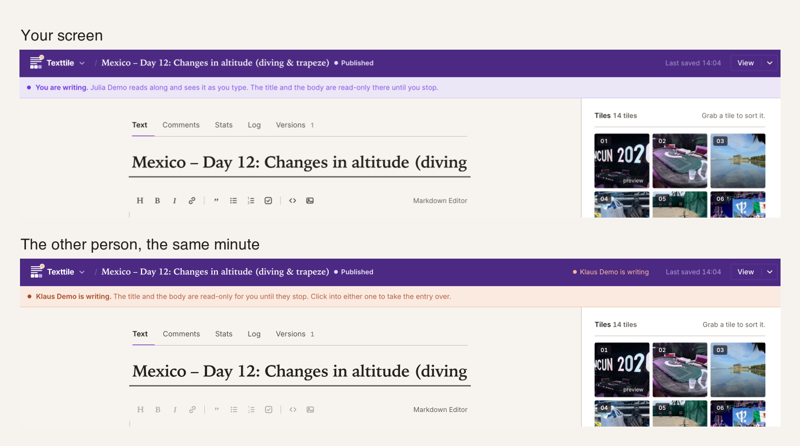
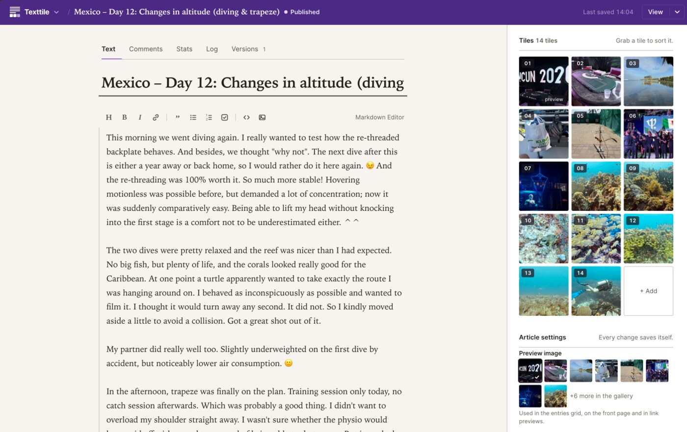
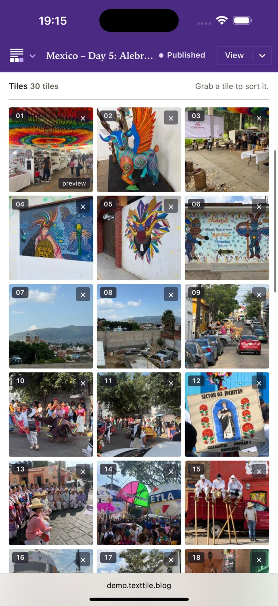

Since our honeymoon in 2015, my wife and I blog about every trip we take. For the people at home, for ourselves later, and by now for our children. In [Polynesia]() in 2025 we spent three weeks and kept one journal between us. We took turns writing. Whoever was not writing added pictures.

The text was never the hard part. The photos were. Picking them was work. Getting them out of the phone and into the CMS was the real pain: on the phone, on a slow line, far from home. And the CMS was WordPress: updates every few weeks, a plugin its author had abandoned, and bots at the login page around the clock.

So after [Mexico]() this year I did what every programmer apparently has to do once. I wrote my own CMS. It is called Texttile, it is open source, and it is written in Elixir.

## What it does differently

Most blog engines give an entry one author and a lock. Texttile gives it company. Two people can have the same entry open. One of them has the text and types, the other watches the words arrive and can take the text over with one tap. The gallery is never locked: both of you drag pictures into place at the same time, and you see each other doing it. An entry is text and tiles. That is the name.



The rest follows from how we travel:

- Nothing is loaded from outside. No CDN, no tracker, no captcha, no hosted font, no cookie banner. A reader's browser talks to your server and to nothing else.
- Light enough for a slow line. Small pages, little JavaScript, pictures only as large as the screen asks for.
- Your Markdown, byte for byte. What you typed is what is stored, so a version diff shows real edits and nothing else.
- One container, one folder. Phoenix, LiveView and SQLite in one Docker image. Everything lives in `/data`. Move that directory and you moved the blog.
- Comments, a newsletter, and statistics, all counted and stored on your server, with no cookie and no stored IP.
- English and German, for now.



## What it is not

There are no roles, no permission matrix, no plugins, no themes marketplace. Everybody with an account is an admin. I built it for people who trust each other, because that is who writes a blog together. A part of Texttile is right when nothing is left to take away.

## Why Elixir

Two people editing one thing at the same time is what the BEAM was made for. The lock is a GenServer, the keystrokes travel over PubSub, and the whole thing runs on one small machine next to a SQLite file. No Redis, no queue, no second service.

## Try it

Run it on your own machine:

```sh
docker run -d --name texttile \
  -p 4000:4000 \
  -v texttile-data:/data \
  -e SECRET_KEY_BASE="$(openssl rand -base64 48)" \
  -e PHX_HOST=localhost \
  -e ADMIN_USERS=you@example.com \
  ghcr.io/texttile-blog/texttile:3
```

Or start a demo at [www.texttile.blog](https://www.texttile.blog). You get a real Texttile of your own for 24 hours. If you like it, you can keep it. If not, it goes to sleep and is deleted 30 days later, with everything in it. Our own travel blog from Mexico runs on it too, at [demo.texttile.blog](https://demo.texttile.blog), if you want to see it from the reader's side.

The code is at [github.com/texttile-blog/texttile](https://github.com/texttile-blog/texttile). I would like to hear what you think, and especially what is missing for the way you blog.
