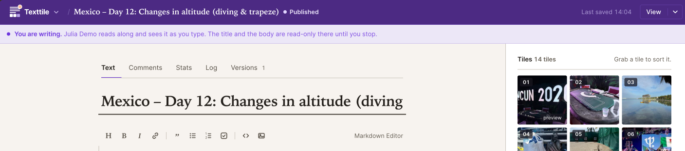
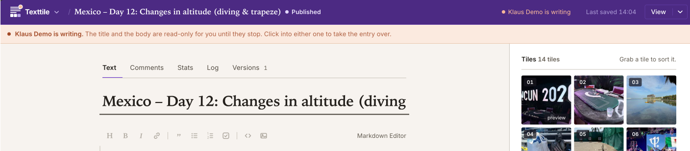
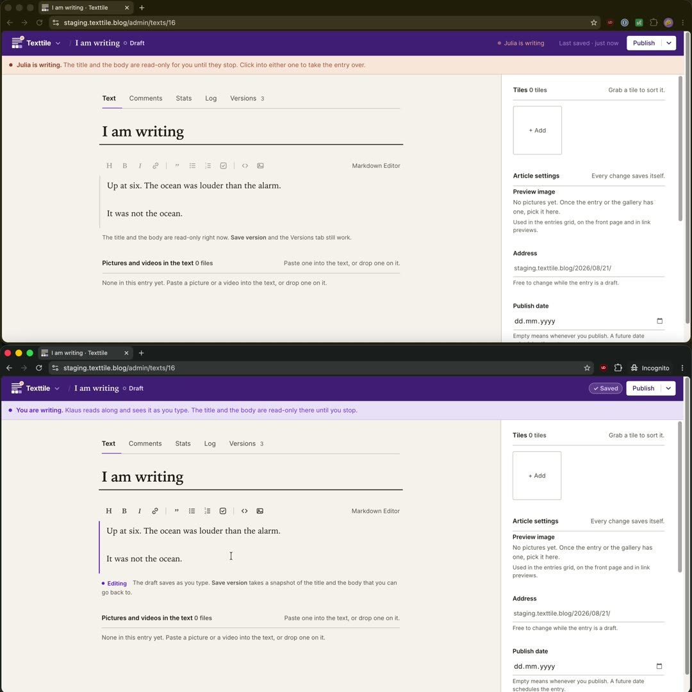

My wife and I have blogged about every trip since our honeymoon 10 years ago. For the people at home, for ourselves later, and by now for our children. We took turns writing, but both had photos and videos on their phones.

The text was never the hard part. The photos and videos were: every day one of us sent them from the phone to the other, who had to upload them and sort them into the entry in the right order.

I built [imaedge](https://imaedge.org) for that part first, and we tried it on the next trip, in [Mexico]() this year. Uploading held up. Tiles arrive in the order the camera gives them, and dragging one changes the order in the gallery.

What was still missing was bringing it together with the text. The family blog ran on WordPress, but WordPress never got this. Not the mobile editing experience, not the video support, not the gallery, and definitely not the "together" part. You are limited to one author per entry (but you get a bunch of plugins nobody maintains and constant bot attacks on your wp-admin).

So after Mexico, with the gallery proven, I did what every programmer apparently has to do once. I wrote my own CMS. It is called Texttile, it is open source, and it is written in Elixir. 

It allows multiple people in the same entry at the same time, uploading and sorting photos AND videos, treated as first-class citizens.

## What it does differently

In most blog engines only one author can edit an entry. Texttile rethinks content management as multiplayer.

- **Text:** multiple people can have the same entry open. One of them has the text and types, the other watches the words arrive and can take the text over with one click.
- **Tile:** both of you drag tiles with photos and videos into place at the same time, and you see each other doing it. The gallery is never locked.

An entry consists of text and tiles - that is the name.





Both screens show the same entry at the same moment. The writer sees a purple status bar and can edit the text. The other person sees an orange status bar and a read-only editor. Both can still work on the gallery.

Travel shaped the rest:

- Texttile loads nothing from outside. No CDN, no tracker, no captcha, no hosted font, no cookie banner. A reader's browser talks to your server and nothing else.
- It stays light enough for a slow line: small pages, little JavaScript, and pictures only as large as the screen asks for.
- Videos come from your own server. Drop one in and Texttile converts it, thumbnail included. No YouTube embed, no player from anywhere else.
- Texttile stores your Markdown byte for byte. A version diff shows real edits and nothing else.
- One container, one folder. Phoenix, LiveView, ffmpeg and SQLite live in one Docker image. Everything is in `/data`. Move that folder and you move the blog.
- Comments, a newsletter, and statistics stay on your server. Texttile uses no cookies and stores no IP addresses.
- English and German (more translations are welcome as a contribution!)

## What it is not

There are no roles, no permission matrix, no plugins, no theme marketplace. Everybody with an account is an admin. I built it for people who trust each other, because that is who writes a blog together. My philosophy is that a product is only perfect when there is nothing left to take away.

## Why Elixir

Multiple people editing one entry at the same time is what the BEAM was made for. The lock is a GenServer, the keystrokes travel over PubSub, and the whole thing runs on one small machine next to a SQLite file. No Redis, no queue, no second service.

## Try it

Run it on your own machine:

```sh
docker run -d --name texttile \
  -p 4000:4000 \
  -v texttile-data:/data \
  -e SECRET_KEY_BASE="$(openssl rand -base64 48)" \
  -e PHX_HOST=localhost \
  -e ADMIN_USERS=you@example.com \
  ghcr.io/texttile-blog/texttile:3
```

Or start a demo at [www.texttile.blog](https://www.texttile.blog). You get your own blog for 24 hours. If you like it, you can keep it. If not, it goes to sleep and is deleted 30 days later, with everything in it.

I put entries from our own travel blog from Mexico online at [demo.texttile.blog](https://demo.texttile.blog), if you want to see it from the reader's side.

The code is at [github.com/texttile-blog/texttile](https://github.com/texttile-blog/texttile). Now I am interested in your feedback! How do you blog on the road?

And here it is in action:

<video autoplay muted playsinline preload="metadata" poster="writing-poster.jpg" width="1080" height="1080" style="max-width:100%;height:auto">
  <source src="writing.mp4" type="video/mp4">
  
</video>
