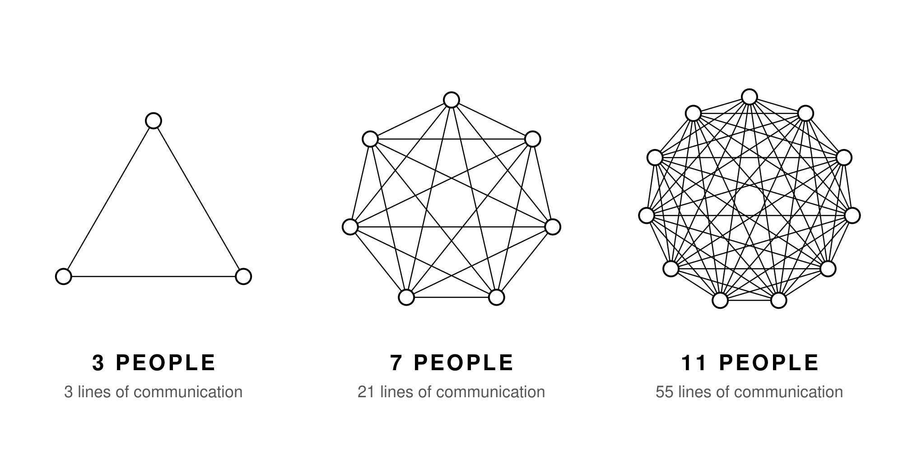

Three people have three lines of communication. Seven people have 21. That is [Brooks' Law](https://en.wikipedia.org/wiki/Brooks%27s_law): communication overhead grows much faster than headcount.

This single insight should change how you staff every phase of product development.

## The Math Is Simple, the Implications Are Not

With three people, everyone talks to two others. Three communication lines. Manageable. Productive. Fast decisions.

Add four more people and you jump to 21 lines. Every person is now coordinating with six others. Meetings get longer. Alignment takes more effort. Decisions slow down. Not because the people are bad, but because the communication overhead eats into the time for actual work.

This is not a theoretical problem. Every team I have worked with has experienced this. The standup that takes 45 minutes. The [Slack thread with 12 participants]() and no resolution. The alignment meeting that needs a follow-up alignment meeting.

## Apply It to Every Phase

I always try to have the minimum amount of people necessary at every step:

**Problem Framing.** Two, maybe three people. Product management, someone with technical context, sometimes a designer if they have user research insights. You do not need the whole team here. You need the people who understand the business context and can articulate the problem.

**Solution Shaping.** Three people, ideally. Product, design, engineering. One representative from each discipline. They [shape the solution together]() on equal footing. If you need specific technical input, pull someone in for one session, then let them go.

**Delivery.** Two engineers, one designer is my default setup. Small enough to work on one scope at the same time, large enough to cover the disciplines needed. With AI tooling, that number [only goes down]().

## You Don't Need Everyone's Opinion

People will say: "But we need everyone's input." No, you don't. You need the right input at the right time. The rest of the team can give feedback asynchronously. They can review [architecture decision records](). They can look at the shaped solution on the board. But they do not need to be in every session.

Including more people feels inclusive. It feels democratic. But it slows everything down. And worse, it diffuses ownership. When everyone is responsible, nobody is responsible.

## The Practical Rule

Before any meeting, any shaping session, any framing discussion, ask: what is the smallest group that has all the context to make this decision? Start with that group. If they discover they are missing context, they can pull someone in. But the default should be small, not large.

[Will Larson](https://lethain.com/) makes a similar point in [*An Elegant Puzzle*](https://amzn.to/4g942DJ): a team needs at least four people to function, a manager should have six to eight engineers, and innovation requires slack. The sizing matters.

This applies at every level. The framing group is small. The shaping group is small. The delivery team is small. And between these groups, you [synchronize through artifacts](), not through attendance.
