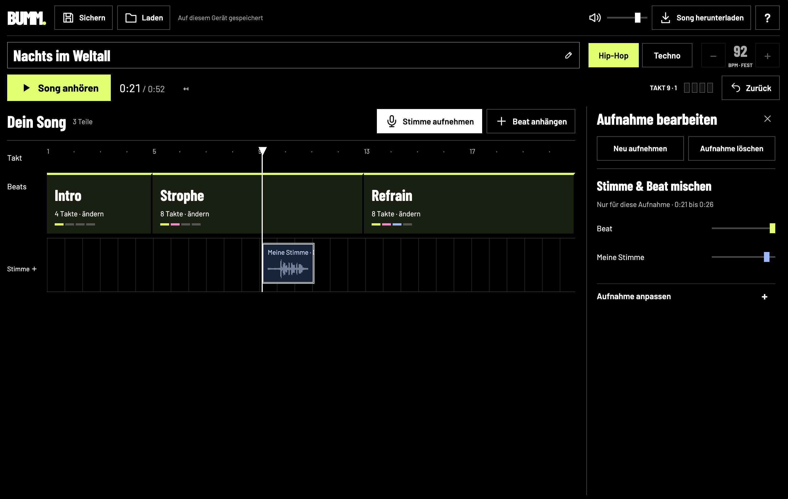

What a time to be alive.

I present: [BUMM](https://klausbreyer.github.io/bumm/).

Over the weekend I tried GPT 6 Astra. With a really vague prompt and a few (many!) iterations on the interface, I built a small beat studio for my son. It is frightening how well this already works.

## The prompt

My prompt was:

> I would like an app for several platforms (iOS and iPad too), but also for the web, that kids can use to build beats. Hip-hop or techno. Loop. But with fat sounds and hooks, and arranging songs and so on.
>
> We start with web first, but it has to be portable.

That was it. The rest was iterations.

## The demos are not the work

I also noticed something: the demos are great and very impressive. Look at all the houses people build in [Blender](https://openai.com/index/gpt-6-astra/), and so on. The model can surely do all of that.

But until you get something out that is exactly the way you want it, and that then works in real life, it still takes a lot of iterations. And as a human you need a very precise feeling for what works and what does not. No model takes that off your hands (yet).

## And still: what a time to be alive

It went from a loose thought (my kid needs tools to play with beats the way he can scribble on paper) to custom software for him in one to two hours.

That is why I love AI so much. The efficiency gains in daily work are only part of it. The bigger part is the many small custom things you would never build otherwise. Things that make your loved ones or your neighbours happy. And on the side you learn how good the new models are and how precisely they work.

And everyone knows that one friend who keeps bugging you with an app or startup idea ;) Now you can disillusion them faster. Or they can do it themselves.

Try it at [klausbreyer.github.io/bumm](https://klausbreyer.github.io/bumm/). The code is at [github.com/klausbreyer/bumm](https://github.com/klausbreyer/bumm).
